# LAV_v0.2 (Local AI VTuber)

---

<h1 align="center">
  <a href="./README_EN.md">English</a> |
  <a href="./README.md"><strong>한국어</strong></a>
</h1>

---

한국어 음성 대화, 로컬 LLM, GPT-SoVITS, VTube Studio 연동을 중심으로 개조 중인 로컬 AI VTuber 프로젝트입니다.

기존 LocalAIVtuber 프로젝트 기반이며, 한국어 지원과 안정성을 중심으로 수정되었습니다.

---

## 프로젝트 객체지향 다이어그램 UML(Unified Modeling Language)

<!-- #20260704_kpopmodder: Keep README architecture diagrams as Mermaid so GitHub renders them directly without regenerating PNG files. -->
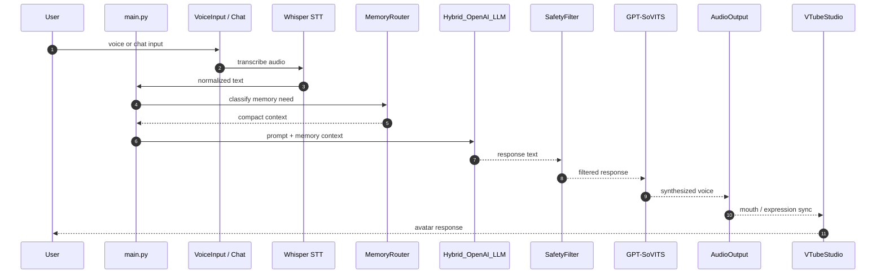

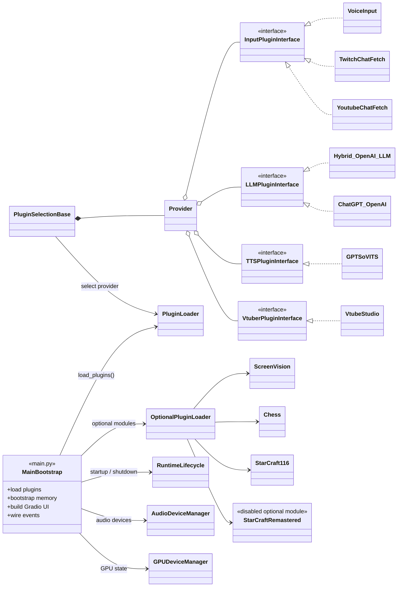

[Mermaid 객체지향 구조도 원본](docs/object_oriented_diagram.md)

> LAV_v0.2는 입력 소스, STT/관찰, LLM, Safety Filter, TTS, VTube Studio 출력을 플러그인 기반 구조로 연결하는 로컬 AI VTuber 프로젝트입니다.

---

## 주요 기능

* 한국어 음성 인식 (Transformers Whisper / PyTorch)
* 로컬 Transformers_LLM은 legacy stub만 남아 있으며 현재 비활성/비권장 <!-- #20260629_kpopmodder: Transformers_LLM files remain, but runtime classes are disabled. -->
* Azure OpenAI 지원
* GPT-SoVITS 지원
* VTube Studio 연동
* Safety Filter
* 오디오 장치 관리자
* 플러그인 기반 구조
* Gradio 기반 웹 UI
* Chess 플러그인 (LC0 / BT4-it332 로컬 엔진)
* StarCraft 1.16 플러그인 (BWAPI 4.4.0 / Stardust, BWAPI 4.2.0 / Monster / JSONL 게임 이벤트)

---

<table>
  <tr>
    <td>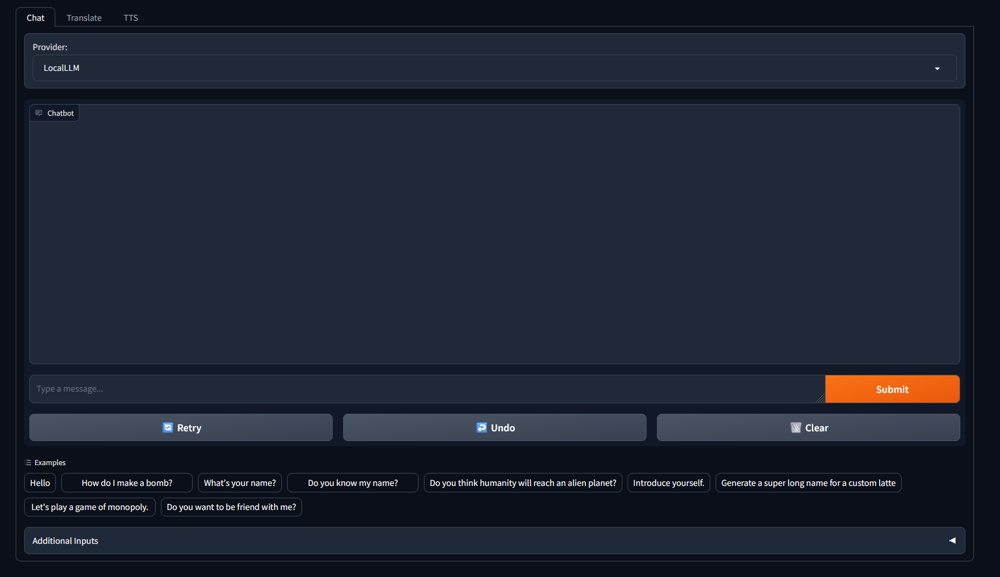</td>
    <td>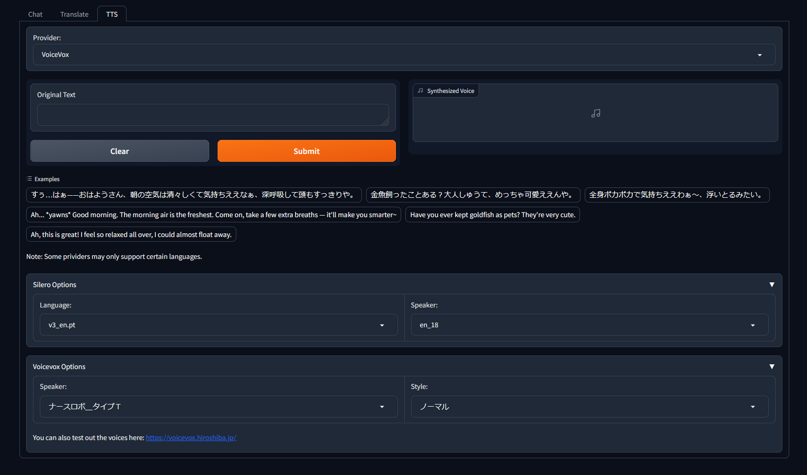</td>
  </tr>
</table>

---

# 설치 방법 (Windows)

버그나 수정사항이 있으면 [jaewoopark96@gmail.com](mailto:jaewoopark96@gmail.com) 으로 메일 주세요.

---

## 1. Python 3.14 설치

Python 3.14를 설치합니다.

https://www.python.org/downloads/

설치 확인:

```bat
py -3.14 --version
```

---

## 2. Visual Studio C++ 설치

일부 Windows Python 패키지가 wheel이 아니라 소스 빌드로 설치될 수 있으므로 Visual Studio C++ Build Tools 설치를 권장합니다.

https://visualstudio.microsoft.com/downloads/

권장 버전은 **Visual Studio 2026 C++ Build Tools**입니다.

설치할 때 아래 항목을 선택합니다.

```text
Desktop development with C++
(C++를 사용한 데스크톱 개발)
```

권장 구성 요소:

```text
MSVC C++ x64/x86 build tools
Windows 10/11 SDK
C++ CMake tools for Windows
```

추가로, **개별 구성 요소** 탭에서 `v141`을 검색한 뒤 아래 항목도 선택하세요.

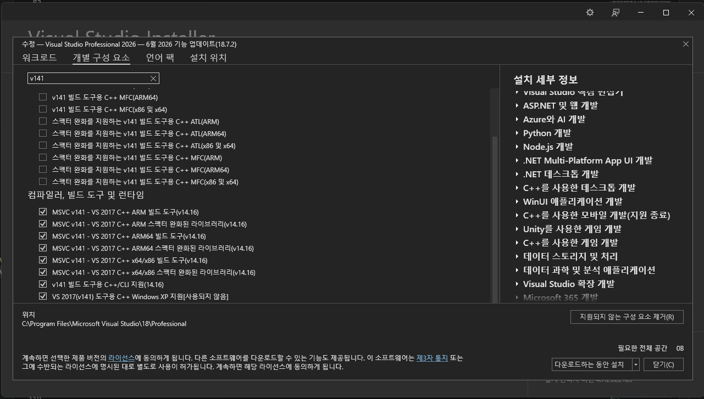

```text
MSVC v141 - VS 2017 C++ x64/x86 build tools (v14.16)
MSVC v141 - VS 2017 C++ x64/x86 Spectre-mitigated libs (v14.16)
```

ARM/ARM64, MFC/ATL, Windows XP 지원 항목은 이 프로젝트의 일반 실행에는 필요하지 않습니다. 특정 소스 빌드 오류가 해당 항목을 요구할 때만 추가하세요.

> 기본 실행만 할 경우 매번 Visual Studio 개발자 명령 프롬프트를 열 필요는 없습니다.
> 소스 빌드 오류가 발생할 때만 `vcvars64.bat` 환경을 사용하세요.

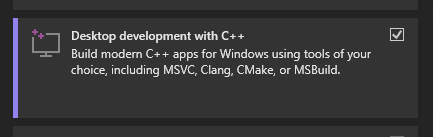

---

## 3. NVIDIA Driver / CUDA 확인

이 프로젝트는 PyTorch CUDA 13.0 wheel 기준으로 설치합니다.

CUDA Toolkit 13.3.1 다운로드 아카이브:

https://developer.nvidia.com/cuda-13-3-0-download-archive?target_os=Windows&target_arch=x86_64&target_version=11&target_type=exe_local

일반 실행에는 CUDA Toolkit의 `nvcc.exe`가 필수는 아닙니다.
다만 NVIDIA GPU를 사용하려면 NVIDIA 드라이버와 PyTorch CUDA가 정상적으로 동작해야 합니다.

NVIDIA 드라이버 확인:

```bat
nvidia-smi
```

PyTorch CUDA 확인은 설치 후 아래 명령어로 확인합니다.

```bat
python -c "import torch; print(torch.cuda.is_available()); print(torch.version.cuda); print(torch.cuda.get_device_name(0))"
```

CUDA Toolkit을 별도로 설치한 경우 `nvcc.exe`가 잡히는지 확인할 수 있습니다.

```bat
where nvcc
```

CUDA Toolkit이 여러 개 설치되어 있다면 LAV 실행 터미널에서는 CUDA Toolkit 13.3.1 경로를 우선으로 두는 것을 권장합니다.

```bat
set "CUDA_PATH=C:\Program Files\NVIDIA GPU Computing Toolkit\CUDA\v13.3"
set "PATH=%CUDA_PATH%\bin;%PATH%"
```

> `cudnn64_9.dll`이 `where`에서 잡히지 않아도 PyTorch CUDA가 정상 동작하면 별도 조치가 필요하지 않습니다.
> PyTorch는 6번 단계의 `cu130` wheel로 설치합니다.

---

## 4. 가상환경 만들기

프로젝트 폴더에서 CMD를 열고 아래 명령어를 입력합니다.

```bat
py -3.14 -m venv venv
call venv\Scripts\activate.bat
```

명령어 앞에 `(venv)`가 보이면 정상입니다.

---

## 5. 기본 도구 설치

설치 도구를 최신 버전으로 업데이트합니다.

```bat
python -m pip install -U pip setuptools wheel
```

일부 패키지가 wheel이 아니라 소스 빌드로 설치될 경우 CMake가 필요할 수 있습니다.
빌드 오류가 발생할 때만 아래 명령어를 추가로 실행하세요.

```bat
pip install cmake
```

---

## 6. PyTorch 설치 (CUDA 13.0)

```bat
pip install torch torchvision torchaudio --index-url https://download.pytorch.org/whl/cu130
```

---

## 7. 수동 설치 패키지 설치

```bat
pip install git+https://github.com/chameleon-ai/LangSegment-0.3.5-backup.git
```

---

## 8. requirements.txt 설치

```bat
pip install -r requirements.txt
```

---

## 9. unidic 다운로드

```bat
python -m unidic download
```

---

## 10. Whisper 모델 다운로드

Hugging Face 토큰이 필요한 환경에서는 먼저 토큰을 설정합니다.
토큰은 README에 직접 저장하지 말고, 실행 터미널에서만 설정하세요.

```bat
set "HF_TOKEN=<YOUR_HUGGING_FACE_TOKEN>"
```

토큰이 잡혔는지 확인합니다.

```bat
python -c "import os; t=os.getenv('HF_TOKEN'); print('HF_TOKEN exists:', bool(t)); print(t[:8] + '...' if t else 'NONE')"
```

<!-- #20260707_kpopmodder: VoiceInput STT uses Transformers Whisper/PyTorch. -->
VoiceInput은 기본 STT 엔진으로 Transformers Whisper의 `openai/whisper-large-v3-turbo` 모델을 사용합니다.
아래 명령어로 모델을 미리 다운로드하고 PyTorch에서 로드 가능 여부를 확인할 수 있습니다.

```bat
python -c "import torch; from transformers import AutoModelForSpeechSeq2Seq, AutoProcessor; model_id='openai/whisper-large-v3-turbo'; device='cuda:0' if torch.cuda.is_available() else 'cpu'; dtype=torch.float16 if device.startswith('cuda') else torch.float32; AutoProcessor.from_pretrained(model_id); AutoModelForSpeechSeq2Seq.from_pretrained(model_id, torch_dtype=dtype).to(device); print('Transformers Whisper ready:', model_id, device, dtype)"
```

VoiceInput STT 설정 예시는 다음과 같습니다.

```json
{
  "VoiceInput": {
    "stt_backend": "transformers_whisper",
    "whisper_model": "openai/whisper-large-v3-turbo",
    "language": "ko",
    "torch_dtype": "auto"
  }
}
```

---

## 11. ScreenVision 모델 다운로드 방법

ScreenVision은 `Qwen/Qwen2.5-VL-3B-Instruct` 모델을 사용합니다.
아래 명령어는 Windows CMD 기준입니다.

```bat
call venv\Scripts\activate.bat

set "HF_TOKEN=<YOUR_HUGGING_FACE_TOKEN>"
set HF_HUB_DISABLE_SYMLINKS_WARNING=1
set HF_XET_HIGH_PERFORMANCE=1

venv\Scripts\hf.exe download Qwen/Qwen2.5-VL-3B-Instruct --cache-dir plugins\ScreenVision\model --max-workers 4
```

---

## 12. 듀얼 GPU 분산 설정

기본 설정 파일은 아래 위치에 있습니다.

```text
LAV_v0.2\config\gpu_device_config.json
```

기본 배치는 다음과 같습니다.

<!-- #20260627_kpopmodder: Match GPU docs to config/gpu_device_config.json. -->

```text
GPU 0 / RTX 5070 Ti: default fallback GPU
GPU 1 / RTX 5060 Ti: VoiceInput / Whisper, ScreenVision / Qwen2.5-VL, GPT-SoVITS API server
```

> Transformers_LLM은 현재 사용 권장하지 않는 legacy 플러그인입니다. 폴더와 주석 처리된 코드 흔적은 남아 있지만 runtime class/client/settings는 비활성화되어 있고 `modules.json`에서도 `false`입니다. 기본 GPU 배치 대상에 포함하지 않습니다.
> VoiceInput, ScreenVision, GPT-SoVITS가 모두 GPU 1 / RTX 5060 Ti에 배치되므로, 동시 사용 시 VRAM 부족이 발생할 수 있습니다. 이 경우 `config\gpu_device_config.json`에서 VoiceInput 또는 ScreenVision 배치를 조정하세요.

LAV 본체를 실행할 때 `CUDA_VISIBLE_DEVICES=0`으로 제한하지 마세요.
그렇게 실행하면 LAV 프로세스 안에서 ScreenVision이 `cuda:1`을 볼 수 없습니다.
LAV 본체는 GPU 0과 GPU 1을 모두 볼 수 있어야 하며, 각 플러그인이 `gpu_device_config.json`의 `device` 또는 `device_map`으로 사용할 GPU를 고정합니다.

GPT-SoVITS는 LAV가 자식 프로세스로 자동 실행합니다.
GPT-SoVITS만 별도 GPU로 고정하려면 아래 파일의 `cuda_visible_devices` 값을 사용합니다.

```text
LAV_v0.2\plugins\GPTSoVITS\config\gpt_sovits_config.json
```

`gpt_sovits_config.json`은 로컬 설정으로만 유지하고, 커밋에는 `gpt_sovits_config.example.json`만 포함하세요.
GPT-SoVITS 설치 경로는 config 파일 대신 `GPT_SOVITS_ROOT` 환경변수로 지정할 수도 있습니다.

```bat
set GPT_SOVITS_ROOT=C:\Vtuber_Souorce_Code\GPT-SoVITS-v2pro-20250604-nvidia50
```

`cuda_visible_devices`가 `"1"`이면 GPT-SoVITS 자식 프로세스에는 `CUDA_VISIBLE_DEVICES=1`이 들어갑니다.
이 경우 GPT-SoVITS 프로세스 내부에서는 물리 GPU 1, 즉 RTX 5060 Ti가 `cuda:0`으로 보이는 것이 정상입니다.

기존 GPT-SoVITS `api_v2.py` 서버가 이미 실행 중이면 새 `cuda_visible_devices` 설정은 적용되지 않습니다.
설정을 바꾼 뒤에는 기존 GPT-SoVITS 프로세스를 종료하고 LAV를 다시 실행하세요.

기존 GPT-SoVITS 서버 종료:

```powershell
powershell -NoProfile -Command "Get-CimInstance Win32_Process | Where-Object { $_.CommandLine -like '*GPT-SoVITS*api_v2.py*' } | ForEach-Object { Stop-Process -Id $_.ProcessId -Force }"
```

GPU 인식 확인:

```bat
python -c "import torch; print(torch.cuda.device_count()); [print(i, torch.cuda.get_device_name(i)) for i in range(torch.cuda.device_count())]"
```

실행 중 GPU 프로세스 확인:

```bat
nvidia-smi
```

LAV / GPT-SoVITS Python 프로세스 확인:

```powershell
powershell -NoProfile -Command "Get-CimInstance Win32_Process | Where-Object { $_.CommandLine -like '*LAV_v0.2*main.py*' -or $_.CommandLine -like '*GPT-SoVITS*api_v2.py*' } | Select-Object ProcessId,ExecutablePath,CommandLine | Format-List"
```

시작 로그에서 아래 흐름을 확인하세요.

<!-- #20260627_kpopmodder: Expected startup log reflects VoiceInput on cuda:1. -->

```text
[GPUDeviceManager] detected: 0 = NVIDIA GeForce RTX 5070 Ti
[GPUDeviceManager] detected: 1 = NVIDIA GeForce RTX 5060 Ti
[GPUDeviceManager] VoiceInput -> cuda:1
[GPUDeviceManager] ScreenVision -> cuda:1
[GPUDeviceManager] GPTSoVITS -> CUDA_VISIBLE_DEVICES=1
[ScreenVision] resolved device=cuda:1
[VoiceInput] resolved device=cuda:1
[GPTSoVITS_TTS] CUDA_VISIBLE_DEVICES=1
```

---

## 12.1. Chess 플러그인 LC0 / BT4-it332 설치

Chess 플러그인은 Gradio 탭 안의 로컬 iframe 체스판에서 실행됩니다.
체스 엔진은 Python으로 구현하지 않고, 별도로 설치한 LC0 / Leela Chess Zero `lc0.exe`를 UCI subprocess로 호출합니다.

LC0 실행 파일과 BT4-it332 weight 파일은 repo에 넣지 마세요.
로컬 경로만 `plugins\Chess\config\chess_config.json`에 적습니다.

### 1. Python 패키지 확인

`requirements.txt`에는 Chess 플러그인에 필요한 최소 Python 패키지 `chess`가 포함되어 있습니다.
Gradio 6.18.0 호환성 때문에 `gradio-chessboard`는 사용하지 않습니다.

```bat
venv\Scripts\python.exe -m pip show chess
```

### 2. LC0 Windows NVIDIA CUDA 12 다운로드

LC0 공식 GitHub release에서 Windows NVIDIA CUDA 12 빌드를 다운로드합니다.

```text
https://github.com/LeelaChessZero/lc0/releases/tag/v0.32.1
```

직접 다운로드:

```text
https://github.com/LeelaChessZero/lc0/releases/download/v0.32.1/lc0-v0.32.1-windows-gpu-nvidia-cuda12.zip
```

예시 압축 해제 위치:

```text
C:\Vtuber_Souorce_Code\lc0-v0.32.1-windows-gpu-nvidia-cuda12
```

압축 해제 후 아래 파일이 있어야 합니다.

```bat
dir C:\Vtuber_Souorce_Code\lc0-v0.32.1-windows-gpu-nvidia-cuda12\lc0.exe
```

### 3. BT4-it332 weight 다운로드

LCZero Best Networks 페이지의 첫 번째 추천 네트워크는 `BT4-it332`입니다.
현재 LAV Chess 설정 예시는 이 네트워크를 사용합니다.

```text
https://lczero.org/play/networks/bestnets/
```

직접 다운로드:

```text
https://storage.lczero.org/files/networks-contrib/BT4-1024x15x32h-swa-6147500-policytune-332.pb.gz
```

예시 저장 위치:

```text
C:\Vtuber_Souorce_Code\lc0-v0.32.1-windows-gpu-nvidia-cuda12\BT4-1024x15x32h-swa-6147500-policytune-332.pb.gz
```

다운로드 후 확인:

```bat
dir C:\Vtuber_Souorce_Code\lc0-v0.32.1-windows-gpu-nvidia-cuda12\BT4-1024x15x32h-swa-6147500-policytune-332.pb.gz
```

### 4. Chess 로컬 설정 파일 만들기

`chess_config.json`은 로컬 전용 설정입니다. 커밋하지 마세요.
예시 파일을 복사해서 실제 LC0 경로와 weight 경로를 적습니다.

```bat
copy plugins\Chess\config\chess_config.example.json plugins\Chess\config\chess_config.json
notepad plugins\Chess\config\chess_config.json
```

예시:

```json
{
  "lc0_path": "C:\\Vtuber_Souorce_Code\\lc0-v0.32.1-windows-gpu-nvidia-cuda12\\lc0.exe",
  "weights_path": "C:\\Vtuber_Souorce_Code\\lc0-v0.32.1-windows-gpu-nvidia-cuda12\\BT4-1024x15x32h-swa-6147500-policytune-332.pb.gz",
  "backend": "cuda",
  "cuda_visible_devices": "",
  "movetime_ms": 1000,
  "auto_start_engine": false,
  "human_side": "white",
  "ai_side": "black",
  "web_server_host": "127.0.0.1",
  "web_server_port": 8790,
  "init_timeout_sec": 15,
  "move_timeout_sec": 10
}
```

`cuda_visible_devices`를 비워 두면 현재 LAV 프로세스에서 보이는 GPU를 그대로 사용합니다.
LC0만 특정 GPU로 제한하고 싶을 때만 `"0"` 또는 `"1"`처럼 설정하세요.

### 5. Chess 모듈 켜기

`modules.json`에서 Chess가 `true`일 때만 Chess 플러그인을 import하고 웹 서버를 시작합니다.
Chess를 쓰지 않을 때는 `false`로 두면 기존 LAV 흐름에 영향을 주지 않습니다.

```json
"Chess": true
```

### 6. 실행 확인

LAV를 실행한 뒤 Gradio의 `Chess` 탭으로 이동합니다.

```bat
python main.py
```

Chess 탭에서 다음 순서로 확인합니다.

```text
1. New Game
2. Start LC0
3. 보드에서 직접 백 말을 이동
4. LC0가 흑 수를 자동으로 둠
```

`Engine Status`가 `running`이고 `Engine Log`에 `bestmove`가 보이면 LC0 연결이 정상입니다.
`lc0.exe not found` 또는 `weights file not found`가 보이면 `chess_config.json`의 경로를 다시 확인하세요.

---

## 12.2. StarCraft 1.16.1 / BWAPI / Stardust / Monster 설치

StarCraft 1.16 플러그인은 StarCraft, BWAPI, Chaoslauncher, Stardust 같은 외부 바이너리를 repo에 포함하지 않습니다.
이미 로컬에 설치된 파일 경로를 검증하고, Chaoslauncher 실행과 BWAPI JSONL 이벤트 소비를 도와주는 선택 기능입니다.

현재 로컬 설정 기준 예시는 아래 구조입니다.

```text
C:\Vtuber_Souorce_Code\StarCraft_1.16
+-- StarCraft
|   +-- StarCraft.exe
|   +-- bwapi-data
|       +-- bwapi.ini
|       +-- AI
|           +-- Stardust.dll
|           +-- LAVEventExporter.dll
|           +-- LAVEventExporter.ini
+-- BWAPI_4_4_0
    +-- Release_Binary
        +-- Chaoslauncher
            +-- Chaoslauncher.exe
```

### 1. StarCraft 1.16.1 설치

StarCraft 1.16.1은 합법적으로 보유한 로컬 설치본을 사용하세요.
LAV 기준 권장 예시 경로는 다음과 같습니다.

```text
C:\Vtuber_Souorce_Code\StarCraft_1.16\StarCraft
```

설치 후 아래 파일이 있어야 합니다.

```bat
dir C:\Vtuber_Souorce_Code\StarCraft_1.16\StarCraft\StarCraft.exe
```

### 2. BWAPI 4.4.0 / Chaoslauncher 설치

BWAPI 4.4.0 Release Binary를 StarCraft 1.16 폴더 옆에 풀어 둡니다.
현재 LAV 설정 예시는 아래 Chaoslauncher를 사용합니다.

```text
C:\Vtuber_Souorce_Code\StarCraft_1.16\BWAPI_4_4_0\Release_Binary\Chaoslauncher\Chaoslauncher.exe
```

설치 후 확인:

```bat
dir C:\Vtuber_Souorce_Code\StarCraft_1.16\BWAPI_4_4_0\Release_Binary\Chaoslauncher\Chaoslauncher.exe
dir C:\Vtuber_Souorce_Code\StarCraft_1.16\StarCraft\bwapi-data
```

Chaoslauncher에서는 최소한 다음 플러그인을 체크한 뒤 `Start`합니다.

```text
BWAPI 4.4.0 Injector [RELEASE]
W-MODE 1.02
```

`SeDebugPrivilege`나 injection 문제가 있으면 LAV의 StarCraft 1.16 설정에서 `chaoslauncher_run_as_admin`을 `true`로 두고, `Launch BWAPI Profile` 실행 후 UAC를 허용하세요.

### 3. Stardust 설치

Stardust는 BWAPI AIModule DLL로 사용합니다.
`Stardust.dll`을 StarCraft의 BWAPI AI 폴더에 넣습니다.

```text
C:\Vtuber_Souorce_Code\StarCraft_1.16\StarCraft\bwapi-data\AI\Stardust.dll
```

직접 Stardust만 로드해서 테스트하려면 `bwapi-data\bwapi.ini`를 다음처럼 설정할 수 있습니다.

```ini
ai     = bwapi-data/AI/Stardust.dll
ai_dbg = bwapi-data/AI/Stardust.dll
race   = Protoss
```

LAV의 게임 진행 해설까지 사용하려면 `LAVEventExporter.dll`을 BWAPI AI로 로드하고, exporter가 내부에서 Stardust를 감싸도록 설정합니다.

```ini
ai     = bwapi-data/AI/LAVEventExporter.dll
ai_dbg = bwapi-data/AI/LAVEventExporter.dll
race   = Protoss
```

`LAVEventExporter.ini` 예시:

```ini
wrapped_ai=Stardust.dll
events_path=C:\Vtuber_Souorce_Code\LAV_v0.2\logs\starcraft116_game_events.jsonl
snapshot_interval_frames=144
combat_cooldown_frames=96
supply_block_cooldown_frames=240
```

이 방식이면 BWAPI는 `LAVEventExporter.dll`을 로드하고, exporter가 `Stardust.dll`을 다시 로드해서 유닛 제어는 Stardust가 계속 담당합니다.
동시에 LAV는 `starcraft116_game_events.jsonl`을 읽어서 OpenAI/TTS 반응을 만들 수 있습니다.

### 3.1. Monster / BWAPI 4.2.0 설치

Monster는 Stardust처럼 BWAPI AIModule DLL이 아니라 EXE 방식 BWAPI client bot입니다.
Monster 프로필은 BWAPI 4.2.0 기준으로 맞추는 것을 권장합니다.

1. BWAPI 4.2.0 다운로드:

https://github.com/bwapi/bwapi/releases/tag/v4.2.0

릴리즈 파일 중 다음 설치 파일을 설치합니다.

```text
BWAPI_Setup.VS.15.7.3.exe
```

설치 폴더는 그대로 써도 되지만, LAV에서 경로 관리하기 쉽게 StarCraft 1.16 작업 폴더 아래로 옮기는 것을 권장합니다.

```text
C:\Vtuber_Souorce_Code\StarCraft_1.16\BWAPI_420
```

2. Monster 다운로드:

https://sscaitournament.com/index.php?action=botDetails&bot=Monster

binary 다운로드:

https://sscaitournament.com/bot_binary.php?bot=Monster

압축을 푼 Monster 폴더 예시:

```text
C:\Vtuber_Souorce_Code\StarCraft_1.16\Monster
```

3. Monster는 실행 시 `sc.dat`, `fp.dat` 경로를 제대로 찾을 수 있어야 합니다.
SSCAIT에서 받은 원본 `Monster.exe`는 LAV 폴더 구조에서 이 파일들을 바로 찾지 못할 수 있으므로, 현재 LAV Monster 구성에서는 ChatGPT로 `Monster.exe` 바이너리 내부 경로를 강제로 수정해서 `sc.dat`, `fp.dat`를 인식하도록 만든 패치본을 사용합니다.
패치 전 원본 `Monster.exe`는 반드시 백업하세요.

4. `run_monster_robust_log.bat`를 `Monster.exe`가 있는 폴더에 복사합니다.
이 배치 파일은 Monster가 한 판 종료 후 끊겨도 다시 실행되도록 하고, `monster_log.txt`를 남깁니다.

```bat
copy C:\Vtuber_Souorce_Code\LAV_v0.2\plugins\StarCraft116\run_monster_robust_log.bat C:\Vtuber_Souorce_Code\StarCraft_1.16\Monster\run_monster_robust_log.bat
```

복사된 `.bat` 파일은 반드시 `Monster.exe`와 같은 폴더에 있어야 합니다.

5. LAV BWAPI 프록시 DLL 설치.
먼저 StarCraft 쪽 원본 BWAPI DLL을 백업합니다.

```bat
copy C:\Vtuber_Souorce_Code\StarCraft_1.16\StarCraft\bwapi-data\BWAPI.dll C:\Vtuber_Souorce_Code\StarCraft_1.16\StarCraft\bwapi-data\BWAPI_real.dll
```

그 다음 LAV 프록시 DLL을 덮어씁니다.

```bat
copy C:\Vtuber_Souorce_Code\LAV_v0.2\plugins\StarCraft116\BWAPI.dll C:\Vtuber_Souorce_Code\StarCraft_1.16\StarCraft\bwapi-data\BWAPI.dll
```

`plugins\StarCraft116\BWAPI.dll`은 LAV용 프록시입니다.
내부에서 `BWAPI_real.dll`을 로드하고 Monster 게임 상태 이벤트를 다음 파일로 기록합니다.

```text
C:\Vtuber_Souorce_Code\StarCraft_1.16\StarCraft\bwapi-data\bwapi_proxy_events.jsonl
```

6. `starcraft116_config.json`에서 Monster 프로필과 BWAPI 프록시 이벤트를 켭니다.

```json
"active_profile": "monster",
"bwapi_proxy_events_enabled": true,
"bwapi_proxy_events_tts_enabled": true,
"bwapi_proxy_events_path": "C:\\Vtuber_Souorce_Code\\StarCraft_1.16\\StarCraft\\bwapi-data\\bwapi_proxy_events.jsonl"
```

정상 동작 시 LAV 로그에서 다음과 비슷한 메시지를 볼 수 있습니다.

```text
BWAPI proxy shared-memory game-state poller started.
Mapped BWAPI shared memory read-only for pid=...
[StarCraft116BWAPIProxyEvents] event: type=...
[StarCraft116Reaction] TTS: ...
```

### 4. LAV 모듈 켜기

`modules.json`에서 StarCraft 1.16 플러그인을 켜고 Remastered 플러그인은 끕니다.

```json
"StarCraft116": true,
"StarCraftRemastered": false
```

### 5. StarCraft116 로컬 설정 파일 만들기

`starcraft116_config.json`은 로컬 경로 설정입니다.
예시 파일을 복사한 뒤 실제 설치 경로로 수정하세요.

```bat
copy plugins\StarCraft116\config\starcraft116_config.example.json plugins\StarCraft116\config\starcraft116_config.json
notepad plugins\StarCraft116\config\starcraft116_config.json
```

현재 Stardust 기준 핵심 설정 예시는 다음과 같습니다.
JSON에서는 Windows 경로의 `\`를 `\\`로 적어야 합니다.

```json
{
  "enabled": true,
  "active_profile": "stardust",
  "auto_launch": false,
  "write_state_log": true,
  "state_log_path": "logs\\starcraft116_state.jsonl",
  "bwapi_event_exporter_enabled": true,
  "profiles": {
    "stardust": {
      "display_name": "Stardust",
      "starcraft_116_dir": "C:\\Vtuber_Souorce_Code\\StarCraft_1.16\\StarCraft",
      "bwapi_data_dir": "C:\\Vtuber_Souorce_Code\\StarCraft_1.16\\StarCraft\\bwapi-data",
      "bot_binary_path": "C:\\Vtuber_Souorce_Code\\StarCraft_1.16\\StarCraft\\bwapi-data\\AI\\Stardust.dll",
      "start_chaoslauncher": true,
      "chaoslauncher_path": "C:\\Vtuber_Souorce_Code\\StarCraft_1.16\\BWAPI_4_4_0\\Release_Binary\\Chaoslauncher\\Chaoslauncher.exe",
      "chaoslauncher_arguments": [],
      "chaoslauncher_working_dir": "C:\\Vtuber_Souorce_Code\\StarCraft_1.16\\BWAPI_4_4_0\\Release_Binary\\Chaoslauncher",
      "chaoslauncher_run_as_admin": true,
      "start_starcraft": false,
      "starcraft_exe_path": "C:\\Vtuber_Souorce_Code\\StarCraft_1.16\\StarCraft\\StarCraft.exe",
      "starcraft_arguments": [],
      "starcraft_working_dir": "C:\\Vtuber_Souorce_Code\\StarCraft_1.16\\StarCraft",
      "starcraft_run_as_admin": false
    }
  }
}
```

경로를 바꿔야 할 때는 주로 아래 키만 확인하면 됩니다.

```text
profiles.stardust.starcraft_116_dir
profiles.stardust.bwapi_data_dir
profiles.stardust.bot_binary_path
profiles.stardust.chaoslauncher_path
profiles.stardust.chaoslauncher_working_dir
profiles.stardust.starcraft_exe_path
profiles.stardust.starcraft_working_dir
```

### 6. LAV에서 실행 확인

LAV를 실행한 뒤 Gradio의 `StarCraft 1.16` 탭으로 이동합니다.

```bat
python main.py
```

권장 확인 순서:

```text
1. Setup 탭에서 Install Folder를 StarCraft 1.16 설치 폴더로 지정
2. Scan Folder
3. Generate Config 또는 config 수동 편집
4. Launch 탭에서 Validate Paths
5. Launch BWAPI Profile
6. UAC 허용
7. Chaoslauncher에서 BWAPI 4.4.0 Injector [RELEASE] + W-MODE 1.02 체크
8. Start
```

정상 동작하면 로그에서 아래 흐름을 확인할 수 있습니다.

```text
[StarCraft116GameEvents] watching: ...\logs\starcraft116_game_events.jsonl
Loaded the AI Module "bwapi-data\AI\LAVEventExporter.dll"
BWAPI 4.4.0 ... now live using "LAVEventExporter.dll"
[StarCraft116Reaction] game_event: type=...
[StarCraft116Reaction] TTS: ...
```

자세한 플러그인 문서는 아래 파일도 참고하세요.

```text
plugins\StarCraft116\README.md
plugins\StarCraft116\bwapi_event_exporter\README.md
```

---

## 13. LLM provider 기본 선택

`ChatGPT_OpenAI`와 `Hybrid_OpenAI_LLM`을 둘 다 켠 상태는 비교용으로 유지할 수 있습니다.
Transformers_LLM은 legacy stub만 남아 있는 비활성 플러그인이므로 현재 LLM provider로 선택하지 마세요.
기본 LLM provider는 플러그인 로딩 순서에 기대지 않고 `PluginSelection` 설정을 우선합니다.
<!-- #20260627_kpopmodder: Make the default LLM provider explicit when both OpenAI plugins are enabled. -->

```ini
[PluginSelection]
default_language_model_provider = Hybrid_OpenAI_LLM
```

시작 로그의 `[PluginSelection] category=language_model ...` 줄에서 실제 선택된 provider와 선택 source를 확인하세요.

---

## 14. MemoryRouter / derived memory 설정

기본 실행은 `raw_events`를 source of truth로 유지합니다.
`main.py`의 `MemoryRetriever`는 `use_derived_fallback=False` 기본값을 사용하며,
`derived_memory.sqlite3`는 reference/fallback index입니다.

`prefer_derived_first`는 실험용 옵션입니다. 켜면 MemoryRouter가 recall이 필요하다고 판단한 쿼리에서 derived index를 raw recall보다 먼저 시도합니다.
ScreenVision 관찰은 오인식이나 화면 요약 환각이 섞일 수 있으므로 일반 실행에서는 `false`를 유지하세요.
<!-- #20260627_kpopmodder: Document derived-first as an experimental recall mode. -->

로컬 `config.ini`에 필요한 키만 추가할 수 있습니다. 실제 API 키가 들어 있는 `config.ini`는 커밋하지 마세요.

```ini
[MemoryRouter]
provider = rule
accuracy_first_raw_search = true
prefer_derived_first = false
allow_single_screen_observation_fallback = false
```

- `provider=rule`: 기본값입니다. 사용자 입력을 외부 API로 보내지 않습니다.
- `provider=openai`: OpenAI 기반 router를 사용합니다. 사용자 입력 일부가 OpenAI API로 전달될 수 있음.
- OpenAI router는 로컬 `config.ini`에서 `provider=openai`를 명시한 경우에만 사용됩니다.
- `accuracy_first_raw_search=true`: 기억이 필요한 질문은 빠른 최근 기록에서 멈추지 않고 전체 `raw_events`를 먼저 검색합니다. 느릴 수 있지만 오래된 실제 기억을 놓칠 가능성을 줄입니다.
- `prefer_derived_first=true`: 실험용 derived-first recall입니다. raw recall은 fallback으로 남지만, derived row가 먼저 주입될 수 있습니다.
- `allow_single_screen_observation_fallback=true`: `source_event_count=1`, `duplicate_count=0`인 단발 `screen_observation` row도 fallback으로 허용합니다. 기본값은 `false`입니다.
- 기본 derived fallback 조건은 `source_event_count >= 2` 또는 `duplicate_count >= 1`입니다.
- 단발 screen row가 명시 옵션으로 recall되면 `MemoryRecallTop` 로그에 `source_event_count`와 `duplicate_count`가 출력됩니다.

---

# GPT-SoVITS 서버 필요

GPT-SoVITS를 사용하려면 GPT-SoVITS 서버를 별도로 설치하고 실행해야 합니다.

GPT-SoVITS 공식 저장소:
https://github.com/RVC-Boss/GPT-SoVITS

서버가 없으면 GPT-SoVITS TTS는 작동하지 않습니다.

또한 GPT-SoVITS 서버 폴더 경로를 아래 설정 파일에 직접 지정해야 합니다.

```text
LAV_v0.2\plugins\GPTSoVITS\config\gpt_sovits_config.json
```

<table>
  <tr>
    <td>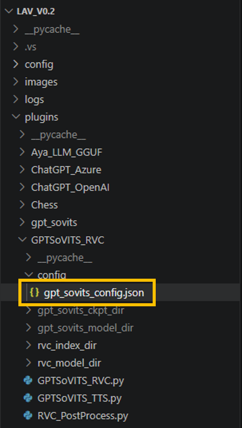</td>
    <td>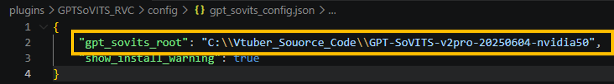</td>
  </tr>
</table>

---

# 프로그램 실행

이 프로젝트는 **Windows CMD 또는 PowerShell에서 실행할 수 있습니다.**

아래의 `C:\Vtuber_Souorce_Code\LAV_v0.2`는 프로젝트 경로 예시입니다.
명령어를 실행할 때는 실제 프로젝트 경로로 바꿔주세요.

CMD와 PowerShell은 환경변수 설정 및 가상환경 활성화 문법이 다릅니다.
각 터미널에 맞는 명령어를 사용하세요.

---

## 기본 실행 방법

CPU 빌드 또는 기본 실행에는 CUDA 환경변수 설정이 필요하지 않습니다.

### CMD

```bat
cd /d C:\Vtuber_Souorce_Code\LAV_v0.2

call venv\Scripts\activate.bat

python main.py
```

### PowerShell

```powershell
Set-Location "C:\Vtuber_Souorce_Code\LAV_v0.2"

.\venv\Scripts\Activate.ps1

python main.py
```

아래 주소로 접속합니다.

```text
http://127.0.0.1:7860
```

---

## 선택 실행 방법: run_lav.cmd 만들기

`run_lav.cmd`는 저장소에 포함되어 있지 않습니다.
매번 명령어를 입력하지 않으려면 프로젝트 루트에 아래 파일을 직접 생성할 수 있습니다.

```text
run_lav.cmd
```

내용:

```bat
@echo off
cd /d "%~dp0"

call venv\Scripts\activate.bat

python main.py

pause
```

이후부터는 `run_lav.cmd`를 더블클릭하거나 CMD에서 아래처럼 실행하면 됩니다.

```bat
cd /d C:\Vtuber_Souorce_Code\LAV_v0.2
run_lav.cmd
```

---

## 개발자용 실행 방법: run_lav_dev.cmd

현재 기본 실행에는 `run_lav_dev.cmd`가 필요하지 않습니다.

이 파일이 저장소에 남아 있다면 Visual Studio C++ 빌드 환경 확인이 필요한 경우에만 사용하는 보조 스크립트로 보면 됩니다.
일반 실행은 아래 방식만 사용하면 됩니다.

```bat
cd /d C:\Vtuber_Souorce_Code\LAV_v0.2
call venv\Scripts\activate.bat
python main.py
```

정리하면 다음과 같습니다.

```text
기본 실행:
가상환경 활성화 후 python main.py

선택 실행 파일:
사용자가 생성한 run_lav.cmd

개발자용 실행 파일:
일반 실행에는 필요하지 않음
```

---

# requirements.txt 주의사항

아래 패키지들은 설치 순서와 환경 의존성 문제로 인해 `requirements.txt` 에서 제거하는 것을 권장합니다.

```text
torch
torchvision
torchaudio
LangSegment
```

전체 패키지 목록 저장:

```bat
pip freeze > requirements_full.txt
```

새 `requirements.txt` 생성:

```bat
findstr /V /R /I ^
/C:"^torch==" ^
/C:"^torchvision==" ^
/C:"^torchaudio==" ^
/C:"^LangSegment==" requirements_full.txt > requirements.txt
```

---

# 현재 목표

* 안정성 우선
* 프로그램 크래시 방지
* TTS 재생 안정화
* 인터럽트 처리 개선
* 마이크 필터링 개선
* 유지보수 개선

---

# Game Extension 추가 가이드

* 새 게임은 반드시 `GameExtensionInterface` 구현체로만 추가합니다.
* 게임별 로직은 공용 게임 실행/관측/명령 계층과 분리하고, `ExtensionRegistry`에 이름(`starcraft116`, `chess` 등)으로 등록합니다.
* 기존 동작은 유지하면서 점진 전환합니다: 기존 ScreenVision 직접 호출은 유지하되, 새 이벤트 경로를 병행 노출하고 필요한 shim을 제공합니다.

# TODO

* TTS.py 리팩토링
* voiceInput.py 리팩토링
* GPTSoVITS.py 리팩토링
* 설치 과정 개선
* 문서 보강

---

# 크레딧

원본 프로젝트:

LocalAIVtuber by Xiaohei

https://github.com/0Xiaohei0/LocalAIVtuber

이 저장소는 한국어 AI VTuber 실험을 위해 수정한 포크 프로젝트입니다.

---

# FAQ

## GPT-SoVITS 모델 누락

아래 폴더에 필요한 모델 파일이 있는지 확인하세요.

```text
plugins\GPTSoVITS\gpt_sovits_ckpt_dir
plugins\GPTSoVITS\gpt_sovits_model_dir
```

---

## GPT-SoVITS 서버 연결 실패

아래 항목을 확인하세요.

* GPT-SoVITS 서버 실행 여부
* API 주소
* 포트 개방 여부
* 방화벽 차단 여부
* `gpt_sovits_config.json`의 서버 설치 경로

---

## VTube Studio 연동

VTube Studio와 LAV_v0.2를 연동하려면 API 플러그인 접근을 허용해야 합니다.

<table>
  <tr>
    <td>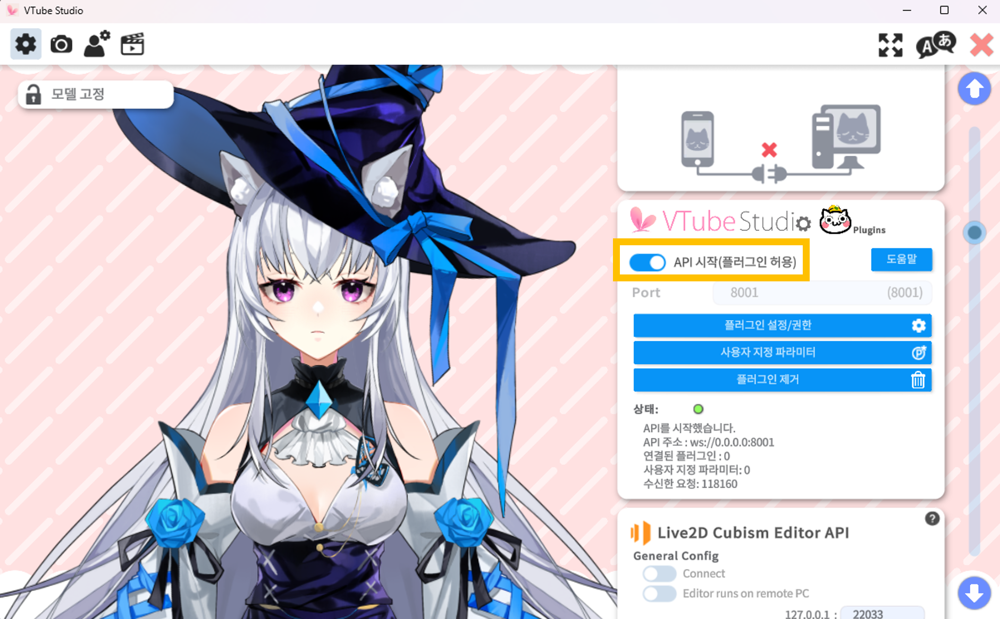</td>
    <td>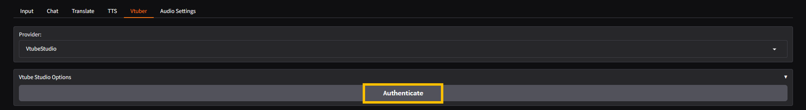</td>
  </tr>
</table>

만약 VTube Studio와 연결되지 않는다면 아래 경로의 `token.txt` 파일을 삭제한 뒤 웹 GUI에서 다시 **Authenticate**를 눌러주세요.

```bat
LAV_v0.2\plugins\VtubeStudio\token.txt
```

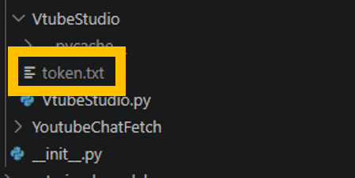

---

## TTS 출력 실패

오디오 장치가 변경되었거나 분리되었을 수 있습니다.

출력 장치를 다시 선택한 뒤 프로그램을 재시작하세요.

---

## 마이크 인식 실패

아래 항목을 확인하세요.

* Windows 마이크 권한
* 올바른 입력 장치 선택 여부
* 마이크 음소거 여부

---

## 유튜브 채팅 연동

유튜브 방송 주소에서 `youtube_video_id`를 복사합니다.

예시:

```text
https://www.youtube.com/watch?v=casNSKwGil4
```

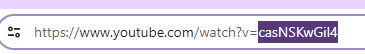

Video ID:

```text
casNSKwGil4
```

`youtube_video_id`에 입력한 뒤 Start Fetching Chat을 누릅니다.

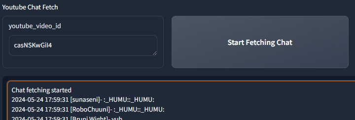

---
