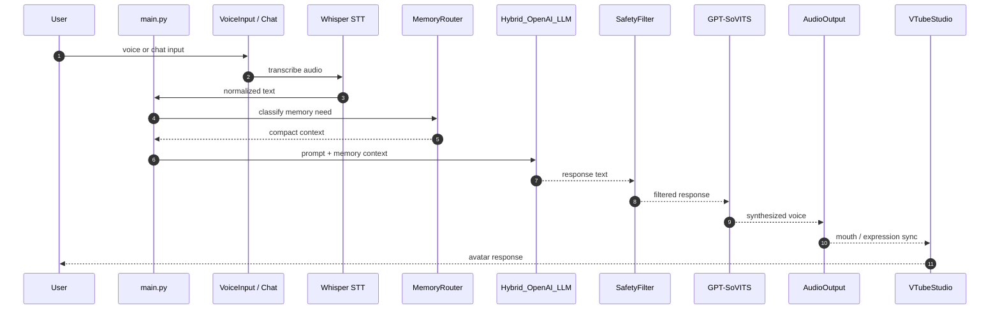
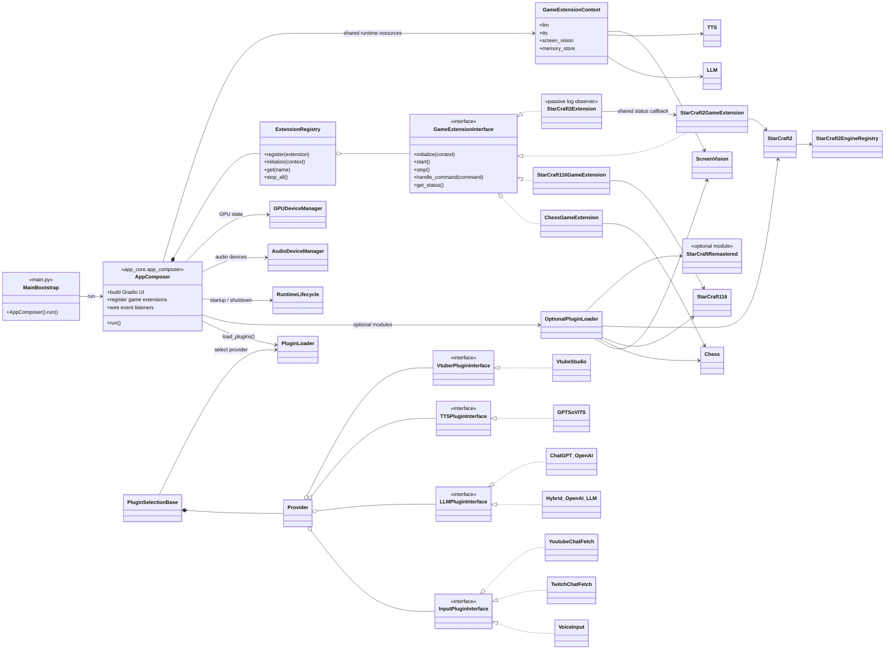
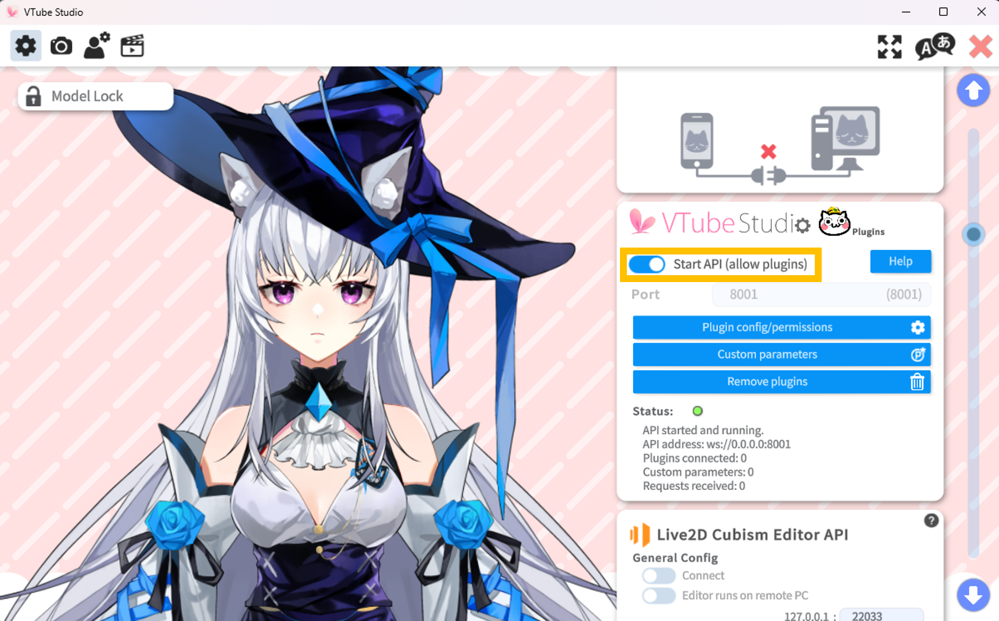

# LAVI (Live AI Vtuber Interface)

---

<h1 align="center">
  <a href="./README_EN.md">English</a> |
  <a href="./README.md"><strong>한국어</strong></a>
</h1>

---

A locally operated AI VTuber project focused on Korean voice interaction, local LLMs, GPT-SoVITS, and VTube Studio integration.

This project is based on the original LocalAIVtuber project and heavily modified for better Korean support and stability.

---

## Project Object-Oriented UML (Unified Modeling Language) Diagrams

<!-- #20260704_kpopmodder: Keep README architecture diagrams as Mermaid so GitHub renders them directly without regenerating PNG files. -->




[Mermaid Object-Oriented Diagram Source](docs/object_oriented_diagram_EN.md)

> LAVI (Live AI Vtuber Interface) is a Windows-based AI VTuber project built on a plugin-based architecture that connects input sources, STT/observation, LLM, Safety Filter, TTS, and VTube Studio output.

---

## Features

* Korean Speech Recognition (Transformers Whisper / PyTorch)
* Local Transformers_LLM remains only as a legacy stub and is currently disabled/not recommended <!-- #20260629_kpopmodder: Transformers_LLM files remain, but runtime classes are disabled. -->
* Azure OpenAI support
* GPT-SoVITS support
* VTube Studio integration
* Safety Filter
* Audio Device Manager
* Plugin-based architecture
* Gradio Web UI
* Chess plugin (LC0 / BT4-it332 local engine)
* StarCraft 1.16 plugin (BWAPI 4.4.0 / Stardust, BWAPI 4.2.0 / Monster / JSONL game events)

---

<table>
  <tr>
    <td></td>
    <td></td>
  </tr>
</table>

---

# Installation (Windows)

If you encounter any bugs or have suggestions for improvements, feel free to contact me at [jaewoopark96@gmail.com](mailto:jaewoopark96@gmail.com).

---

## 1. Install Python 3.14

Install Python 3.14.

https://www.python.org/downloads/

Check:

```bat
py -3.14 --version
```

---

## 2. Install Visual Studio C++

Some Windows Python packages may be installed from source instead of prebuilt wheels, so installing Visual Studio C++ Build Tools is recommended.

https://visualstudio.microsoft.com/downloads/

The recommended version is **Visual Studio 2026 C++ Build Tools**.

During installation, select:

```text
Desktop development with C++
```

Recommended components:

```text
MSVC C++ x64/x86 build tools
Windows 10/11 SDK
C++ CMake tools for Windows
```

Also open the **Individual components** tab, search for `v141`, and select:


```text
MSVC v141 - VS 2017 C++ x64/x86 build tools (v14.16)
MSVC v141 - VS 2017 C++ x64/x86 Spectre-mitigated libs (v14.16)
```

ARM/ARM64, MFC/ATL, and Windows XP support are not required for normal project use. Add them only if a specific source build error asks for them.

> For normal execution, you do not need to open the Visual Studio Developer Command Prompt every time.
> Use the `vcvars64.bat` environment only when a source build error occurs.


---

## 3. Check NVIDIA Driver / CUDA

This project uses the PyTorch CUDA 13.0 wheel.

CUDA Toolkit 13.3.1 download archive:

https://developer.nvidia.com/cuda-13-3-0-download-archive?target_os=Windows&target_arch=x86_64&target_version=11&target_type=exe_local

For normal execution, the CUDA Toolkit `nvcc.exe` is not required.
However, to use an NVIDIA GPU, the NVIDIA driver and PyTorch CUDA must work correctly.

Check the NVIDIA driver:

```bat
nvidia-smi
```

After installing PyTorch, check CUDA availability:

```bat
python -c "import torch; print(torch.cuda.is_available()); print(torch.version.cuda); print(torch.cuda.get_device_name(0))"
```

If CUDA Toolkit is installed separately, you can check whether `nvcc.exe` is available:

```bat
where nvcc
```

If multiple CUDA Toolkits are installed, it is recommended to prioritize the CUDA Toolkit 13.3.1 path in the LAV terminal.

```bat
set "CUDA_PATH=C:\Program Files\NVIDIA GPU Computing Toolkit\CUDA\v13.3"
set "PATH=%CUDA_PATH%\bin;%PATH%"
```

> If `cudnn64_9.dll` is not found by `where`, no action is required as long as PyTorch CUDA works correctly.
> PyTorch is installed using the `cu130` wheel in step 6.

---

## 4. Create virtual environment

Open Command Prompt in the project folder.

```bat
py -3.14 -m venv venv
call venv\Scripts\activate.bat
```

If `(venv)` appears, it is working.

For the minimal reproducible Windows install path, use the project-local installer instead of `run.bat`:

```powershell
powershell -NoProfile -ExecutionPolicy Bypass -File .\scripts\install_windows.ps1 -Profile Core -Accelerator CPU
```

Supported installer profiles:

| Profile | Accelerator | Lock file |
|---|---|---|
| Core | CPU | `requirements/locks/windows-py314-core-cpu.txt` |
| Voice | cu130 | `requirements/locks/windows-py314-voice-cu130.txt` |
| Vision | cu130 | `requirements/locks/windows-py314-vision-cu130.txt` |
| Games | CPU | `requirements/locks/windows-py314-games-cpu.txt` |
| Full | cu130 | `requirements/locks/windows-py314-full-cu130.txt` |

For the existing full CUDA 13.0 runtime path, use this command. Omitting both parameters keeps this Full/cu130 path as the compatibility default.

```powershell
powershell -NoProfile -ExecutionPolicy Bypass -File .\scripts\install_windows.ps1 -Profile Full -Accelerator cu130
```

`run.bat` is only a runtime launcher. It uses `venv\Scripts\python.exe`, runs `scripts\preflight.py`, and exits non-zero when the venv or preflight is not ready.

---

## 5. Install base tools

Update the installation tools to the latest versions.

```bat
python -m pip --version
```

CMake may be required when some packages are installed from source instead of prebuilt wheels.
Run the following command only if a build error occurs.

```bat
python -m pip install cmake
```

---

## 6. Install PyTorch (CUDA 13.0)

For normal setup, prefer `install_windows.ps1 -Profile Full -Accelerator cu130`. The command below is for manual recovery or troubleshooting.

```bat
python -m pip install torch==2.13.0+cu130 torchvision==0.28.0+cu130 torchaudio==2.11.0+cu130 --index-url https://download.pytorch.org/whl/cu130
```

---

## 7. Install required manual package

```bat
python -m pip install git+https://github.com/chameleon-ai/LangSegment-0.3.5-backup.git
```

---

## 8. Install requirements.txt

For normal setup, prefer `install_windows.ps1`. The command below is a manual compatibility entrypoint.

```bat
python -m pip install -r requirements.txt
```

---

## 9. Download unidic

```bat
python -m unidic download
```

---

## 10. Download Whisper Model

If your environment requires a Hugging Face token, set it in the current terminal first.
Do not save the real token in README files.

```bat
set "HF_TOKEN=<YOUR_HUGGING_FACE_TOKEN>"
```

Verify that the token is available.

```bat
python -c "import os; t=os.getenv('HF_TOKEN'); print('HF_TOKEN exists:', bool(t)); print(t[:8] + '...' if t else 'NONE')"
```

<!-- #20260707_kpopmodder: VoiceInput STT uses Transformers Whisper/PyTorch. -->
VoiceInput uses the Transformers Whisper `openai/whisper-large-v3-turbo` model as the default STT engine.
You can pre-download the model and verify that it loads through PyTorch with the following command.

```bat
python -c "import torch; from transformers import AutoModelForSpeechSeq2Seq, AutoProcessor; model_id='openai/whisper-large-v3-turbo'; device='cuda:0' if torch.cuda.is_available() else 'cpu'; dtype=torch.float16 if device.startswith('cuda') else torch.float32; AutoProcessor.from_pretrained(model_id); AutoModelForSpeechSeq2Seq.from_pretrained(model_id, torch_dtype=dtype).to(device); print('Transformers Whisper ready:', model_id, device, dtype)"
```

Example VoiceInput STT configuration:

```json
{
  "VoiceInput": {
    "stt_backend": "transformers_whisper",
    "whisper_model": "openai/whisper-large-v3-turbo",
    "language": "ko",
    "torch_dtype": "auto"
  }
}
```

---

## 11. Download ScreenVision Model

ScreenVision uses the `Qwen/Qwen2.5-VL-3B-Instruct` model.
The commands below are for Windows CMD.

```bat
call venv\Scripts\activate.bat

set "HF_TOKEN=<YOUR_HUGGING_FACE_TOKEN>"
set HF_HUB_DISABLE_SYMLINKS_WARNING=1
set HF_XET_HIGH_PERFORMANCE=1

venv\Scripts\hf.exe download Qwen/Qwen2.5-VL-3B-Instruct --cache-dir plugins\ScreenVision\model --max-workers 4
```

---

## 12. Dual GPU Distribution Settings

The default GPU placement config is here:

```text
LAVI\config\gpu_device_config.json
```

The default layout is:

<!-- #20260627_kpopmodder: Match GPU docs to config/gpu_device_config.json. -->

```text
default_device: cuda:0
VoiceInput: cuda:0
ScreenVision: device_map auto
GPTSoVITS: no CUDA_VISIBLE_DEVICES override by default
```

> Transformers_LLM is a legacy plugin that is not recommended for current use. Its folder and commented-out code traces remain, but runtime class/client/settings are disabled and `modules.json` sets it to `false`. Do not include it in the default GPU placement.
> The example config avoids pinning everything to `cuda:1`. Copy it to `config\gpu_device_config.json` and adjust only for the local machine.

Do not run the LAV main process with `CUDA_VISIBLE_DEVICES=0`.
If you limit the main LAV process that way, other GPUs will not be visible to LAV.
The main LAV process must be able to see the GPUs you want to use, while each plugin selects its GPU through the `device` or `device_map` values in `gpu_device_config.json`.

GPT-SoVITS is launched automatically by LAV as a child process.
To pin only GPT-SoVITS to a separate GPU, use the `cuda_visible_devices` value in this file:

```text
LAVI\plugins\GPTSoVITS\config\gpt_sovits_config.json
```

Keep `gpt_sovits_config.json` local. Commit only `gpt_sovits_config.example.json`.
You can set the GPT-SoVITS install path with `GPT_SOVITS_ROOT` instead of writing a local path into the config file:

```bat
set GPT_SOVITS_ROOT=C:\Vtuber_Souorce_Code\GPT-SoVITS-v2pro-20250604-nvidia50
```

When `cuda_visible_devices` is `"1"`, the GPT-SoVITS child process receives `CUDA_VISIBLE_DEVICES=1`.
Inside that GPT-SoVITS process, physical GPU 1, the RTX 5060 Ti, will appear as `cuda:0`. This is normal.

If an old GPT-SoVITS `api_v2.py` server is already running, the new `cuda_visible_devices` setting will not apply.
After changing the setting, stop the old GPT-SoVITS process and restart LAV.

Stop the existing GPT-SoVITS server:

```powershell
powershell -NoProfile -Command "Get-CimInstance Win32_Process | Where-Object { $_.CommandLine -like '*GPT-SoVITS*api_v2.py*' } | ForEach-Object { Stop-Process -Id $_.ProcessId -Force }"
```

Check GPU detection:

```bat
python -c "import torch; print(torch.cuda.device_count()); [print(i, torch.cuda.get_device_name(i)) for i in range(torch.cuda.device_count())]"
```

Check running GPU processes:

```bat
nvidia-smi
```

Check the LAV / GPT-SoVITS Python processes:

```powershell
powershell -NoProfile -Command "Get-CimInstance Win32_Process | Where-Object { $_.CommandLine -like '*LAVI*main.py*' -or $_.CommandLine -like '*GPT-SoVITS*api_v2.py*' } | Select-Object ProcessId,ExecutablePath,CommandLine | Format-List"
```

On startup, check for logs like these:

<!-- #20260627_kpopmodder: Expected startup log reflects portable cuda:0/default GPU placement. -->

```text
[GPUDeviceManager] detected: 0 = NVIDIA GeForce RTX 5070 Ti
[GPUDeviceManager] detected: 1 = NVIDIA GeForce RTX 5060 Ti
[GPUDeviceManager] VoiceInput -> cuda:0
[GPUDeviceManager] ScreenVision -> cuda:0
[GPUDeviceManager] GPTSoVITS -> CUDA_VISIBLE_DEVICES=1
[ScreenVision] resolved device=cuda:0
[VoiceInput] resolved device=cuda:0
[GPTSoVITS_TTS] CUDA_VISIBLE_DEVICES=1
```

---

## 12.1. Install LC0 / BT4-it332 for the Chess Plugin

The Chess plugin runs inside the Gradio tab as a local iframe chessboard.
The chess engine is not implemented in Python. LAV launches a separately installed LC0 / Leela Chess Zero `lc0.exe` process and talks to it through the UCI protocol.

Do not put `lc0.exe` or the BT4-it332 weight file in this repository.
Only reference their local paths from `config\chess_config.json`.

### 1. Check the Python package

`requirements.txt` includes the minimal Python package needed by the Chess plugin: `chess`.
`gradio-chessboard` is not used because this project must keep Gradio 6.18.0.

```bat
venv\Scripts\python.exe -m pip show chess
```

### 2. Download LC0 Windows NVIDIA CUDA 12

Download the Windows NVIDIA CUDA 12 build from the official LC0 GitHub release.

```text
https://github.com/LeelaChessZero/lc0/releases/tag/v0.32.1
```

Direct download:

```text
https://github.com/LeelaChessZero/lc0/releases/download/v0.32.1/lc0-v0.32.1-windows-gpu-nvidia-cuda12.zip
```

Example extraction path:

```text
C:\Vtuber_Souorce_Code\lc0-v0.32.1-windows-gpu-nvidia-cuda12
```

After extracting, this file must exist:

```bat
dir C:\Vtuber_Souorce_Code\lc0-v0.32.1-windows-gpu-nvidia-cuda12\lc0.exe
```

### 3. Download the BT4-it332 weight

On the LCZero Best Networks page, the first recommended network is `BT4-it332`.
The current LAV Chess example config uses this network.

```text
https://lczero.org/play/networks/bestnets/
```

Direct download:

```text
https://storage.lczero.org/files/networks-contrib/BT4-1024x15x32h-swa-6147500-policytune-332.pb.gz
```

Example save path:

```text
C:\Vtuber_Souorce_Code\lc0-v0.32.1-windows-gpu-nvidia-cuda12\BT4-1024x15x32h-swa-6147500-policytune-332.pb.gz
```

Check after downloading:

```bat
dir C:\Vtuber_Souorce_Code\lc0-v0.32.1-windows-gpu-nvidia-cuda12\BT4-1024x15x32h-swa-6147500-policytune-332.pb.gz
```

### 4. Create the local Chess config

`config\chess_config.json` is the default Chess config file.
If it is missing, copy the example file and edit the real LC0 and weight paths.

```bat
copy config\chess_config.example.json config\chess_config.json
notepad config\chess_config.json
```

Example:

```json
{
  "lc0_path": "C:\\Vtuber_Souorce_Code\\lc0-v0.32.1-windows-gpu-nvidia-cuda12\\lc0.exe",
  "weights_path": "C:\\Vtuber_Souorce_Code\\lc0-v0.32.1-windows-gpu-nvidia-cuda12\\BT4-1024x15x32h-swa-6147500-policytune-332.pb.gz",
  "backend": "cuda",
  "cuda_visible_devices": "",
  "movetime_ms": 1000,
  "auto_start_engine": false,
  "human_side": "white",
  "ai_side": "black",
  "web_server_host": "127.0.0.1",
  "web_server_port": 8790,
  "init_timeout_sec": 15,
  "move_timeout_sec": 10
}
```

When `cuda_visible_devices` is empty, LC0 uses the GPUs visible to the current LAV process.
Set it to `"0"` or `"1"` only if you want to restrict LC0 to a specific GPU.

### 5. Enable the Chess module

LAV imports the Chess plugin and starts the local Chess web server only when `Chess` is `true` in `modules.json`.
If you do not use Chess, keep it `false` so the existing LAV runtime is unaffected.

```json
"Chess": true
```

### 6. Runtime check

Start LAV and open the `Chess` tab in Gradio.

```bat
python main.py
```

Check this flow in the Chess tab:

```text
1. New Game
2. Start LC0
3. Move a white piece directly on the board
4. LC0 automatically replies with a black move
```

If `Engine Status` is `running` and `Engine Log` shows `bestmove`, LC0 is connected correctly.
If you see `lc0.exe not found` or `weights file not found`, check the paths in `chess_config.json`.

---

## 12.2. Install StarCraft 1.16.1 / BWAPI / Stardust / Monster

The StarCraft 1.16 plugin does not include StarCraft, BWAPI, Chaoslauncher, Stardust, or any other third-party binaries in this repository.
It is an optional integration that validates local paths, launches Chaoslauncher, and consumes BWAPI JSONL events for LAV commentary.

The current local setup uses this folder layout as an example.

```text
C:\Vtuber_Souorce_Code\StarCraft_1.16
+-- StarCraft
|   +-- StarCraft.exe
|   +-- bwapi-data
|       +-- bwapi.ini
|       +-- AI
|           +-- Stardust.dll
|           +-- LAVEventExporter.dll
|           +-- LAVEventExporter.ini
+-- BWAPI_4_4_0
    +-- Release_Binary
        +-- Chaoslauncher
            +-- Chaoslauncher.exe
```

### 1. Install StarCraft 1.16.1

Use a legitimate local StarCraft 1.16.1 installation that you own.
The recommended example path for LAV is:

```text
C:\Vtuber_Souorce_Code\StarCraft_1.16\StarCraft
```

After installation, this file must exist:

```bat
dir C:\Vtuber_Souorce_Code\StarCraft_1.16\StarCraft\StarCraft.exe
```

### 2. Install BWAPI 4.4.0 / Chaoslauncher

Extract the BWAPI 4.4.0 Release Binary next to the StarCraft 1.16 folder.
The current LAV example config uses this Chaoslauncher path:

```text
C:\Vtuber_Souorce_Code\StarCraft_1.16\BWAPI_4_4_0\Release_Binary\Chaoslauncher\Chaoslauncher.exe
```

Check after installation:

```bat
dir C:\Vtuber_Souorce_Code\StarCraft_1.16\BWAPI_4_4_0\Release_Binary\Chaoslauncher\Chaoslauncher.exe
dir C:\Vtuber_Souorce_Code\StarCraft_1.16\StarCraft\bwapi-data
```

In Chaoslauncher, check at least these plugins before pressing `Start`.

```text
BWAPI 4.4.0 Injector [RELEASE]
W-MODE 1.02
```

If `SeDebugPrivilege` or injection problems occur, keep `chaoslauncher_run_as_admin` set to `true` in the LAV StarCraft 1.16 config, launch through `Launch BWAPI Profile`, and approve the UAC prompt.

### 3. Install Stardust

Stardust is used as a BWAPI AIModule DLL.
Place `Stardust.dll` in the StarCraft BWAPI AI folder.

```text
C:\Vtuber_Souorce_Code\StarCraft_1.16\StarCraft\bwapi-data\AI\Stardust.dll
```

To test Stardust directly, set `bwapi-data\bwapi.ini` like this:

```ini
ai     = bwapi-data/AI/Stardust.dll
ai_dbg = bwapi-data/AI/Stardust.dll
race   = Protoss
```

To enable LAV's in-game commentary, load `LAVEventExporter.dll` as the BWAPI AI and let the exporter wrap Stardust internally.

```ini
ai     = bwapi-data/AI/LAVEventExporter.dll
ai_dbg = bwapi-data/AI/LAVEventExporter.dll
race   = Protoss
```

Example `LAVEventExporter.ini`:

```ini
wrapped_ai=Stardust.dll
events_path=C:\Vtuber_Souorce_Code\LAVI\logs\starcraft116_game_events.jsonl
snapshot_interval_frames=144
combat_cooldown_frames=96
supply_block_cooldown_frames=240
```

With this setup, BWAPI loads `LAVEventExporter.dll`; the exporter loads `Stardust.dll` again, so Stardust still controls the units.
At the same time, LAV can read `starcraft116_game_events.jsonl` and generate OpenAI/TTS reactions.

### 3.1. Install Monster with BWAPI 4.2.0

Monster is an EXE BWAPI client bot, so it uses a different setup from Stardust.
Use BWAPI 4.2.0 for the Monster profile.

1. Download BWAPI 4.2.0 from:

https://github.com/bwapi/bwapi/releases/tag/v4.2.0

Install this release asset:

```text
BWAPI_Setup.VS.15.7.3.exe
```

The installed folder can stay where the installer places it, but moving it under the StarCraft 1.16 workspace is recommended.

```text
C:\Vtuber_Souorce_Code\StarCraft_1.16\BWAPI_420
```

2. Download Monster from SSCAIT:

https://sscaitournament.com/index.php?action=botDetails&bot=Monster

Use the binary download:

https://sscaitournament.com/bot_binary.php?bot=Monster

Example extracted Monster folder:

```text
C:\Vtuber_Souorce_Code\StarCraft_1.16\Monster
```

3. Monster must be able to resolve `sc.dat` and `fp.dat` at runtime.
The original `Monster.exe` from SSCAIT may not find those files in the LAV folder layout, so the current LAV Monster setup uses a patched `Monster.exe` whose internal paths were forcibly adjusted with ChatGPT so it can recognize `sc.dat` and `fp.dat`.
Always keep a backup of the original `Monster.exe` before patching.

4. Copy `run_monster_robust_log.bat` into the folder that contains
`Monster.exe`.
This batch file restarts Monster after a game/disconnect and writes
`monster_log.txt`.

```bat
copy C:\Vtuber_Souorce_Code\LAVI\plugins\StarCraft116\run_monster_robust_log.bat C:\Vtuber_Souorce_Code\StarCraft_1.16\Monster\run_monster_robust_log.bat
```

The copied `.bat` file must sit beside `Monster.exe`.

5. Install the LAV BWAPI proxy DLL.
Back up the original StarCraft-side BWAPI DLL first:

```bat
copy C:\Vtuber_Souorce_Code\StarCraft_1.16\StarCraft\bwapi-data\BWAPI.dll C:\Vtuber_Souorce_Code\StarCraft_1.16\StarCraft\bwapi-data\BWAPI_real.dll
```

Then overwrite it with the LAV proxy DLL:

```bat
copy C:\Vtuber_Souorce_Code\LAVI\plugins\StarCraft116\BWAPI.dll C:\Vtuber_Souorce_Code\StarCraft_1.16\StarCraft\bwapi-data\BWAPI.dll
```

`plugins\StarCraft116\BWAPI.dll` is the LAV proxy DLL.
It loads `BWAPI_real.dll` internally and writes Monster game-state events to:

```text
C:\Vtuber_Souorce_Code\StarCraft_1.16\StarCraft\bwapi-data\bwapi_proxy_events.jsonl
```

6. In `starcraft116_config.json`, select the Monster profile and enable BWAPI proxy events.

```json
"active_profile": "monster",
"bwapi_proxy_events_enabled": true,
"bwapi_proxy_events_tts_enabled": true,
"bwapi_proxy_events_path": "C:\\Vtuber_Souorce_Code\\StarCraft_1.16\\StarCraft\\bwapi-data\\bwapi_proxy_events.jsonl"
```

Useful runtime proof:

```text
BWAPI proxy shared-memory game-state poller started.
Mapped BWAPI shared memory read-only for pid=...
[StarCraft116BWAPIProxyEvents] event: type=...
[StarCraft116Reaction] TTS: ...
```

### 4. Enable the LAV module

In `modules.json`, enable the StarCraft 1.16 plugin and disable the Remastered plugin.

```json
"StarCraft116": true,
"StarCraftRemastered": false
```

### 5. Create the local StarCraft116 config

`starcraft116_config.json` is a local path config.
Copy the example file and edit it to match your real installation paths.

```bat
copy config\starcraft116_config.example.json config\starcraft116_config.json
notepad config\starcraft116_config.json
```

The core Stardust profile looks like this.
In JSON, Windows `\` path separators must be written as `\\`.

```json
{
  "enabled": true,
  "active_profile": "stardust",
  "auto_launch": false,
  "write_state_log": true,
  "state_log_path": "logs\\starcraft116_state.jsonl",
  "bwapi_event_exporter_enabled": true,
  "profiles": {
    "stardust": {
      "display_name": "Stardust",
      "starcraft_116_dir": "C:\\Vtuber_Souorce_Code\\StarCraft_1.16\\StarCraft",
      "bwapi_data_dir": "C:\\Vtuber_Souorce_Code\\StarCraft_1.16\\StarCraft\\bwapi-data",
      "bot_binary_path": "C:\\Vtuber_Souorce_Code\\StarCraft_1.16\\StarCraft\\bwapi-data\\AI\\Stardust.dll",
      "start_chaoslauncher": true,
      "chaoslauncher_path": "C:\\Vtuber_Souorce_Code\\StarCraft_1.16\\BWAPI_4_4_0\\Release_Binary\\Chaoslauncher\\Chaoslauncher.exe",
      "chaoslauncher_arguments": [],
      "chaoslauncher_working_dir": "C:\\Vtuber_Souorce_Code\\StarCraft_1.16\\BWAPI_4_4_0\\Release_Binary\\Chaoslauncher",
      "chaoslauncher_run_as_admin": true,
      "start_starcraft": false,
      "starcraft_exe_path": "C:\\Vtuber_Souorce_Code\\StarCraft_1.16\\StarCraft\\StarCraft.exe",
      "starcraft_arguments": [],
      "starcraft_working_dir": "C:\\Vtuber_Souorce_Code\\StarCraft_1.16\\StarCraft",
      "starcraft_run_as_admin": false
    }
  }
}
```

When moving the installation, these are the main keys to update:

```text
profiles.stardust.starcraft_116_dir
profiles.stardust.bwapi_data_dir
profiles.stardust.bot_binary_path
profiles.stardust.chaoslauncher_path
profiles.stardust.chaoslauncher_working_dir
profiles.stardust.starcraft_exe_path
profiles.stardust.starcraft_working_dir
```

### 6. Runtime check in LAV

Start LAV and open the `StarCraft 1.16` tab in Gradio.

```bat
python main.py
```

Recommended check flow:

```text
1. In Setup, set Install Folder to the StarCraft 1.16 install folder
2. Scan Folder
3. Generate Config, or edit the config manually
4. In Launch, click Validate Paths
5. Launch BWAPI Profile
6. Approve UAC
7. In Chaoslauncher, check BWAPI 4.4.0 Injector [RELEASE] + W-MODE 1.02
8. Press Start
```

When it works, logs should show this flow:

```text
[StarCraft116GameEvents] watching: ...\logs\starcraft116_game_events.jsonl
Loaded the AI Module "bwapi-data\AI\LAVEventExporter.dll"
BWAPI 4.4.0 ... now live using "LAVEventExporter.dll"
[StarCraft116Reaction] game_event: type=...
[StarCraft116Reaction] TTS: ...
```

For deeper plugin-specific details, see:

```text
plugins\StarCraft116\README.md
plugins\StarCraft116\bwapi_event_exporter\README.md
```

---

## 12.3. StarCraft II / Ares-sc2 / ProBots setup notes

<!-- #20260713_kpopmodder: Document the external StarCraft II resources and local path fields required by the StarCraft2 plugin. -->

The StarCraft2 plugin can work with several different bot/runtime paths. These paths are local to each PC, so update the Gradio fields and `config\starcraft2_config.json` before running a match.

Useful Ares-sc2 resources:

```text
Ares-sc2 framework:
https://github.com/AresSC2/ares-sc2/

Ares-sc2 bot template:
https://github.com/AresSC2/ares-sc2-bot-template

Official Ares-sc2 documentation:
https://aressc2.github.io/ares-sc2/index.html

Ares random example bot:
https://github.com/AresSC2/ares-random-example
```

`Ares-sc2` is for developing Python StarCraft II bots. New bot projects should usually start from `ares-sc2-bot-template`, then use the official docs and example bot for reference.

For the existing ProBots/Changeling workflow, download the ProBots vs Human App:

```text
https://versusai.net/how-to-play-against-the-probots/
```

The downloaded app contains the `Bots` folder used by LAV's StarCraft2 runtime. After downloading or moving it, update these paths in the StarCraft2 tab and in `config\starcraft2_config.json`:

```text
StarCraft II Path
SC2PATH
Map Name
Engine
External Exe Path
MicroMachine Exe Path
Ares-sc2 Script Path
External Jar Path
```

Common path fields in `config\starcraft2_config.json` that must be filled for the local machine:

```json
{
  "sc2aiapp_path": "C:\\path\\to\\SC2AIApp.exe",
  "probots_app_path": "C:\\path\\to\\SC2AIApp.exe",
  "starcraft2_exe_path": "C:\\Program Files (x86)\\StarCraft II\\Versions\\BaseXXXXX\\SC2_x64.exe",
  "starcraft2_install_path": "C:\\Program Files (x86)\\StarCraft II",
  "maps_path": "C:\\path\\to\\Maps",
  "ladder_proxy": {
    "executable_path": "C:\\path\\to\\LavHumanVsBot.exe",
    "working_directory": "C:\\path\\to\\StarCraft2\\runtime",
    "args": ["--bot", "changeling", "--map", "PersephoneLE.SC2Map"]
  },
  "ares_sc2": {
    "script_path": "C:\\path\\to\\ares-sc2-bot-template\\run.py"
  }
}
```

If `plugins\StarCraft2\runtime\jre\bin\java.exe` exists, the runtime already has a bundled Java executable and a separate system Java install is usually not required.

---

## 13. LLM provider default selection

Keeping both `ChatGPT_OpenAI` and `Hybrid_OpenAI_LLM` enabled is supported for comparison.
Transformers_LLM remains only as a disabled legacy stub, so do not select it as the current LLM provider.
The default LLM provider prefers the `PluginSelection` config instead of relying on plugin load order.
<!-- #20260627_kpopmodder: Make the default LLM provider explicit when both OpenAI plugins are enabled. -->

```ini
[PluginSelection]
default_language_model_provider = Hybrid_OpenAI_LLM
```

On startup, check the `[PluginSelection] category=language_model ...` log line for the selected provider and source.

---

## 14. MemoryRouter / derived memory settings

The default runtime keeps `raw_events` as the source of truth.
`MemoryRetriever` in `main.py` uses `use_derived_fallback=False` by default, and
`derived_memory.sqlite3` is only a reference/fallback index.

`prefer_derived_first` is experimental. When enabled, MemoryRouter can try the derived index before raw recall for queries that need memory.
ScreenVision observations can contain recognition mistakes or visual-summary hallucinations, so keep this option `false` for normal runtime use.
<!-- #20260627_kpopmodder: Document derived-first as an experimental recall mode. -->

Add only the needed keys to your local `config.ini`. Do not commit a `config.ini` that contains real API keys.

```ini
[MemoryRouter]
provider = rule
accuracy_first_raw_search = true
prefer_derived_first = false
allow_single_screen_observation_fallback = false
```

- `provider=rule`: default. It does not send user input to an external API.
- `provider=openai`: uses the OpenAI router provider. Part of the user input may be sent to the OpenAI API.
- The OpenAI router is used only when local `config.ini` explicitly sets `provider=openai`.
- `accuracy_first_raw_search=true`: recall scans the full `raw_events` store before accepting a fast recent hit. This is slower, but keeps older DB-backed memories available.
- `prefer_derived_first=true`: experimental derived-first recall. Raw recall remains as fallback, but derived rows may be injected first.
- `allow_single_screen_observation_fallback=true`: allows a single `screen_observation` row with `source_event_count=1` and `duplicate_count=0` to be used as fallback. The default is `false`.
- The default derived fallback condition is `source_event_count >= 2` or `duplicate_count >= 1`.
- When a single screen row is explicitly allowed and recalled, `MemoryRecallTop` logs `source_event_count` and `duplicate_count`.

---

# GPT-SoVITS Server Required

To use GPT-SoVITS, you must install and run the GPT-SoVITS server separately.

GPT-SoVITS Official Repository:
https://github.com/RVC-Boss/GPT-SoVITS

Without the server, GPT-SoVITS TTS will not work.

You must also manually specify the GPT-SoVITS server folder path in the following config file:

```text
LAVI\plugins\GPTSoVITS\config\gpt_sovits_config.json
```

<table>
  <tr>
    <td></td>
    <td></td>
  </tr>
</table>

---

# Start Program

This project can be run from either **Windows Command Prompt or PowerShell**.

The path `C:\Vtuber_Souorce_Code\LAVI` below is an example.
Replace it with the actual path to your project.

CMD and PowerShell use different syntax for environment variables and virtual environment activation.
Use the commands for your current terminal.

---

## Basic Run

CUDA environment variables are not required for the CPU build or a basic run.

### CMD

```bat
cd /d C:\Vtuber_Souorce_Code\LAVI

call venv\Scripts\activate.bat

python main.py
```

### PowerShell

```powershell
Set-Location "C:\Vtuber_Souorce_Code\LAVI"

.\venv\Scripts\Activate.ps1

python main.py
```

The browser opens automatically.
If you need to open the UI manually, use the default address below.
If the port is already in use, LAVI automatically moves to the next port such as 47861 or 47862.

```text
http://127.0.0.1:47860
```

---

## Optional Launcher: Create run_lav.cmd

`run_lav.cmd` is not included in the repository.
To avoid typing the commands every time, you can create the following file in the project root.

```text
run_lav.cmd
```

Contents:

```bat
@echo off
cd /d "%~dp0"

call venv\Scripts\activate.bat

python main.py

pause
```

After that, double-click `run_lav.cmd` or run:

```bat
cd /d C:\Vtuber_Souorce_Code\LAVI
run_lav.cmd
```

---

## Developer Run: run_lav_dev.cmd

`run_lav_dev.cmd` is not required for normal execution.

If this file remains in the repository, treat it as an auxiliary script for cases where the Visual Studio C++ build environment must be checked.
For normal execution, use the following commands:

```bat
cd /d C:\Vtuber_Souorce_Code\LAVI
call venv\Scripts\activate.bat
python main.py
```

Summary:

```text
Basic run:
Activate the virtual environment, then run python main.py

Optional launcher:
User-created run_lav.cmd

Developer launcher:
Not required for normal execution
```

---

# requirements files

`requirements.txt` is now an entrypoint that includes grouped runtime requirements:

```text
requirements/base.txt
requirements/windows.txt
requirements/voice.txt
requirements/vision.txt
requirements/games.txt
requirements/dev.txt
```

The known-good frozen environment snapshot remains in `requirements_full.txt`.
The CUDA 13.0 PyTorch wheel pins are in `requirements/constraints-windows-py314-cu130.txt` and must be installed with the dedicated `cu130` index URL.
The canonical Windows installer uses committed locks under `requirements/locks/`.
Profile source files live under `requirements/profiles/`; accelerator wheel pins live under `requirements/accelerators/`.

---

# Current Focus

* Stability first
* Prevent crashes
* Better TTS playback
* Better interrupt handling
* Better microphone filtering
* Better maintainability

---

# Game Extension Addition Guide

* New games must be added only as `GameExtensionInterface` implementations.
* Keep game-specific logic separated from shared execution/observation/command layers and register each extension by name (`starcraft116`, `chess`, etc.) through `ExtensionRegistry`.
* Preserve existing behavior during migration: keep direct ScreenVision calls working while progressively exposing the new event path and providing compatibility shims where needed.

# TODO

* Refactor TTS.py
* Refactor voiceInput.py
* Refactor GPTSoVITS.py
* Improve installation process
* Improve documentation

---

# Credits

Original base project:

LocalAIVtuber by Xiaohei

https://github.com/0Xiaohei0/LocalAIVtuber

This repository is a modified fork for Korean AI VTuber experiments.

---

# FAQ

## GPT-SoVITS model missing

Check that the required model files exist in:

```text
plugins\GPTSoVITS\gpt_sovits_ckpt_dir
plugins\GPTSoVITS\gpt_sovits_model_dir
```

---

## GPT-SoVITS server connection failed

Check:

* GPT-SoVITS server is running
* API address is correct
* Port is open
* Firewall is not blocking
* GPT-SoVITS server path in `gpt_sovits_config.json`

---

## VTube Studio Integration

To connect VTube Studio to LAVI, you must allow the API plugin when VTube Studio asks for permission.

<table>
  <tr>
    <td></td>
    <td></td>
  </tr>
</table>

If VTube Studio fails to connect with LAVI, delete the `token.txt` file below and click **Authenticate** again in the Web GUI.

```bat
LAVI\plugins\VtubeStudio\token.txt
```


---

## TTS playback failed

This is usually caused by a disconnected or changed audio output device.

Re-select the output device and restart the program.

---

## Microphone not detected

Check:

* Windows microphone permissions
* Correct input device selected
* Microphone is not muted

---

## YouTube Chat Fetch

Copy `youtube_video_id` from the stream URL.

Example:

```text
https://www.youtube.com/watch?v=casNSKwGil4
```


Video ID:

```text
casNSKwGil4
```

Paste it into `youtube_video_id`, then press Start Fetching Chat.


