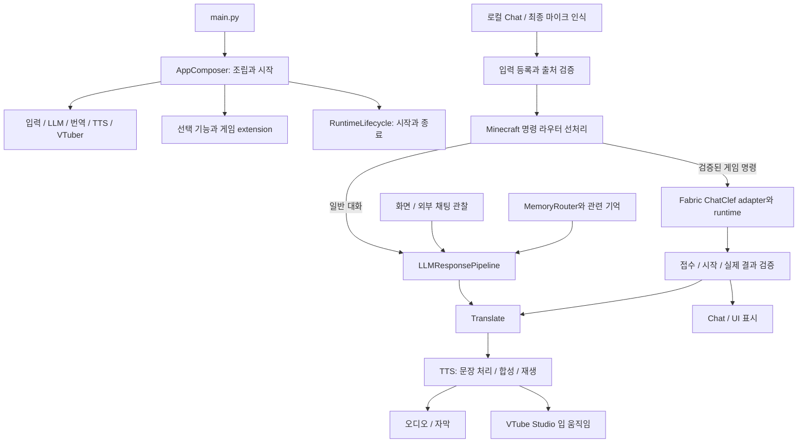

<!-- #20260915_kpopmodder: Record source-backed project understanding for future account/session handoffs; documentation only. -->

# LAVI 프로젝트 이해와 인수인계 — 2026-09-15

## 1. 이 문서의 목적과 범위

계정·세션 전환 후 프로젝트의 구조, 결정 이유와 미완료 작업을 다시 파악하기 위한 기록이다.
사용자의 최신 요청은 **코드 수정 없이 프로젝트 이해만 진행하고, 필요하면 /docs 아래 새 문서만 추가**하는 것이다.

- 저장소: `C:\Vtuber_Souorce_Code\LAVI`.
- 분석 기준 HEAD: `b3a6c9d206da52bbfb11260787d873cb260be17f`.
- branch: `minecraft-plugin-fix/alto-clef-infinite-loop`.
- 분석 시작과 문서 생성 직전: staged/unstaged/untracked 변경 없음.
- 원격 최신성: UNKNOWN. 로컬 tracking ref와의 표시만 확인했고 원격 조회는 하지 않았다.
- 조사 방법: 파일 목록, 주요 소스·호출자·기능 문서·테스트 구성·최근 Git 기록의 읽기 전용 대조.
- 조사 범위: 시작·설정·플러그인 조립, 입력/LLM/기억/출력, 게임별 경계, 검증 체계와 최근 상태.
- 전체 소스 줄·vendor 엔진·binary의 정밀 감사 또는 현재 실행 환경의 정상 동작 인증은 아니다.
- 최종 산출물은 이 새 문서와 같은 폴더의 README.md다. 운영 코드·테스트·설정·AGENTS.md는 변경하지 않는다.
- 앱 import·테스트·빌드·배포·게임 실행·캐시 변경·커밋·푸시는 수행하지 않았다.
- 문서에는 실행 의미가 없어 동반 runtime 로그는 NOT_APPLICABLE이다.

`memory_core`는 **LAVI 캐릭터의 앱 대화 기억**이다. 개발 에이전트의 과거 대화·요구사항·승인 이력과는 별개다.
이 문서는 다음 세션이 읽을 수 있는 근거이며, 계정 전환 후 자동으로 읽혔거나 모든 맥락이 복원됐다는 보장은 아니다.

## 2. 다음 계정·세션의 재진입 순서

1. 현재 [AGENTS.md](../../../AGENTS.md)와 사용자 요청을 읽는다. 이 문서는 안전 규칙을 대체하지 않는다.
2. cwd/Git root가 위 저장소인지 확인하고, branch·HEAD·staged·unstaged·untracked 상태를 확인한다.
3. 이 문서의 기준 HEAD와 현재 소스를 대조한다. 뒤에 변경된 코드는 다시 읽는다.
4. 아래 담당 영역의 진입점 → 실제 소유자 → 호출자 → 관련 테스트·필수 기능 문서를 읽는다.
5. 구현 사실, 과거 검사 기록, 이번 실행 결과, UNKNOWN/NOT_RUN을 분리한다.
6. 이전 대화에서만 정한 요구사항·승인을 추정하지 않는다. 현재 세션에 전달된 사용자 승인·선호는 적용한다.

짧은 재시작 문장:

> AGENTS.md와 docs/codex/project-understanding/2026-09-15.md를 읽고 현재 Git 상태와 대조해줘. 이번 작업은 [원하는 작업]이야.

기존 [7월 handoff pack](../handoff/README.md)은 P0/P1 당시 참고 자료다.
그 안의 실행 프롬프트나 과거 승인 범위를 지금의 작업 지시로 실행하지 않는다.
후속 인수인계에는 날짜·기준 HEAD·변경 이유·실제 검증·남은 일과 문서 경로를 남긴다.

## 3. 프로젝트 목적과 큰 흐름

LAVI는 Windows용 Live AI Vtuber Interface다. 한국어 음성·채팅으로 대화하거나 게임 명령을 요청하고,
LLM 응답과 실제 게임 결과를 음성·자막·화면·VTube Studio 아바타로 전달한다.
화면 관찰, 앱 기억, 노래, Chess, StarCraft 계열, Minecraft를 플러그인으로 연결한다.



그림은 대화와 Minecraft 명령의 주요 흐름이다. 관찰 텍스트가 실제 사용자 명령 권한을 얻지는 않는다.
Minecraft 명령 응답을 발행할 때도 요청 결합과 일회성 응답 권한을 검사한다.

## 4. 시작·종료·설정 지도

| 영역 | 먼저 읽을 파일 | 실제 책임 |
| --- | --- | --- |
| 진입점 | [main.py](../../../main.py), [lavi/cli.py](../../../lavi/cli.py) | `AppComposer().run()`; CLI app/smoke/doctor 위임 |
| 조립 | [app_composer.py](../../../app_core/app_composer.py) | 검색·GPU 점검 요청·기억·화면 router·core/optional/UI/이벤트 조립 |
| 코어 생성 | [core_component_composition_service.py](../../../app_core/composition_core/core_component_composition_service.py) | Input/LLM/Translate/TTS/Vtuber 생성 |
| 이벤트 배선 | [component_event_listener_wiring.py](../../../app_core/composition_core/component_wiring/component_event_listener_wiring.py) | terminal callback을 연결한 뒤 신뢰된 입력 노출, LLM→Translate→TTS→Vtuber |
| 수명주기 | [runtime_lifecycle.py](../../../app_core/runtime_lifecycle.py) | required/optional 시작 실패 취급, idle timer, shutdown·구독 정리 |
| Gradio | [gradio_runtime_launcher.py](../../../app_core/gradio_runtime_launcher.py), [gradio_launch.py](../../../app_core/gradio_launch.py) | queue/launch·종료 위임, 설정 기반 host/port |
| 경로와 INI | [paths.py](../../../core/paths.py), [config_manager.py](../../../core/config_manager.py) | 저장소 기준 상대 경로·외부 절대 경로 유지, 원자적 설정 저장 |
| 모듈 설정 | [module_settings_resolver.py](../../../core/profile_resolver_core/module_settings_resolver.py) | 명시 설정 → 명시 Core → 사용자 override → root production |
| 공통 보조 | [core](../../../core), [audio_device_manager.py](../../../audio_device_manager.py) | event/log/GPU/process, 오디오 장치·재생 |

실제 시작 순서: logging → plugin discovery → GPU 점검 요청 → memory → screen router
→ UI 안 core/optional/extension/배선 구성 → runtime start → Gradio launch.
시작 도중 실패하면 생성한 구성요소의 정리를 시도한다.

설정 체계는 `config.ini`/`LAVI_CONFIG_FILE`, `LAVI_CONFIG_DIR`,
`LAVI_MODULES_CONFIG`/`--modules-config`, `LAVI_PROFILE`/`--profile`, 플러그인별 설정으로 나뉜다.
root `modules.json`은 production 기본값이다. `config/modules.core.json`은 명시 선택하는 Core 검사용이다.
`module=true`는 실제 provider 선택·모델 로딩·외부 연결·게임 성공을 뜻하지 않는다.

Gradio 소스 기본값은 `127.0.0.1:47860`부터 최대 100개 포트 탐색, share=false다.
현재 설정·실행 포트는 확인하지 않았다. 앱 import/시작도 로그·DB·스레드·모델·서버·자식 프로세스를 만들 수 있다.

## 5. 플러그인 연결은 두 경로다

### 인터페이스 provider

[plugin_system/loader.py](../../../plugin_system/loader.py)가 AST metadata로 발견하고,
[PluginHandle](../../../plugin_system/loader_core/plugin_handle.py)이 지연 import·생성을 담당한다.
[selection.py](../../../plugin_system/selection.py)는 provider 선택·가용성·실패 정리·fallback을 관리한다.
인터페이스는 Input/LLM/Translation/TTS/Vtuber다.

- 입력: VoiceInput, TwitchChatFetch, YoutubeChatFetch.
- LLM: ChatGPT_OpenAI, Hybrid_OpenAI_LLM 등. 폴더 이름으로 실제 활성 경로를 추정하지 않는다.
- 번역: No_Translate, Local_EN_to_JA 등.
- 주요 TTS: GPTSoVITS. 구형 TTS/RVC 폴더 존재는 활성·사용 권고가 아니다.
- 아바타: VtubeStudio. Core 검증에는 NullInput/NullLLM/NullTTS/NullVtuber가 있다.

### 직접 합성하는 선택 기능과 게임 extension

[optional_module_manifest.py](../../../app_core/optional_module_manifest.py)와
[optional_plugin_composition_service.py](../../../app_core/composition_core/optional_plugin_composition_service.py)가
SongPlayer/ScreenVision/게임 플러그인을 구성한다.
[GameExtensionInterface](../../../app_core/extensions/game_extension_interface.py),
[ExtensionRegistry](../../../app_core/extensions/extension_registry.py),
[GameExtensionCompositionService](../../../app_core/extensions/extension_composition_core/game_extension_composition_service.py)가
context/command/result/status/event와 수명주기를 연결한다. 게임 상태·프로세스는 해당 게임 소유자에게 남는다.

## 6. 입력·LLM·음성 출력의 소유권

| 영역 | 주요 파일·폴더 | 핵심 계약 |
| --- | --- | --- |
| 입력 출처 | [input_core/input_event](../../../input_core/input_event) | `LaviInputEvent` source/event_id/final/provider_id; 등록→큐→dispatch→consume/abandon |
| Input/LLM façade | [input_component.py](../../../input_core/input_component.py), [llm_component.py](../../../llm_core/llm_component.py) | 공개 API 뒤 runtime/composition collaborator가 실제 동작 소유 |
| 라우터 선처리 | [llm_prediction_dispatch_coordinator.py](../../../llm_core/input_routing/llm_prediction_dispatch_coordinator.py) | 처리한 입력은 일반 LLM 생성에 재제출하지 않음 |
| 로컬 Chat·마이크 | [chat_input](../../../llm_core/chat_input), [trusted_voice_input_wiring.py](../../../app_core/composition_core/component_wiring/trusted_voice_input_wiring.py) | 신뢰된 전달 등록, 최종 마이크 경로, 중복 callback 제외 |
| 생성·후처리 | [response_pipeline.py](../../../llm_core/response_pipeline.py), [response_post_processor.py](../../../llm_core/response_post_processor.py) | 화면·이력·기억, streaming, response generation, 완료 응답 기록 |
| 응답 권한 | [routed_response](../../../llm_core/routed_response), [input_routing](../../../llm_core/input_routing) | 응답을 해당 입력 event에 결합하고 capability 검증·소비 |
| STT | [VoiceInput](../../../plugins/VoiceInput) | Transformers Whisper, 녹음/VAD, 화자·잡음·AI 음성 누출 필터, cooldown |
| 번역 | [translate_component.py](../../../translation_core/translate_component.py) | 큐·payload metadata 유지, interrupt 구독 정리 |
| TTS | [tts_component.py](../../../tts_core/tts_component.py), [tts_queue_worker.py](../../../tts_core/tts_queue_worker.py) | 문장 큐·합성·재생 lock, queue/response generation으로 낡은 음성 제외 |
| 중단·전달 증거 | [tts_interrupt_controller.py](../../../tts_core/tts_interrupt_controller.py), [delivery](../../../tts_core/delivery) | 오디오·입 움직임·큐 중단, enqueue와 playback receipt 구분 |
| 음성 backend | [GPTSoVITS](../../../plugins/GPTSoVITS) | 별도 서버·모델·참조 음원·GPU 설정 lifecycle |
| 정제·표시 | [safety_filter.py](../../../safety_filter.py), [ui_core](../../../ui_core) | 발화 정제와 UI 표시 구분; 특정 ID 표시 허용을 전역 필터 예외로 확대하지 않음 |

legacy 문자열은 신뢰된 사용자 입력으로 자동 승격되지 않는다.
`receive_input()`/`predict()` 직접 호출로 권한·큐·소비 경계를 우회하면 안 된다.
LLM response generation과 TTS queue generation은 별도 상태다.
명령 접수, Task 종료, 효과 확인, UI 큐, 합성, 실제 음성 재생은 서로 다른 사실이다.

## 7. 앱 기억·화면·LLM의 현재 구현

[memory_bootstrap.py](../../../app_core/memory_bootstrap.py)가 MemoryStore/DerivedMemorySQLiteStore/
MemoryRetriever/MemoryRouter/MemoryContextBuilder를 조립한다.
[memory_core](../../../memory_core)는 working/session memory, 장기 JSON, raw event JSONL/SQLite,
derived 검색 인덱스와 재구축을 관리한다. [memory_bridge.py](../../../llm_core/memory_bridge.py)는
기억 검색 실패 시 기본 프롬프트를 유지한다. Router 실패·파싱 오류 시 fallback_to_keyword가 활성화돼 있으면 규칙 fallback을 사용하고, 비활성화돼 있으면 기억 없이 진행한다.
과거 기억 속 명령은 현재 실행 지시로 취급하지 않는다.

**검색 순서에는 문서와 소스 사이 차이가 있어 현재 동작을 단정하지 않는다.**

- AGENTS.md 정책은 working→derived→long-term 우선과 raw-primary 회피를 요구한다.
- README의 MemoryRouter 안내는 raw-first와 derived-first 실험 옵션을 설명한다.
- bootstrap의 retriever 구성은 `use_derived_fallback=False`이고 raw-first 주석이 있다.
- 동시에 `prefer_derived_first`의 설정 누락 시 소스 기본값은 `true`이며 stale DB이면 해당 실행에서 false로 내린다.
- builder가 요청별 override를 전달한다. 실제 설정·DB 상태를 읽지 않았으므로 현재 검색 순서는 UNKNOWN이다.
- 이 차이를 기록했으며 정책·코드 수정이나 DB 재구축은 하지 않았다.

[Hybrid_OpenAI_LLM.py](../../../plugins/Hybrid_OpenAI_LLM/Hybrid_OpenAI_LLM.py)의 `_build_runtime()`은
OpenAI route/memory/chat provider와 **DisabledLocalLightChatProvider**를 구성한다.
이름만으로 로컬 모델도 동시에 실행한다고 설명하면 안 된다. Transformers_LLM은 README에 비활성 legacy stub으로 안내한다.
실제 선택 provider·API 연결·로컬 모델 준비는 이번에 확인하지 않았다.

[ScreenVision](../../../plugins/ScreenVision)은 capture/분석/auto-watch/중복 관찰 방지와 memory/output 전달을 담당한다.
[SongPlayer](../../../plugins/SongPlayer)는 노래 재생·일반 발화 중단·표정/입 움직임을 담당한다.
노래 중 음성 입력과 화면 입력의 차단 계약을 보존한다.

## 8. 게임별 지도

| 게임 | 탐색 지점 | 실제 경계 |
| --- | --- | --- |
| Chess | [Chess.py](../../../plugins/Chess/Chess.py), [Chess extension](../../../app_core/extensions/chess_game_extension.py) | iframe/로컬 HTTP UI, python-chess 보드, 별도 LC0 UCI 프로세스 |
| StarCraft116 | [starcraft116.py](../../../plugins/StarCraft116/starcraft116.py), [extension](../../../app_core/extensions/starcraft116_game_extension.py) | BWAPI/Chaoslauncher/기존 bot, JSONL·Monster 로그, reaction; 프로세스 정지는 설정·소유권에 따름 |
| StarCraft2 | [starcraft2.py](../../../plugins/StarCraft2/starcraft2.py), [starcraft2_core](../../../plugins/StarCraft2/starcraft2_core) | engine adapter, 내부 bot/외부 EXE·JAR/human-vs-bot, ladder proxy, 이벤트·reaction |
| StarCraft Remastered | [starcraft_remastered.py](../../../plugins/StarCraftRemastered/starcraft_remastered.py) | 현재 façade·대표 plugin test가 주석 보존 상태, module=false. 하위 shim/문서 존재를 실행 지원으로 해석하지 않음 |
| Minecraft | [README](../../../plugins/Minecraft/README.md), [구조 문서](../../../plugins/Minecraft/docs/chatclef-structure-overview.md) | Fabric 전용 Python/Java/엔진 경계 |

StarCraft2 Changeling observer는 로그 관측→commentary 역할이다. gameplay control과 별개지만
설정에 따라 ProBots 프로세스를 시작하는 경로가 있어 start 자체가 무부작용인 것은 아니다.
vendor/native/DLL/JAR/모델은 이름만으로 정리 대상이나 LAVI 소유 코드로 취급하지 않는다.

### Minecraft Fabric ChatClef

```text
Chat / 최종 마이크 → provenance → MinecraftChatClefInputRouter
→ 한국어 규칙·현재 catalogue·확인·busy/중복/STOP
→ canonical command → extension → adapter → Python WebSocket server
→ Java callback decode/enqueue → client tick dispatcher
→ 기존 CommandExecutor / AltoClef TaskRunner / Task → Baritone
→ 요청·session·Task·실제 효과 검증 → 한국어 UI / TTS
```

주요 Python 소유자는 [fabric/chatclef](../../../plugins/Minecraft/fabric/chatclef)의
input/intent/extension/adapter/transport/diagnostics다.
Java root는 [chatclef_fabric_1.20.1](../../../plugins/Minecraft/runtime/chatclef_fabric_1.20.1)이다.
`src/main/java/lavi/minecraft`의 LAVI 코드와 `adris/altoclef` upstream 파생 엔진을 구분한다.

- 현재 승인된 구현 backend는 Fabric ChatClef다. Forge MineMind placeholder나 공유 transport/session/UI/logger/build를 만들지 않는다.
- GUI가 transport를 시작하지 않는다. extension lifecycle이 adapter/server를 관리한다.
- WebSocket callback에서 게임 행동을 수행하지 않는다. 실제 game 접근은 client tick 경계다.
- Python이 한국어 이름·별칭·현재 catalogue를 사용하고 Java는 실제 registry와 실행을 담당한다.
- EQUIP은 실제 slot evidence를 검증한다. 구 JAR의 evidence 부재를 성공으로 추정하지 않는다.
- FIND의 지속 탐색·approach와 이동 없는 report는 다르다.
- GOTO 현재 V3.1은 native-first와 준비 선택 시 고정 수량에 따른 handoff다.
  채집을 시작했으면 `plan.requiredHeld()`, 시작하지 않았으면 `placementDemand`를 요구한다.
  이동 후 기하 추정으로 minimum을 바꾸거나 역사적 admission deltaY+3 선행 채굴을 복원하지 않는다.
  과거 일반 GOTO 실패의 원인이 이 계약으로 입증된 것은 아니다.
- 자동 보관/Carry On은 Task·child 정리, GUI 안정화, 실제 inventory·세계 관찰 계약을 보존한다.
- 로그는 실제 owner의 결정을 관측한다. 진단 설정·예산·실패가 행동·재시도·성공을 선택하지 않는다.

해당 작업 전 필수 문서:
[backend separation](../../../plugins/Minecraft/docs/minecraft-backend-separation.md),
[Carry On/엔진 경계](../../../plugins/Minecraft/docs/chatclef-carryon-integration-direction.md),
[빌드 runbook](../../../plugins/Minecraft/docs/chatclef-fabric-build-verification.md),
[GOTO incident](../../../plugins/Minecraft/docs/chatclef-goto-diagnostics-before-behavior-incident-2026-09-11.md),
[현재 GOTO 계약](../../../plugins/Minecraft/docs/chatclef-goto-upward-material-preflight-contract-2026-09-12.md),
[Baritone cache](../../../plugins/Minecraft/docs/chatclef-baritone-cache-troubleshooting.md).
링크 목록은 해당 동작의 실행 승인이나 작업 요청이 아니다.

## 9. VTube Studio·오디오·환경

[VTube Studio 연결 계약](../../VTubeSTudio/vtube-studio-connection-lifecycle.md)을 먼저 읽는다.
VTube Studio 미실행은 provider/LAVI 시작 실패 조건이 아니다. 연결 인스턴스가 단일 worker,
3초 retry, socket generation과 제한된 종료를 소유한다. 설정 endpoint `ws://localhost:8001`은
유지하면서 Windows local transport는 IPv4 loopback을 사용한다.
음성 중단·종료 시 입 닫기, 오디오 기본 장치 fallback, 재생 lock을 보존한다.

README/installer는 Python 3.14와 Core/Voice/Vision/Games/Full 설치 경로를 설명한다.
[requirements](../../../requirements)에는 profile source와 lock이 있고 [scripts](../../../scripts)에 installer/preflight/smoke가 있다.
현재 설치 Python/CUDA/torch/Gradio와 선언의 일치는 별도 검증이다.
기존 venv·DLL·모델·참조 음원·사용자 설정·전역 환경을 자동 변경하지 않는다.

## 10. 테스트와 CI를 읽는 법

- [tests](../../../tests): unit/contract/import/구조/수명주기/이벤트 테스트.
- [pyproject.toml](../../../pyproject.toml): testpaths와 windows/gpu/integration/network/slow marker.
  marker 선언 자체가 자동 제외를 의미하지 않는다.
- [tests/conftest.py](../../../tests/conftest.py): 임시 산출물의 저장소 내 격리.
  ad-hoc 검증 기본 위치는 `test/test_Isolation`이며 자동 삭제 권한은 아니다.
- [Windows CI](../../../.github/workflows/windows-ci.yml): Core CPU 설치, 일부 compile/lint/Core 검사,
  ChatClef offline 검사, Core/config/readiness smoke. 모든 게임·GPU·음성 runtime 검증은 아니다.
- [Mixin advisory](../../../.github/workflows/chatclef-mixin-advisory.yml): 수동 Java 검사. 실제 게임 Mixin 적용과는 별도 증거다.
- 한국어 명령: [command_cases.py](../../../tests/minecraft_chatclef/lavi_input/all_commands/command_cases.py),
  [support matrix](../../../tests/minecraft_chatclef/korean_translation/test_korean_command_support_matrix.py),
  [grammar tests](../../../tests/test_minecraft_chatclef_all_command_grammar.py), [Minecraft tests](../../../tests/minecraft_chatclef).

이번에는 검사 구성과 기록만 읽었다. 구현·로그 경로·테스트·빌드·배포·실제 출력·원인 입증을 분리한다.
실행하지 않은 것은 NOT_RUN, 증거가 없는 상태는 UNKNOWN이다.

## 11. 최근 소스 작업과 검증 기록

| 커밋 | 기록된 작업 |
| --- | --- |
| `b3a6c9d2` 9/15 | 한국어 명령 routing 확대, Chat/최종 마이크 공통 처리, 확인·거절, catalogue, 장착 결과 evidence, 목록 표시·음성 분리 |
| `1b65f980` 9/15 | FIND 한국어 이름 해석을 Python으로 이동 |
| `faad7895` 9/15 | FIND 지속 탐색·접근 |
| `2ecc1283` 9/14 | 최소 완결 변경 우선 AGENTS 규칙 |
| `dca25dbe` / `63fa7f54` 9/14 | 자동 보관 counter 진단·rearm |
| `dfe29ef8` / `99af65f2` 9/13 | 한국어 GOTO 결과와 재료 획득 후 원래 목표 이동 재개 |

### 검증 시점을 구분한다

근거는 [9/15 한국어 명령 구현 기록](../../../plugins/Minecraft/docs/chatclef-all-commands-korean-implementation-2026-09-15.md)과
`git show -s --format=fuller b3a6c9d2`의 커밋 본문이다.

1. 문서의 후속 구현·산출물 시점:
   - Python **2,591 passed / 15,910 subtests passed / 1 failed / 2 skipped**.
   - 실패는 기존 `test_java_contract_sources_have_not_drifted_at_head`의 Dispatcher HEAD 해시 불일치로 기록됨.
     전체 suite exit code는 **1**이며 해시 기대값을 근거 없이 바꾸어 성공 처리하지 않는다.
   - Java **1.20.1 대상 clean graph, 52 focused tests 성공, JAR 생성**.
     canonical 다중 버전 clean build 또는 모든 버전 호환성 성공이 아니다.
   - 당시 JAR은 `versions/1.20.1/build/libs/chatclef-1.20.1-0.18.23.jar`.
     SHA-256 `6D5601C2607F4C8523105F78CDE685A5068A846DFA50307BA067D0DBE90EB70E`는
     문서의 20:38 산출물 식별자이며 현재 설치 JAR을 재해시한 결과가 아니다.
   - 문서 해당 시점의 후속 배포·실게임은 NOT_RUN.
2. 그 뒤 21:26 KST 현재 HEAD 커밋 본문:
   - 네 방어구 slot, ChatClef OFF, 다이아몬드 1개 추가 획득을 실게임에서 확인했다고 기록됨.
   - 앞선 문서의 NOT_RUN만으로 이후 확인 기록을 지우지 않는다.
   - 이번에는 실게임 재실행·활성 인스턴스 JAR 대조를 하지 않았으므로 **과거 커밋의 확인 기록**으로만 전달한다.

### 명시적으로 남은 작업

현재 HEAD 커밋의 remaining verification:

1. 자동 보관 블록 배치 경로 Java 예외 조사.
2. 실제 마이크 입력의 실게임 명령 실행 확인.
3. 화면 보관함 ID 복사·재사용 확인.

Python 전체 suite의 해시 검사 실패도 남아 있다.
이번 프로젝트 이해 요청은 위 문제의 수정·재현·배포·게임 실행을 승인한 요청이 아니다.

## 12. 확인되지 않은 것과 재발 방지 핵심

| 항목 | 이번 상태 |
| --- | --- |
| 개인 API/토큰 설정, 현재 선택 provider | UNKNOWN; 비밀값을 읽지 않음 |
| 현재 GPU·마이크·TTS·스피커·모델·외부 프로그램 동작 | NOT_RUN |
| 활성 Minecraft 인스턴스·설치 JAR·월드·캐시 | UNKNOWN |
| 최신 remote/CI 상태 | UNKNOWN; 원격 조회 없음 |
| 이 대화에 전달되지 않은 이전 계정의 요구사항·승인 | UNKNOWN |

기억해야 할 핵심:

- 폴더·README·module switch가 있다는 사실과 현재 실행 가능한 구현을 구별한다.
- Hybrid_OpenAI_LLM의 비활성 local 경로, Remastered 주석 보존 상태를 임의 복원하지 않는다.
- 기억 retrieval 정책/소스 차이를 알고 시작하되 현재 요청 없이 수정하지 않는다.
- Minecraft GOTO 역사적 계약과 현재 V3.1, source와 실제 설치 JAR, Task 종료와 실제 효과를 구별한다.
- 과거 테스트 통과를 새 코드·새 JAR·새 세션에서 재검증한 사실처럼 말하지 않는다.
- 다음 변경은 해당 owner와 현재 계약부터 읽고 기존 사용자 변경·외부 자원·의존성을 보존한다.
- 이번 작업은 이해·문서화다. 코드 개선·리팩터링·환경 변경을 수행하지 않았다.
