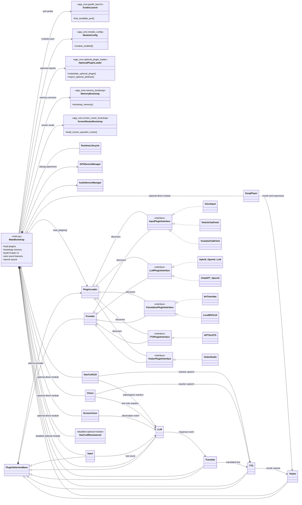
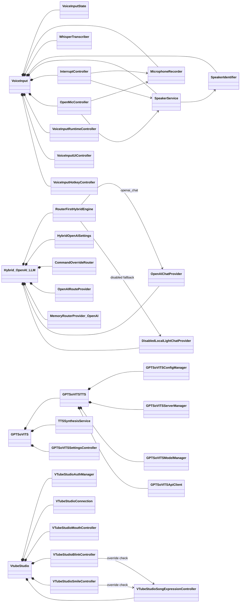

# LAV_v0.2 객체지향 구조도

이 문서는 프로젝트가 직접 소유한 주요 런타임 클래스와 플러그인 관계를 현재 코드 기준으로 요약합니다.
외부 라이브러리의 내부 클래스, 모델 파일, 비활성화된 레거시 코드는 제외했습니다.

## 1. 전체 애플리케이션과 플러그인 구조

`main.py`는 별도 애플리케이션 클래스가 아니라 객체를 조립하는 지점입니다.
`MainBootstrap`, `MemoryBootstrap`, `ScreenRouterBootstrap`, `ModuleConfig`, `GradioLaunch`는 파일/함수 역할을 표현하기 위한 도식상의 모듈입니다.
`ScreenVision`, `SongPlayer`, `Chess`, `StarCraft116`은 `PluginSelectionBase` provider가 아니라 `modules.json`으로 켜고 끄는 `main.py` 직접 구성 요소입니다.
이 직접 모듈들은 `app_core.optional_plugin_loader`를 통해 선택적으로 import/생성됩니다.
`StarCraftRemastered`는 `main.py`에 선택 로딩 훅이 남아 있어 다이어그램에 표시하지만, 현재 `modules.json`에서는 비활성화되어 있고 체크인된 런타임 클래스도 주석 처리된 상태입니다.

`Hybrid_OpenAI_LLM`은 현재 기본 LLM provider로 표시합니다. `ChatGPT_OpenAI`는 활성화 가능한 LLM provider이지만 기본 선택은 `PluginSelection` 설정과 내장 기본값에 의해 `Hybrid_OpenAI_LLM`이 우선됩니다. <!-- #20260630_kpopmodder: Update architecture docs for app_core bootstrap, lazy provider loading, and direct optional modules. -->
<!-- #20260704_kpopmodder: Updated optional direct-module docs for StarCraft116 and optional_plugin_loader. -->

## 2. 핵심 실행 객체와 메모리/화면 라우팅 구조

메모리 계층은 `raw_events.jsonl`을 복구 가능한 원본으로 두고, `raw_events.sqlite3`는 조회용 미러, `derived_memory.sqlite3`는 선택적인 파생 검색 인덱스로 사용합니다.
`MemoryRouter`와 `ScreenQuestionRouter`는 사용자에게 직접 답하지 않고, 검색/화면 컨텍스트가 필요한지만 판단합니다.

## 3. 주요 provider 플러그인의 내부 구조

## 4. `main.py` 직접 선택 모듈의 내부 구조

`SongPlayer`, `Chess`, `StarCraft116`은 provider selector에 등록되는 플러그인이 아니라, Gradio 탭과 자체 컨트롤러를 가진 선택 모듈입니다.
`SongPlayer`는 TTS 큐와 분리된 재생 흐름을 사용하고, `Chess`는 Gradio 안에 로컬 웹 보드를 iframe으로 붙입니다.
`StarCraft116`은 BWAPI 프로필 설정, 실행 명령, 상태 조회, 게임 이벤트 tailing, 선택적 LLM/TTS 반응을 관리합니다.

현재 기본 GPU 배치는 `GPUDeviceManager` 기준으로 VoiceInput/Whisper, ScreenVision, GPT-SoVITS를 GPU 1 / `cuda:1` 계열로 설명합니다. 시작 시 preflight 로그가 이 배치를 다시 확인합니다. <!-- #20260630_kpopmodder: Mirror current GPU preflight ownership. -->

## 관계 기호

- `<|--`: 클래스 상속
- `<|..`: 인터페이스 구현
- `*--`: 객체가 구성 요소의 생명주기를 소유하는 합성
- `o--`: 외부에서 전달받거나 공유하는 집약
- `-->`: 이벤트, 콜백 또는 일반 의존 관계
