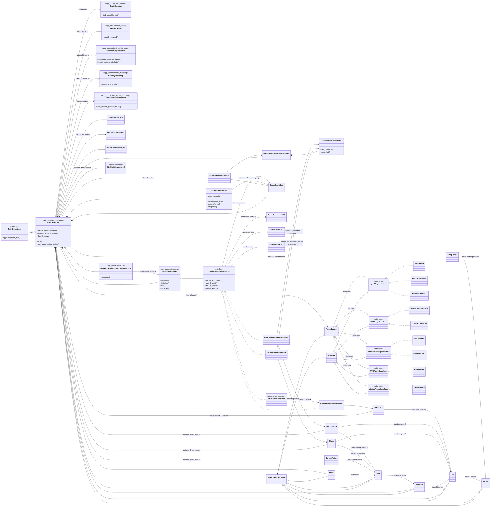
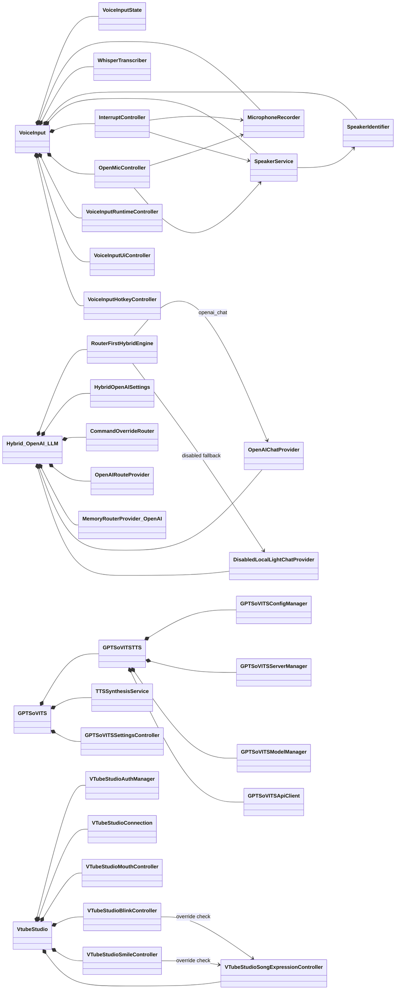
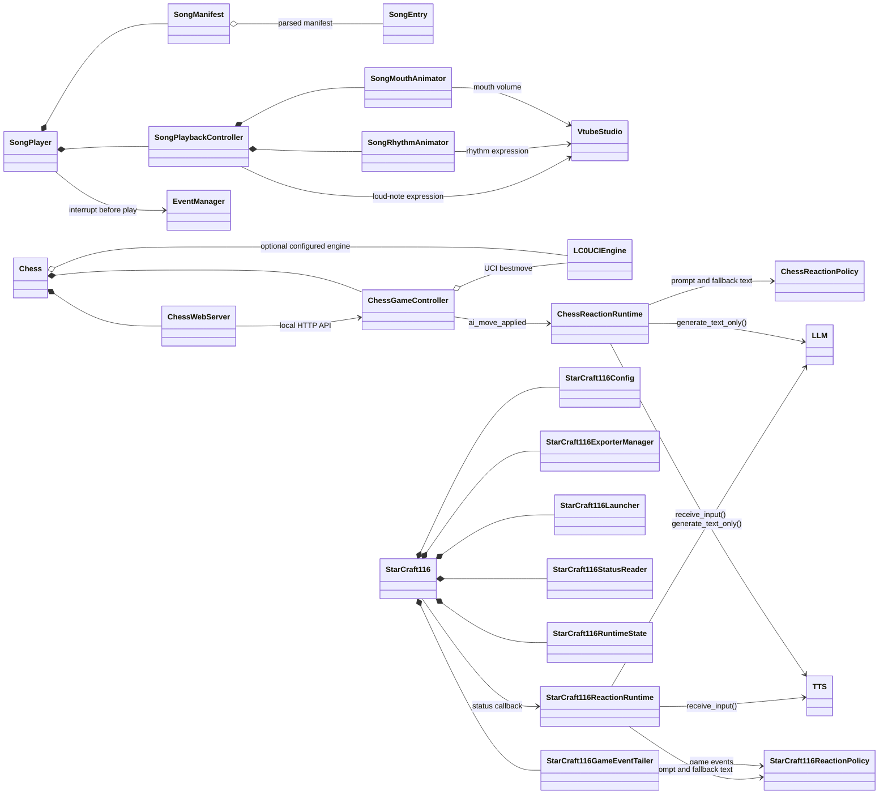

# LAVI 객체지향 구조도

이 문서는 프로젝트가 직접 소유한 주요 런타임 클래스와 플러그인 관계를 현재 코드 기준으로 요약합니다.
외부 라이브러리의 내부 클래스, 모델 파일, 비활성화된 레거시 코드는 제외했습니다.

## 1. 전체 애플리케이션과 플러그인 구조

`main.py`는 별도 애플리케이션 클래스가 아니라 `AppComposer().run()`을 호출하는 얇은 진입점입니다.
`AppComposer`가 시작 조립, 플러그인 로딩, Gradio UI 구성, 선택 모듈 로딩, 게임 확장 등록, lifecycle 시작, Gradio launch를 소유합니다.
`MainBootstrap`, `MemoryBootstrap`, `ScreenRouterBootstrap`, `ModuleConfig`, `GradioLaunch`는 파일/함수 역할을 표현하기 위한 도식상의 모듈입니다.
`ScreenVision`, `SongPlayer`, `Chess`, `StarCraft116`, `StarCraft2`, `StarCraftRemastered`는 `PluginSelectionBase` provider가 아니라 `modules.json`으로 켜고 끄는 `AppComposer` 선택 구성 요소입니다.
이 직접 모듈들은 `app_core.optional_plugin_loader`를 통해 선택적으로 import/생성됩니다.
현재 `modules.json` 기준으로 `StarCraft2`, `StarCraft116`, `Chess`, `ScreenVision`, `SongPlayer`는 활성화되어 있고 `StarCraftRemastered`는 비활성화되어 있습니다.

`Hybrid_OpenAI_LLM`은 현재 기본 LLM provider로 표시합니다. `ChatGPT_OpenAI`는 활성화 가능한 LLM provider이지만 기본 선택은 `PluginSelection` 설정과 내장 기본값에 의해 `Hybrid_OpenAI_LLM`이 우선됩니다. <!-- #20260630_kpopmodder: Update architecture docs for app_core bootstrap, lazy provider loading, and direct optional modules. -->
<!-- #20260704_kpopmodder: Updated optional direct-module docs for StarCraft116 and optional_plugin_loader. -->
`AppComposer`는 게임 확장 생성과 등록 세부 로직을
`GameExtensionCompositionService`에 위임합니다. 공통 게임 확장 계층은
`GameCommandDTO`, `GameStatusDTO`, `GameResultDTO`,
`GameRuntimeContextRegistry`, `GameEventBus`를 제공해서 command/status/result와
observer 이벤트 전달이 임의 dict에만 의존하지 않도록 합니다.
`GameEventMonitor` subscribes to the shared `GameEventBus` and logs sampled
delivery confirmations such as `[GameEventMonitor] received ...`, so SC2 bridge
events can be verified at runtime without changing the SC2 TTS/memory path.
It also keeps a small recent-event snapshot that `AppComposer.get_game_debug_status()`
can expose for runtime/debug inspection.
`GameRuntimeContext` can also keep resource references; Chess now records its
plugin/controller/web_server resources, and StarCraft116 records plugin/bridge/worker
runtime resources, in the shared context snapshot first.
<!-- #20260715_kpopmodder: Document game extension composition service and shared contracts. -->
<!-- #20260715_kpopmodder: Document GameEventMonitor and Chess runtime-context resource tracking. -->
<!-- #20260715_kpopmodder: Document GameEventMonitor recent snapshots and StarCraft116 runtime resources. -->

## 2. 핵심 실행 객체와 메모리/화면 라우팅 구조

```mermaid
classDiagram
    direction TB

    class RuntimeLifecycle
    class EventManager
    class EventSubscription

    RuntimeLifecycle o-- Input : shutdown
    RuntimeLifecycle o-- LLM : shutdown and idle check
    RuntimeLifecycle o-- Translate : shutdown and idle check
    RuntimeLifecycle o-- TTS : shutdown and idle check
    RuntimeLifecycle o-- ScreenVision : optional shutdown
    RuntimeLifecycle o-- SongPlayer : optional idle check
    RuntimeLifecycle o-- Chess : optional shutdown
    RuntimeLifecycle o-- StarCraft116 : optional shutdown
    EventManager *-- EventSubscription

    class LLM
    class LLMContextManager
    class LLMEventDispatcher
    class LLMInputQueueWorker
    class LLMResponsePipeline
    class LLMStreamingChunker
    class LLMInteractionContext
    class LLMMemoryBridge
    class ScreenQuestionRouter
    class ScreenQuestionDecision
    class OpenAIScreenQuestionRouterProvider

    LLM *-- LLMContextManager
    LLM *-- LLMEventDispatcher
    LLM *-- LLMInputQueueWorker
    LLM *-- LLMResponsePipeline
    LLM *-- LLMStreamingChunker
    LLM o-- ScreenQuestionRouter
    LLMResponsePipeline *-- LLMMemoryBridge
    LLMResponsePipeline *-- LLMInteractionContext
    LLMResponsePipeline o-- ScreenQuestionRouter
    ScreenQuestionRouter --> ScreenQuestionDecision
    ScreenQuestionRouter o-- OpenAIScreenQuestionRouterProvider : optional AI route

    class MemoryContextBuilder
    class MemoryStore
    class MemoryRetriever
    class MemoryRouter
    class MemoryRouteDecision
    class OpenAIMemoryRouterProvider
    class MemoryConsolidator
    class RawEventSQLiteStore
    class DerivedMemorySQLiteStore
    class DerivedMemoryBuilder
    class RawEventsJsonl {
        <<file>>
    }
    class LongTermMemoryJson {
        <<file>>
    }

    LLMMemoryBridge o-- MemoryContextBuilder
    MemoryContextBuilder o-- MemoryStore
    MemoryContextBuilder o-- MemoryRetriever
    MemoryContextBuilder o-- MemoryRouter
    MemoryRouter --> MemoryRouteDecision
    MemoryRouter o-- OpenAIMemoryRouterProvider : optional AI route
    MemoryRetriever *-- MemoryConsolidator
    MemoryRetriever o-- DerivedMemorySQLiteStore : optional reference index
    MemoryStore *-- RawEventSQLiteStore
    MemoryStore --> RawEventsJsonl : source of truth
    MemoryStore --> LongTermMemoryJson : manual long-term memory
    RawEventSQLiteStore --> RawEventsJsonl : mirrors JSONL rows
    DerivedMemoryBuilder --> RawEventsJsonl : rebuild source
    DerivedMemoryBuilder --> DerivedMemorySQLiteStore : writes derived index

    class TTS
    class TTSTextProcessor
    class TTSQueueWorker
    class TTSInterruptController
    class TTSMouthAnimator
    class WinSoundAudioPlayer

    TTS *-- TTSTextProcessor
    TTS *-- TTSQueueWorker
    TTS *-- TTSInterruptController
    TTS *-- TTSMouthAnimator
    TTS *-- WinSoundAudioPlayer
    WinSoundAudioPlayer --> TTSMouthAnimator
    TTSInterruptController --> EventManager : INTERRUPT

    class ScreenVision
    class ScreenCapture
    class VisionAnalyzer
    class ObservationPolicy
    class ScreenObservationProcessor
    class AutoWatchController

    ScreenVision *-- ScreenCapture
    ScreenVision *-- VisionAnalyzer
    ScreenVision *-- ObservationPolicy
    ScreenVision *-- ScreenObservationProcessor
    ScreenVision *-- AutoWatchController
    ScreenVision o-- MemoryStore
    ScreenObservationProcessor --> ObservationPolicy
    AutoWatchController --> ScreenCapture : callbacks

    class AudioDeviceManager
    class AudioDeviceRegistry
    class AudioDeviceConfigStore
    class AudioPlaybackController

    AudioDeviceManager *-- AudioDeviceRegistry
    AudioDeviceManager *-- AudioDeviceConfigStore
    AudioDeviceManager *-- AudioPlaybackController
```

메모리 계층은 `raw_events.jsonl`을 복구 가능한 원본으로 두고, `raw_events.sqlite3`는 조회용 미러, `derived_memory.sqlite3`는 선택적인 파생 검색 인덱스로 사용합니다.
`MemoryRouter`와 `ScreenQuestionRouter`는 사용자에게 직접 답하지 않고, 검색/화면 컨텍스트가 필요한지만 판단합니다.

## 3. 주요 provider 플러그인의 내부 구조

## 4. `main.py` 직접 선택 모듈의 내부 구조

`SongPlayer`, `Chess`, `StarCraft116`은 provider selector에 등록되는 플러그인이 아니라, Gradio 탭과 자체 컨트롤러를 가진 선택 모듈입니다.
`SongPlayer`는 TTS 큐와 분리된 재생 흐름을 사용하고, `Chess`는 Gradio 안에 로컬 웹 보드를 iframe으로 붙입니다.
`StarCraft116`은 BWAPI 프로필 설정, 실행 명령, 상태 조회, 게임 이벤트 tailing, 선택적 LLM/TTS 반응을 관리합니다.

현재 기본 GPU 배치는 `GPUDeviceManager` 기준으로 VoiceInput/Whisper, ScreenVision, GPT-SoVITS를 GPU 1 / `cuda:1` 계열로 설명합니다. 시작 시 preflight 로그가 이 배치를 다시 확인합니다. <!-- #20260630_kpopmodder: Mirror current GPU preflight ownership. -->

## 5. StarCraft2 확장과 엔진 구조

```mermaid
classDiagram
    direction LR

    class AppComposer
    class ExtensionRegistry
    class GameExtensionInterface {
        <<interface>>
        +initialize(context)
        +start()
        +stop()
        +handle_command(command)
        +get_status()
    }
    class GameExtensionContext

    class StarCraft2 {
        <<plugins.StarCraft2.starcraft2>>
        +create_ui()
        +start(config_overrides)
        +stop()
        +get_status()
        +set_status_event_callback(callback)
        +set_tts(tts)
        +subscribe_status_events(callback)
        +attach_game_event_bus(bus)
        +subscribe_common_events(callback)
        +on_local_human_vs_changeling_click(...)
    }
    class StarCraft2RuntimeFactory {
        <<composition factory>>
        +create(plugin_root, race_choices): StarCraft2RuntimeBundle
    }
    class StarCraft2RuntimeBundle {
        <<dataclass>>
        +facade_service
        +runtime_context
        +event_bus
        +local_match_service
        +ladder_proxy
    }
    class StarCraft2GameExtension {
        <<app_core.extensions>>
        +start()
        +stop()
        +handle_command(command)
        +get_status()
    }
    class StarCraft2Bridge
    class StarCraft2Worker
    class StarCraft2FacadeService {
        <<orchestrator>>
        +start(config_overrides)
        +stop()
        +get_status()
        +on_local_human_vs_changeling_click(...)
    }
    class StarCraft2LocalMatchService {
        <<domain service>>
        +start_local_match(command)
        +stop_local_match()
        +get_local_match_status()
    }
    class StarCraft2EventBus {
        <<typed observer channel>>
        +subscribe(legacy_dict_callback)
        +set_common_event_bus(bus)
        +subscribe_common_events(callback)
        +emit(event: StarCraft2Event): bool
    }
    class StarCraft2GameEventBridge {
        <<adapter>>
        +emit(event)
    }
    class StarCraft2Contracts {
        <<DTO/dataclass>>
        +EngineStartCommandDTO
        +EngineResultDTO
        +EngineStatusDTO
        +LocalMatchLaunchConfigDTO
        +LadderProxyResultDTO
        +LadderProxyStatusDTO
        +LadderProxyExitEventDTO
        +LadderProxyPortCheckDTO
        +StartResultDTO
        +StopResultDTO
        +LocalMatchRuntimeStatusDTO
        +StarCraft2Event
    }
    class GameStartResultDTO
    class GameStopResultDTO
    class GameStatusDTO
    class GameEventBus
    class StarCraft2EngineEventService {
        +update_state(event: StarCraft2Event)
    }
    class StarCraft2LadderProxyEventService {
        <<typed stdout parser>>
        +parse_line(stream, line): StarCraft2Event[]
        +on_ladder_proxy_line(stream, line)
    }
    class StarCraft2EngineRegistry
    class StarCraft2EngineInterface {
        <<interface>>
        +start(command: EngineStartCommandDTO, event_callback): EngineResultDTO
        +stop(): EngineResultDTO
        +get_status(): EngineStatusDTO
    }
    class LegacyStarCraft2EngineAdapter
    class InternalLAVBotEngine {
        <<typed_DTO_engine>>
    }
    class AresSC2BotEngine {
        <<legacy_adapter_backed>>
    }
    class MicroMachineBotEngine {
        <<legacy_adapter_backed>>
    }
    class ExternalExeBotEngine {
        <<legacy_adapter_backed>>
    }
    class ExternalJarBotEngine {
        <<legacy_adapter_backed>>
    }
    class HumanVsBotLauncher {
        <<typed_placeholder>>
    }
    class SC2LadderProxyLauncher {
        <<typed_DTO_boundary>>
        +start(command: LocalMatchLaunchConfigDTO): LadderProxyResultDTO
        +stop(timeout_sec): LadderProxyResultDTO
        +get_status(command): LadderProxyStatusDTO
    }
    class SC2RuntimeContext {
        <<runtime state>>
        +snapshot()
    }
    class SC2ObservationTracker

    class StarCraft2Extension {
        <<passive log observer>>
        +start()
        +stop()
        +handle_command(command)
        +get_status()
    }
    class ProBotsLauncher
    class ProBotsLogWatcher
    class SC2EventParser
    class StarCraft2ReactionRuntime
    class StarCraft2ReactionPolicy
    class StarCraft2ReactionTTSAdapter
    class StarCraft2ReactionMemoryRecorder
    class TTS
    class MemoryStore

    AppComposer *-- ExtensionRegistry
    AppComposer --> GameExtensionContext
    ExtensionRegistry o-- GameExtensionInterface
    GameExtensionInterface <|.. StarCraft2GameExtension
    GameExtensionInterface <|.. StarCraft2Extension

    StarCraft2GameExtension *-- StarCraft2Bridge
    StarCraft2GameExtension *-- StarCraft2Worker
    StarCraft2GameExtension --> StarCraft2 : facade/plugin
    StarCraft2GameExtension --> StarCraft2EventBus : subscribes
    StarCraft2GameExtension --> StarCraft2ReactionRuntime : event callback
    StarCraft2ReactionRuntime --> StarCraft2ReactionPolicy : speak/log policy
    StarCraft2ReactionRuntime *-- StarCraft2ReactionTTSAdapter
    StarCraft2ReactionRuntime *-- StarCraft2ReactionMemoryRecorder
    StarCraft2ReactionTTSAdapter --> TTS : cancel/speak
    StarCraft2ReactionMemoryRecorder --> MemoryStore : raw event memory

    StarCraft2 --> StarCraft2RuntimeFactory : create runtime
    StarCraft2RuntimeFactory --> StarCraft2RuntimeBundle : returns
    StarCraft2 --> StarCraft2RuntimeBundle : UI references
    StarCraft2RuntimeFactory *-- StarCraft2EngineRegistry
    StarCraft2RuntimeFactory *-- StarCraft2FacadeService
    StarCraft2RuntimeFactory *-- StarCraft2LocalMatchService
    StarCraft2RuntimeFactory *-- StarCraft2EventBus
    StarCraft2RuntimeFactory *-- SC2LadderProxyLauncher
    StarCraft2RuntimeFactory *-- SC2RuntimeContext
    StarCraft2RuntimeFactory *-- SC2ObservationTracker
    StarCraft2FacadeService --> StarCraft2EngineRegistry : start/stop/status
    StarCraft2FacadeService --> StarCraft2LocalMatchService : local match flow
    StarCraft2FacadeService --> StarCraft2Contracts : typed results
    StarCraft2FacadeService --> GameStartResultDTO : common start result
    StarCraft2FacadeService --> GameStopResultDTO : common stop result
    StarCraft2FacadeService --> GameStatusDTO : common status
    StarCraft2FacadeService --> SC2RuntimeContext : sole writer
    StarCraft2LocalMatchService --> SC2LadderProxyLauncher : launch/stop/status
    StarCraft2LocalMatchService --> StarCraft2Contracts : proxy DTO conversion
    SC2LadderProxyLauncher --> StarCraft2Contracts : typed process results
    StarCraft2LocalMatchService ..> SC2RuntimeContext : snapshot read only
    StarCraft2LocalMatchService --> GameStartResultDTO : common local result
    StarCraft2LocalMatchService --> GameStatusDTO : common local status
    StarCraft2LadderProxyEventService --> SC2ObservationTracker : telemetry deltas
    StarCraft2LadderProxyEventService --> StarCraft2EventBus : stdout/game events
    StarCraft2EngineEventService --> StarCraft2EventBus : engine events
    StarCraft2EventBus --> StarCraft2Contracts : StarCraft2Event
    StarCraft2EventBus *-- StarCraft2GameEventBridge
    StarCraft2GameEventBridge --> GameEventBus : mirror shared events
    StarCraft2EngineRegistry o-- StarCraft2EngineInterface
    StarCraft2EngineInterface <|.. InternalLAVBotEngine
    StarCraft2EngineInterface <|.. AresSC2BotEngine
    StarCraft2EngineInterface <|.. MicroMachineBotEngine
    StarCraft2EngineInterface <|.. ExternalExeBotEngine
    StarCraft2EngineInterface <|.. ExternalJarBotEngine
    StarCraft2EngineInterface <|.. HumanVsBotLauncher

    StarCraft2Extension *-- ProBotsLauncher
    StarCraft2Extension *-- ProBotsLogWatcher
    StarCraft2Extension *-- SC2EventParser
    StarCraft2Extension --> StarCraft2GameExtension : shared status callback
```

`StarCraft2`는 이제 UI 바인딩 표면입니다. `StarCraft2RuntimeFactory`가 runtime 객체 그래프를 만들고 `StarCraft2RuntimeBundle` dataclass로 반환하며, UI는 bundle의 Facade와 UI 호환 참조만 보관합니다. 실행은 `StarCraft2FacadeService`로 위임합니다. `StarCraft2FacadeService`는 start/stop/status와 Local Human vs AI 버튼 흐름을 조율하는 경계입니다. Local match 명령 생성, runtime preflight, ladder-proxy 실행, stdout/game-event 파싱, reaction TTS/memory 처리는 domain service 쪽에 남깁니다.

`StarCraft2FacadeService`와 `StarCraft2LocalMatchService`는 기존 SC2 result dict를 유지하면서 공통 `GameStartResultDTO`, `GameStopResultDTO`, `GameStatusDTO` wrapper를 함께 보관합니다. UI/Gradio 경계에서는 마지막에 dict/JSON으로 변환된 payload만 반환합니다. `StarCraft2EventBus`는 계속 SC2 전용 live channel이고, `StarCraft2GameEventBridge`가 연결된 공통 `GameEventBus`로 이벤트를 mirror합니다.

`StarCraft2EventBus`는 SC2 stdout 기반 이벤트, engine 이벤트, telemetry observation을 모으는 단일 live event channel입니다. UI/game extension은 이 채널을 구독하며 ladder stdout을 직접 파싱하지 않습니다. `StarCraft2Extension`은 여전히 수동 관찰자입니다. ProBots/Changeling 로그를 관찰하고 이벤트를 파싱한 뒤 공유 StarCraft2 status callback을 재사용하지만, main game facade를 직접 제어하지 않습니다. 현재 소스에서 LAN Lobby remote-human 코드는 보관용으로 주석 처리되어 있으며 live 다이어그램에는 포함하지 않습니다.

`StarCraft2LocalMatchService`, `StarCraft2EngineEventService`, `StarCraft2LadderProxyEventService`는 현재 코드의 public service 이름입니다. 기존 `_...` 이름은 호환성 alias로만 유지합니다.

`InternalLAVBotEngine`은 실제 게임 엔진 중 처음으로 `EngineStartCommandDTO`, `EngineResultDTO`, `EngineStatusDTO`를 직접 사용하는 typed 엔진입니다. Ares, MicroMachine, 외부 EXE/JAR 엔진은 기존 동작을 보존하기 위해 `LegacyStarCraft2EngineAdapter` 뒤에서 dict 계약을 계속 사용합니다. `HumanVsBotLauncher`는 typed 계약을 사용하는 비실행 placeholder입니다.

`SC2LadderProxyLauncher`는 `LocalMatchLaunchConfigDTO`를 입력으로 받고 `LadderProxyResultDTO`, `LadderProxyStatusDTO`, `LadderProxyExitEventDTO`를 반환하는 typed 프로세스 경계입니다. `StarCraft2LocalMatchService`가 이 DTO를 SC2 공통 결과와 `proxy_stopped` 이벤트로 조율하며, `StarCraft2FacadeService`는 DTO를 UI용 dict로 변환한 뒤 `SC2RuntimeContext`를 갱신하는 유일한 writer로 남습니다. 기존 UI 콜백과 JSON 출력은 변경하지 않습니다.

`GameEventMonitor` is the runtime proof point for the SC2-to-common bus bridge:
successful shared delivery appears as sampled `[GameEventMonitor] received ...`
log lines.

`SC2RuntimeContext`의 상태 변경은 `StarCraft2FacadeService`만 수행합니다. `SC2LadderProxyLauncher`는 프로세스 상태를 반환하고, `StarCraft2LocalMatchService`는 결과와 이벤트를 생성하며 UI 상태 DTO를 만들 때 snapshot만 읽습니다. 비동기 proxy 종료도 `StarCraft2EventBus`의 `proxy_stopped` 이벤트를 통해 Facade가 반영합니다.
<!-- #20260713_kpopmodder: Document current StarCraft2 facade/service/event split and archived LAN Lobby status. -->
<!-- #20260715_kpopmodder: Keep public SC2 service names and legacy aliases documented with source. -->
<!-- #20260715_kpopmodder: Document common DTO result wrappers and the SC2-to-GameEventBus bridge. -->
<!-- #20260715_kpopmodder: Document common GameEventBus runtime monitoring. -->
<!-- #20260715_kpopmodder: Document typed internal engine and adapter-backed migration state. -->
<!-- #20260715_kpopmodder: Document the typed ladder-proxy process boundary. -->
`StarCraft2LadderProxyEventService.parse_line()`은 stdout과 `LAV_OBSERVATION` JSON을 `StarCraft2Event` 목록으로 변환합니다. `StarCraft2EngineEventService`는 typed 이벤트의 상태 갱신과 EventBus 전달만 조율하고 문자열을 직접 해석하지 않습니다. `StarCraft2EventBus`는 내부와 공통 GameEventBus mirror에서 typed 계약을 사용하며, 기존 Reaction TTS·memory·UI subscriber를 호출하는 마지막 경계에서만 dict로 변환합니다.
<!-- #20260715_kpopmodder: Document the typed stdout-event and EventBus boundary. -->
<!-- #20260715_kpopmodder: Document Facade-only SC2RuntimeContext ownership. -->
<!-- #20260715_kpopmodder: Document StarCraft2RuntimeFactory composition ownership. -->

## 관계 기호

- `<|--`: 클래스 상속
- `<|..`: 인터페이스 구현
- `*--`: 객체가 구성 요소의 생명주기를 소유하는 합성
- `o--`: 외부에서 전달받거나 공유하는 집약
- `-->`: 이벤트, 콜백 또는 일반 의존 관계
