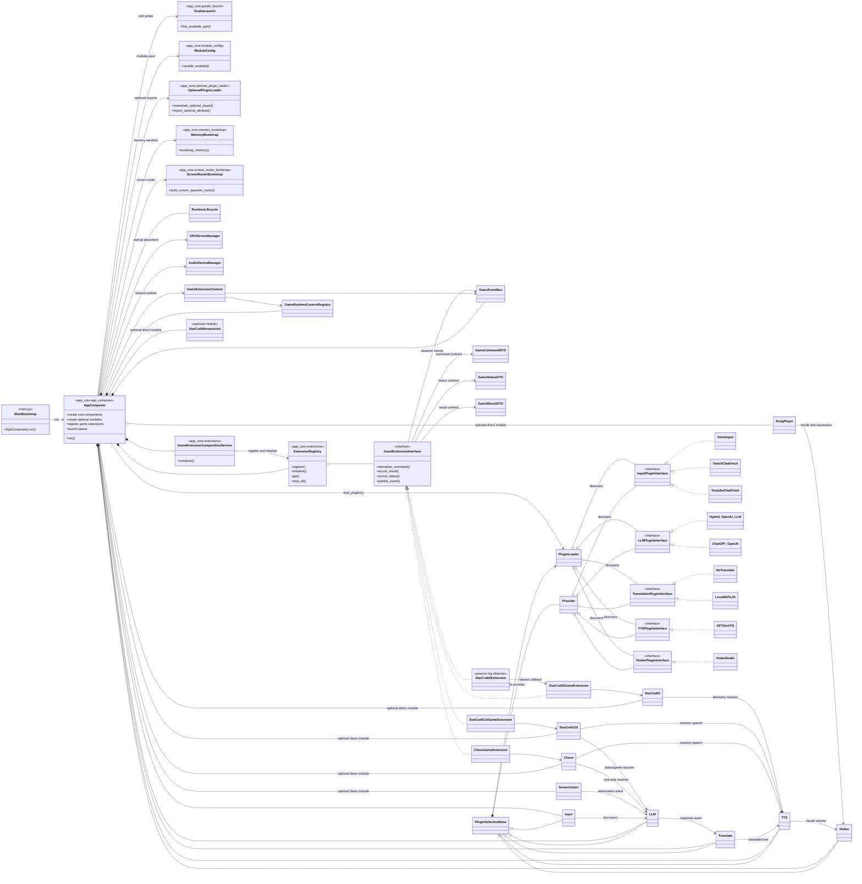
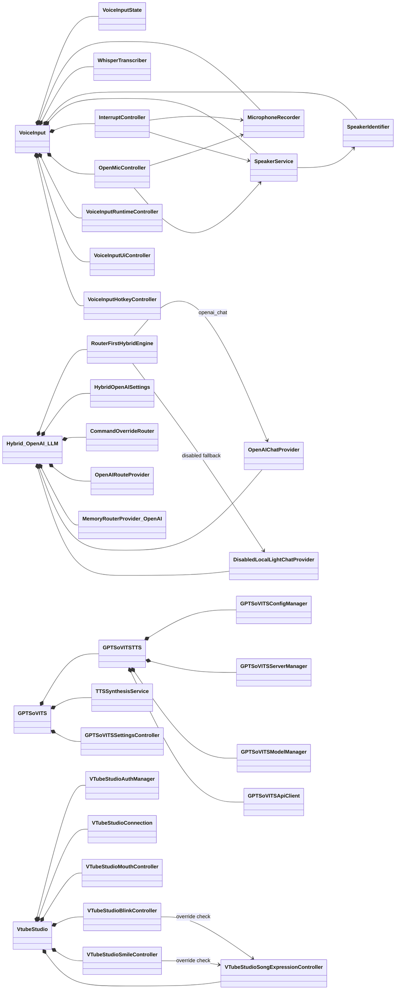
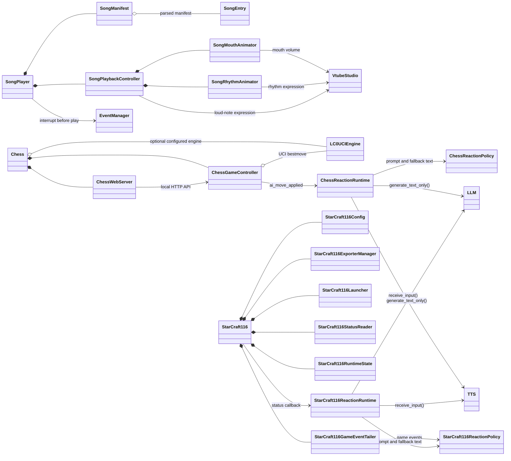

# LAVI Object-Oriented Architecture

This document summarizes the main project-owned runtime classes and plugin
relationships based on the current codebase. Internal classes from external
libraries, model files, and disabled legacy code are excluded.

## 1. Application and Plugin Architecture

`main.py` is not a separate application class. It is now a thin entry point
that calls `AppComposer().run()`. `AppComposer` owns startup assembly, plugin
loading, Gradio UI construction, optional module loading, game extension
registration, lifecycle startup, and Gradio launch. `MainBootstrap`,
`MemoryBootstrap`, `ScreenRouterBootstrap`, `ModuleConfig`, and `GradioLaunch`
are diagram-only module roles for files/functions.

`AppComposer` delegates game extension construction and registration to
`GameExtensionCompositionService`. The shared game-extension layer also exposes
`GameCommandDTO`, `GameStatusDTO`, `GameResultDTO`,
`GameRuntimeContextRegistry`, and `GameEventBus`, so command/status/result/event
handoffs can move away from ad-hoc dicts without forcing every game plugin to
change at once.

<!-- #20260715_kpopmodder: Document game extension composition service and shared contracts. -->

`ScreenVision`, `SongPlayer`, `Chess`, `StarCraft116`, `StarCraft2`, and
`StarCraftRemastered` are not `PluginSelectionBase` providers. They are
optional AppComposer components gated by `modules.json` and loaded through
`app_core.optional_plugin_loader`. In the current `modules.json`, `StarCraft2`,
`StarCraft116`, `Chess`, `ScreenVision`, and `SongPlayer` are enabled, while
`StarCraftRemastered` is disabled.

`Hybrid_OpenAI_LLM` is shown as the current default LLM provider.
`ChatGPT_OpenAI` may still be available as an LLM provider, but the built-in
default and `PluginSelection` settings prefer `Hybrid_OpenAI_LLM`.
<!-- #20260704_kpopmodder: Updated optional direct-module docs for StarCraft116 and optional_plugin_loader. -->

## 2. Core Runtime, Memory, and Screen Routing

```mermaid
classDiagram
    direction TB

    class RuntimeLifecycle
    class EventManager
    class EventSubscription

    RuntimeLifecycle o-- Input : shutdown
    RuntimeLifecycle o-- LLM : shutdown and idle check
    RuntimeLifecycle o-- Translate : shutdown and idle check
    RuntimeLifecycle o-- TTS : shutdown and idle check
    RuntimeLifecycle o-- ScreenVision : optional shutdown
    RuntimeLifecycle o-- SongPlayer : optional idle check
    RuntimeLifecycle o-- Chess : optional shutdown
    RuntimeLifecycle o-- StarCraft116 : optional shutdown
    EventManager *-- EventSubscription

    class LLM
    class LLMContextManager
    class LLMEventDispatcher
    class LLMInputQueueWorker
    class LLMResponsePipeline
    class LLMStreamingChunker
    class LLMInteractionContext
    class LLMMemoryBridge
    class ScreenQuestionRouter
    class ScreenQuestionDecision
    class OpenAIScreenQuestionRouterProvider

    LLM *-- LLMContextManager
    LLM *-- LLMEventDispatcher
    LLM *-- LLMInputQueueWorker
    LLM *-- LLMResponsePipeline
    LLM *-- LLMStreamingChunker
    LLM o-- ScreenQuestionRouter
    LLMResponsePipeline *-- LLMMemoryBridge
    LLMResponsePipeline *-- LLMInteractionContext
    LLMResponsePipeline o-- ScreenQuestionRouter
    ScreenQuestionRouter --> ScreenQuestionDecision
    ScreenQuestionRouter o-- OpenAIScreenQuestionRouterProvider : optional AI route

    class MemoryContextBuilder
    class MemoryStore
    class MemoryRetriever
    class MemoryRouter
    class MemoryRouteDecision
    class OpenAIMemoryRouterProvider
    class MemoryConsolidator
    class RawEventSQLiteStore
    class DerivedMemorySQLiteStore
    class DerivedMemoryBuilder
    class RawEventsJsonl {
        <<file>>
    }
    class LongTermMemoryJson {
        <<file>>
    }

    LLMMemoryBridge o-- MemoryContextBuilder
    MemoryContextBuilder o-- MemoryStore
    MemoryContextBuilder o-- MemoryRetriever
    MemoryContextBuilder o-- MemoryRouter
    MemoryRouter --> MemoryRouteDecision
    MemoryRouter o-- OpenAIMemoryRouterProvider : optional AI route
    MemoryRetriever *-- MemoryConsolidator
    MemoryRetriever o-- DerivedMemorySQLiteStore : optional reference index
    MemoryStore *-- RawEventSQLiteStore
    MemoryStore --> RawEventsJsonl : source of truth
    MemoryStore --> LongTermMemoryJson : manual long-term memory
    RawEventSQLiteStore --> RawEventsJsonl : mirrors JSONL rows
    DerivedMemoryBuilder --> RawEventsJsonl : rebuild source
    DerivedMemoryBuilder --> DerivedMemorySQLiteStore : writes derived index

    class TTS
    class TTSTextProcessor
    class TTSQueueWorker
    class TTSInterruptController
    class TTSMouthAnimator
    class WinSoundAudioPlayer

    TTS *-- TTSTextProcessor
    TTS *-- TTSQueueWorker
    TTS *-- TTSInterruptController
    TTS *-- TTSMouthAnimator
    TTS *-- WinSoundAudioPlayer
    WinSoundAudioPlayer --> TTSMouthAnimator
    TTSInterruptController --> EventManager : INTERRUPT

    class ScreenVision
    class ScreenCapture
    class VisionAnalyzer
    class ObservationPolicy
    class ScreenObservationProcessor
    class AutoWatchController

    ScreenVision *-- ScreenCapture
    ScreenVision *-- VisionAnalyzer
    ScreenVision *-- ObservationPolicy
    ScreenVision *-- ScreenObservationProcessor
    ScreenVision *-- AutoWatchController
    ScreenVision o-- MemoryStore
    ScreenObservationProcessor --> ObservationPolicy
    AutoWatchController --> ScreenCapture : callbacks

    class AudioDeviceManager
    class AudioDeviceRegistry
    class AudioDeviceConfigStore
    class AudioPlaybackController

    AudioDeviceManager *-- AudioDeviceRegistry
    AudioDeviceManager *-- AudioDeviceConfigStore
    AudioDeviceManager *-- AudioPlaybackController
```

The memory layer keeps `raw_events.jsonl` as the recoverable source of truth.
`raw_events.sqlite3` is a query mirror, and `derived_memory.sqlite3` is an
optional derived search index. `MemoryRouter` and `ScreenQuestionRouter` do not
answer the user directly; they only decide whether memory or screen context is
needed.

## 3. Internal Architecture of Major Provider Plugins

## 4. Internal Architecture of Direct `main.py` Optional Modules

`SongPlayer`, `Chess`, and `StarCraft116` are selectable modules with their own
Gradio tabs and controllers, not provider-selector plugins. `SongPlayer` keeps
playback separate from the TTS queue. `Chess` embeds a local web board in
Gradio through an iframe. `StarCraft116` manages BWAPI profile setup, launch
commands, status polling, exported game events, and optional LLM/TTS reactions
without merging that path into the generic LLM provider system.

The current default GPU placement is documented through `GPUDeviceManager`:
VoiceInput/Whisper, ScreenVision, and GPT-SoVITS are described as GPU 1 /
`cuda:1`-family placements. Startup preflight logs re-check this placement.
<!-- #20260630_kpopmodder: Mirror current GPU preflight ownership. -->

## 5. StarCraft2 Extension and Engine Architecture

```mermaid
classDiagram
    direction LR

    class AppComposer
    class ExtensionRegistry
    class GameExtensionInterface {
        <<interface>>
        +initialize(context)
        +start()
        +stop()
        +handle_command(command)
        +get_status()
    }
    class GameExtensionContext

    class StarCraft2 {
        <<plugins.StarCraft2.starcraft2>>
        +create_ui()
        +start(config_overrides)
        +stop()
        +get_status()
        +set_status_event_callback(callback)
        +set_tts(tts)
        +subscribe_status_events(callback)
        +on_local_human_vs_changeling_click(...)
    }
    class StarCraft2GameExtension {
        <<app_core.extensions>>
        +start()
        +stop()
        +handle_command(command)
        +get_status()
    }
    class StarCraft2Bridge
    class StarCraft2Worker
    class StarCraft2FacadeService {
        <<orchestrator>>
        +start(config_overrides)
        +stop()
        +get_status()
        +on_local_human_vs_changeling_click(...)
    }
    class StarCraft2LocalMatchService {
        <<domain service>>
        +start_local_match(command)
        +stop_local_match()
        +get_local_match_status()
    }
    class StarCraft2EventBus {
        <<observer channel>>
        +subscribe(callback)
        +emit(event)
    }
    class StarCraft2Contracts {
        <<DTO/dataclass>>
        +StartResultDTO
        +StopResultDTO
        +LocalMatchRuntimeStatusDTO
        +StarCraft2Event
    }
    class StarCraft2EngineEventService
    class StarCraft2LadderProxyEventService
    class StarCraft2EngineRegistry
    class StarCraft2EngineInterface {
        <<interface>>
        +start(config, event_callback)
        +stop()
        +get_status()
    }
    class InternalLAVBotEngine
    class AresSC2BotEngine
    class MicroMachineBotEngine
    class ExternalExeBotEngine
    class ExternalJarBotEngine
    class HumanVsBotLauncher
    class SC2LadderProxyLauncher
    class SC2ObservationTracker

    class StarCraft2Extension {
        <<passive log observer>>
        +start()
        +stop()
        +handle_command(command)
        +get_status()
    }
    class ProBotsLauncher
    class ProBotsLogWatcher
    class SC2EventParser
    class StarCraft2ReactionRuntime
    class StarCraft2ReactionPolicy
    class StarCraft2ReactionTTSAdapter
    class StarCraft2ReactionMemoryRecorder
    class TTS
    class MemoryStore

    AppComposer *-- ExtensionRegistry
    AppComposer --> GameExtensionContext
    ExtensionRegistry o-- GameExtensionInterface
    GameExtensionInterface <|.. StarCraft2GameExtension
    GameExtensionInterface <|.. StarCraft2Extension

    StarCraft2GameExtension *-- StarCraft2Bridge
    StarCraft2GameExtension *-- StarCraft2Worker
    StarCraft2GameExtension --> StarCraft2 : facade/plugin
    StarCraft2GameExtension --> StarCraft2EventBus : subscribes
    StarCraft2GameExtension --> StarCraft2ReactionRuntime : event callback
    StarCraft2ReactionRuntime --> StarCraft2ReactionPolicy : speak/log policy
    StarCraft2ReactionRuntime *-- StarCraft2ReactionTTSAdapter
    StarCraft2ReactionRuntime *-- StarCraft2ReactionMemoryRecorder
    StarCraft2ReactionTTSAdapter --> TTS : cancel/speak
    StarCraft2ReactionMemoryRecorder --> MemoryStore : raw event memory

    StarCraft2 *-- StarCraft2EngineRegistry
    StarCraft2 *-- StarCraft2FacadeService
    StarCraft2 *-- StarCraft2LocalMatchService
    StarCraft2 *-- StarCraft2EventBus
    StarCraft2 *-- SC2LadderProxyLauncher
    StarCraft2 *-- SC2ObservationTracker
    StarCraft2FacadeService --> StarCraft2EngineRegistry : start/stop/status
    StarCraft2FacadeService --> StarCraft2LocalMatchService : local match flow
    StarCraft2FacadeService --> StarCraft2Contracts : typed results
    StarCraft2LocalMatchService --> SC2LadderProxyLauncher : launch/stop/status
    StarCraft2LadderProxyEventService --> SC2ObservationTracker : telemetry deltas
    StarCraft2LadderProxyEventService --> StarCraft2EventBus : stdout/game events
    StarCraft2EngineEventService --> StarCraft2EventBus : engine events
    StarCraft2EventBus --> StarCraft2Contracts : StarCraft2Event
    StarCraft2EngineRegistry o-- StarCraft2EngineInterface
    StarCraft2EngineInterface <|.. InternalLAVBotEngine
    StarCraft2EngineInterface <|.. AresSC2BotEngine
    StarCraft2EngineInterface <|.. MicroMachineBotEngine
    StarCraft2EngineInterface <|.. ExternalExeBotEngine
    StarCraft2EngineInterface <|.. ExternalJarBotEngine
    StarCraft2EngineInterface <|.. HumanVsBotLauncher

    StarCraft2Extension *-- ProBotsLauncher
    StarCraft2Extension *-- ProBotsLogWatcher
    StarCraft2Extension *-- SC2EventParser
    StarCraft2Extension --> StarCraft2GameExtension : shared status callback
```

`StarCraft2` is now the UI and assembly surface: it builds the Gradio tab,
holds runtime references, and delegates execution to `StarCraft2FacadeService`.
`StarCraft2FacadeService` is the orchestration boundary for start/stop/status
and the Local Human vs AI button flow. Local match command construction,
runtime preflight, ladder-proxy launch, stdout/game-event parsing, and reaction
TTS/memory handling remain in domain services.

`StarCraft2LocalMatchService`, `StarCraft2EngineEventService`, and
`StarCraft2LadderProxyEventService` are the public service names in code.
The underscore-prefixed names remain as compatibility aliases only.

`StarCraft2EventBus` is the single live event channel for SC2 stdout-derived
events, engine events, and telemetry observations. UI/game extensions subscribe
to it; they do not parse ladder stdout directly. `StarCraft2Extension` is still
intentionally passive: it observes ProBots/Changeling logs, parses events, and
reuses the shared StarCraft2 status callback instead of controlling the main
game facade. LAN Lobby remote-human code is archived/commented out in the
current source and is not part of the live diagram.
<!-- #20260713_kpopmodder: Document current StarCraft2 facade/service/event split and archived LAN Lobby status. -->
<!-- #20260715_kpopmodder: Keep public SC2 service names and legacy aliases documented with source. -->

## Relationship Symbols

- `<|--`: Class inheritance
- `<|..`: Interface implementation
- `*--`: Composition; the owning object controls the component lifecycle
- `o--`: Aggregation; an object is externally supplied or shared
- `-->`: Event, callback, or general dependency
