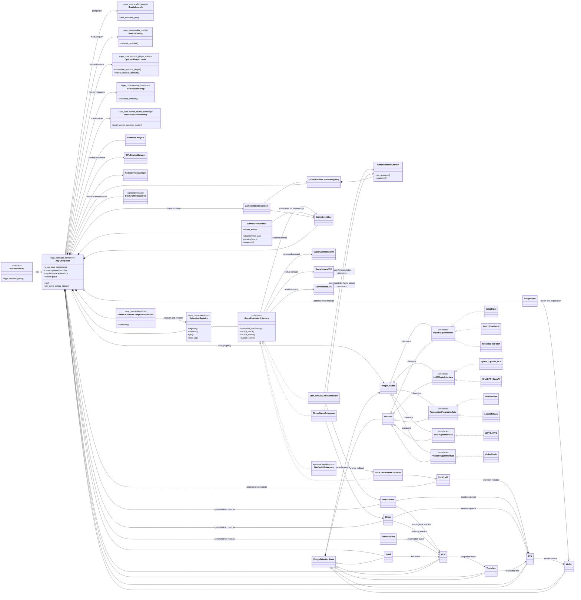
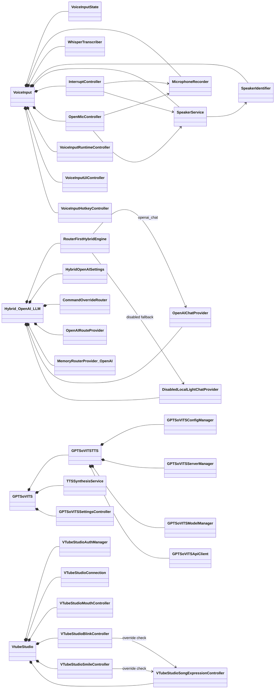

# LAVI Object-Oriented Architecture

This document summarizes the main project-owned runtime classes and plugin
relationships based on the current codebase. Internal classes from external
libraries, model files, and disabled legacy code are excluded.

## 1. Application and Plugin Architecture

`main.py` is not a separate application class. It is now a thin entry point
that calls `AppComposer().run()`. `AppComposer` owns startup assembly, plugin
loading, Gradio UI construction, optional module loading, game extension
registration, lifecycle startup, and Gradio launch. `MainBootstrap`,
`MemoryBootstrap`, `ScreenRouterBootstrap`, `ModuleConfig`, and `GradioLaunch`
are diagram-only module roles for files/functions.

`AppComposer` delegates game extension construction and registration to
`GameExtensionCompositionService`. The shared game-extension layer also exposes
`GameCommandDTO`, `GameStatusDTO`, `GameResultDTO`,
`GameRuntimeContextRegistry`, and `GameEventBus`, so command/status/result/event
handoffs can move away from ad-hoc dicts without forcing every game plugin to
change at once.
`GameEventMonitor` subscribes to the shared `GameEventBus` and logs sampled
delivery confirmations such as `[GameEventMonitor] received ...`, so SC2 bridge
events can be verified at runtime without changing the SC2 TTS/memory path.
It also keeps a small recent-event snapshot that `AppComposer.get_game_debug_status()`
can expose for runtime/debug inspection.
`GameRuntimeContext` can also keep resource references; Chess now records its
plugin/controller/web_server resources, and StarCraft116 records plugin/bridge/worker
runtime resources, in the shared context snapshot first.

<!-- #20260715_kpopmodder: Document game extension composition service and shared contracts. -->
<!-- #20260715_kpopmodder: Document GameEventMonitor and Chess runtime-context resource tracking. -->
<!-- #20260715_kpopmodder: Document GameEventMonitor recent snapshots and StarCraft116 runtime resources. -->

`ScreenVision`, `SongPlayer`, `Chess`, `StarCraft116`, `StarCraft2`, and
`StarCraftRemastered` are not `PluginSelectionBase` providers. They are
optional AppComposer components gated by `modules.json` and loaded through
`app_core.optional_plugin_loader`. In the current `modules.json`, `StarCraft2`,
`StarCraft116`, `Chess`, `ScreenVision`, and `SongPlayer` are enabled, while
`StarCraftRemastered` is disabled.

`Hybrid_OpenAI_LLM` is shown as the current default LLM provider.
`ChatGPT_OpenAI` may still be available as an LLM provider, but the built-in
default and `PluginSelection` settings prefer `Hybrid_OpenAI_LLM`.
<!-- #20260704_kpopmodder: Updated optional direct-module docs for StarCraft116 and optional_plugin_loader. -->

## 2. Core Runtime, Memory, and Screen Routing

```mermaid
classDiagram
    direction TB

    class RuntimeLifecycle
    class EventManager
    class EventSubscription

    RuntimeLifecycle o-- Input : shutdown
    RuntimeLifecycle o-- LLM : shutdown and idle check
    RuntimeLifecycle o-- Translate : shutdown and idle check
    RuntimeLifecycle o-- TTS : shutdown and idle check
    RuntimeLifecycle o-- ScreenVision : optional shutdown
    RuntimeLifecycle o-- SongPlayer : optional idle check
    RuntimeLifecycle o-- Chess : optional shutdown
    RuntimeLifecycle o-- StarCraft116 : optional shutdown
    EventManager *-- EventSubscription

    class LLM
    class LLMContextManager
    class LLMEventDispatcher
    class LLMInputQueueWorker
    class LLMResponsePipeline
    class LLMStreamingChunker
    class LLMInteractionContext
    class LLMMemoryBridge
    class ScreenQuestionRouter
    class ScreenQuestionDecision
    class OpenAIScreenQuestionRouterProvider

    LLM *-- LLMContextManager
    LLM *-- LLMEventDispatcher
    LLM *-- LLMInputQueueWorker
    LLM *-- LLMResponsePipeline
    LLM *-- LLMStreamingChunker
    LLM o-- ScreenQuestionRouter
    LLMResponsePipeline *-- LLMMemoryBridge
    LLMResponsePipeline *-- LLMInteractionContext
    LLMResponsePipeline o-- ScreenQuestionRouter
    ScreenQuestionRouter --> ScreenQuestionDecision
    ScreenQuestionRouter o-- OpenAIScreenQuestionRouterProvider : optional AI route

    class MemoryContextBuilder
    class MemoryStore
    class MemoryRetriever
    class MemoryRouter
    class MemoryRouteDecision
    class OpenAIMemoryRouterProvider
    class MemoryConsolidator
    class RawEventSQLiteStore
    class DerivedMemorySQLiteStore
    class DerivedMemoryBuilder
    class RawEventsJsonl {
        <<file>>
    }
    class LongTermMemoryJson {
        <<file>>
    }

    LLMMemoryBridge o-- MemoryContextBuilder
    MemoryContextBuilder o-- MemoryStore
    MemoryContextBuilder o-- MemoryRetriever
    MemoryContextBuilder o-- MemoryRouter
    MemoryRouter --> MemoryRouteDecision
    MemoryRouter o-- OpenAIMemoryRouterProvider : optional AI route
    MemoryRetriever *-- MemoryConsolidator
    MemoryRetriever o-- DerivedMemorySQLiteStore : optional reference index
    MemoryStore *-- RawEventSQLiteStore
    MemoryStore --> RawEventsJsonl : source of truth
    MemoryStore --> LongTermMemoryJson : manual long-term memory
    RawEventSQLiteStore --> RawEventsJsonl : mirrors JSONL rows
    DerivedMemoryBuilder --> RawEventsJsonl : rebuild source
    DerivedMemoryBuilder --> DerivedMemorySQLiteStore : writes derived index

    class TTS
    class TTSTextProcessor
    class TTSQueueWorker
    class TTSInterruptController
    class TTSMouthAnimator
    class WinSoundAudioPlayer

    TTS *-- TTSTextProcessor
    TTS *-- TTSQueueWorker
    TTS *-- TTSInterruptController
    TTS *-- TTSMouthAnimator
    TTS *-- WinSoundAudioPlayer
    WinSoundAudioPlayer --> TTSMouthAnimator
    TTSInterruptController --> EventManager : INTERRUPT

    class ScreenVision
    class ScreenCapture
    class VisionAnalyzer
    class ObservationPolicy
    class ScreenObservationProcessor
    class AutoWatchController

    ScreenVision *-- ScreenCapture
    ScreenVision *-- VisionAnalyzer
    ScreenVision *-- ObservationPolicy
    ScreenVision *-- ScreenObservationProcessor
    ScreenVision *-- AutoWatchController
    ScreenVision o-- MemoryStore
    ScreenObservationProcessor --> ObservationPolicy
    AutoWatchController --> ScreenCapture : callbacks

    class AudioDeviceManager
    class AudioDeviceRegistry
    class AudioDeviceConfigStore
    class AudioPlaybackController

    AudioDeviceManager *-- AudioDeviceRegistry
    AudioDeviceManager *-- AudioDeviceConfigStore
    AudioDeviceManager *-- AudioPlaybackController
```

The memory layer keeps `raw_events.jsonl` as the recoverable source of truth.
`raw_events.sqlite3` is a query mirror, and `derived_memory.sqlite3` is an
optional derived search index. `MemoryRouter` and `ScreenQuestionRouter` do not
answer the user directly; they only decide whether memory or screen context is
needed.

## 3. Internal Architecture of Major Provider Plugins

## 4. Internal Architecture of Direct `main.py` Optional Modules

`SongPlayer`, `Chess`, and `StarCraft116` are selectable modules with their own
Gradio tabs and controllers, not provider-selector plugins. `SongPlayer` keeps
playback separate from the TTS queue. `Chess` embeds a local web board in
Gradio through an iframe. `StarCraft116` manages BWAPI profile setup, launch
commands, status polling, exported game events, and optional LLM/TTS reactions
without merging that path into the generic LLM provider system.

The current default GPU placement is documented through `GPUDeviceManager`:
VoiceInput/Whisper, ScreenVision, and GPT-SoVITS are described as GPU 1 /
`cuda:1`-family placements. Startup preflight logs re-check this placement.
<!-- #20260630_kpopmodder: Mirror current GPU preflight ownership. -->

## 5. StarCraft2 Extension and Engine Architecture

```mermaid
classDiagram
    direction LR

    class AppComposer
    class ExtensionRegistry
    class GameExtensionInterface {
        <<interface>>
        +initialize(context)
        +start()
        +stop()
        +handle_command(command)
        +get_status()
    }
    class GameExtensionContext

    class StarCraft2 {
        <<plugins.StarCraft2.starcraft2>>
        +create_ui()
        +start(config_overrides)
        +stop()
        +get_status()
        +set_status_event_callback(callback)
        +set_tts(tts)
        +subscribe_status_events(callback)
        +attach_game_event_bus(bus)
        +subscribe_common_events(callback)
        +on_local_human_vs_changeling_click(...)
    }
    class StarCraft2RuntimeFactory {
        <<composition factory>>
        +create(plugin_root, race_choices): StarCraft2RuntimeBundle
    }
    class StarCraft2RuntimeBundle {
        <<dataclass>>
        +facade_service
        +runtime_context
        +event_bus
        +local_match_service
        +ladder_proxy
    }
    class StarCraft2GameExtension {
        <<app_core.extensions>>
        +start()
        +stop()
        +handle_command(command)
        +get_status()
    }
    class StarCraft2Bridge
    class StarCraft2Worker
    class StarCraft2FacadeService {
        <<orchestrator>>
        +start(config_overrides)
        +stop()
        +get_status()
        +on_local_human_vs_changeling_click(...)
    }
    class StarCraft2LocalMatchService {
        <<domain service>>
        +start_local_match(command)
        +stop_local_match()
        +get_local_match_status()
    }
    class StarCraft2EventBus {
        <<typed observer channel>>
        +subscribe(legacy_dict_callback)
        +subscribe_typed(callback)
        +set_common_event_bus(bus)
        +subscribe_common_events(callback)
        +emit(event: StarCraft2Event): bool
    }
    class StarCraft2GameEventBridge {
        <<adapter>>
        +emit(event)
    }
    class StarCraft2Contracts {
        <<DTO/dataclass>>
        +EngineStartCommandDTO
        +EngineResultDTO
        +EngineStatusDTO
        +LocalMatchLaunchConfigDTO
        +LadderProxyResultDTO
        +LadderProxyStatusDTO
        +LadderProxyExitEventDTO
        +LadderProxyPortCheckDTO
        +StartResultDTO
        +StopResultDTO
        +LocalMatchRuntimeStatusDTO
        +StarCraft2Event
    }
    class GameStartResultDTO
    class GameStopResultDTO
    class GameStatusDTO
    class GameEventBus
    class StarCraft2EngineEventService {
        +update_state(event: StarCraft2Event)
    }
    class StarCraft2LadderProxyEventService {
        <<typed stdout parser>>
        +parse_line(stream, line): StarCraft2Event[]
        +on_ladder_proxy_line(stream, line)
    }
    class StarCraft2EngineRegistry
    class StarCraft2EngineInterface {
        <<interface>>
        +start(command: EngineStartCommandDTO, event_callback): EngineResultDTO
        +stop(): EngineResultDTO
        +get_status(): EngineStatusDTO
    }
    class LegacyStarCraft2EngineAdapter
    class InternalLAVBotEngine {
        <<typed_DTO_engine>>
    }
    class AresSC2BotEngine {
        <<typed_external_process_engine>>
    }
    class MicroMachineBotEngine {
        <<typed_external_process_engine>>
    }
    class ExternalExeBotEngine {
        <<typed_external_process_engine>>
    }
    class ExternalJarBotEngine {
        <<typed_external_process_engine>>
    }
    class HumanVsBotLauncher {
        <<typed_placeholder>>
    }
    class SC2LadderProxyLauncher {
        <<typed_DTO_boundary>>
        +start(command: LocalMatchLaunchConfigDTO): LadderProxyResultDTO
        +stop(timeout_sec): LadderProxyResultDTO
        +get_status(command): LadderProxyStatusDTO
    }
    class SC2RuntimeContext {
        <<runtime state>>
        +snapshot()
    }
    class StarCraft2RuntimeState {
        <<typed state sink>>
        +update_event(event: StarCraft2Event)
    }
    class SC2ObservationTracker {
        <<typed telemetry tracker>>
        +update(snapshot): StarCraft2Event[]
    }

    class StarCraft2Extension {
        <<passive log observer>>
        +start()
        +stop()
        +handle_command(command)
        +get_status()
    }
    class ProBotsLauncher
    class ProBotsLogWatcher
    class SC2EventParser
    class StarCraft2ReactionRuntime {
        <<typed reaction orchestrator>>
        +handle_status_event(legacy_dict): bool
        +handle_event(event: StarCraft2Event): bool
    }
    class StarCraft2ReactionPolicy {
        <<typed policy>>
        +should_emit(event: StarCraft2Event): bool
    }
    class StarCraft2ReactionTTSAdapter
    class StarCraft2ReactionMemoryRecorder {
        <<typed memory adapter>>
        +store_event(event: StarCraft2Event)
    }
    class TTS
    class MemoryStore

    AppComposer *-- ExtensionRegistry
    AppComposer --> GameExtensionContext
    ExtensionRegistry o-- GameExtensionInterface
    GameExtensionInterface <|.. StarCraft2GameExtension
    GameExtensionInterface <|.. StarCraft2Extension

    StarCraft2GameExtension *-- StarCraft2Bridge
    StarCraft2GameExtension *-- StarCraft2Worker
    StarCraft2GameExtension --> StarCraft2 : facade/plugin
    StarCraft2GameExtension --> StarCraft2EventBus : subscribes
    StarCraft2GameExtension --> StarCraft2ReactionRuntime : event callback
    StarCraft2ReactionRuntime --> StarCraft2ReactionPolicy : speak/log policy
    StarCraft2ReactionRuntime *-- StarCraft2ReactionTTSAdapter
    StarCraft2ReactionRuntime *-- StarCraft2ReactionMemoryRecorder
    StarCraft2ReactionTTSAdapter --> TTS : cancel/speak
    StarCraft2ReactionMemoryRecorder --> MemoryStore : raw event memory

    StarCraft2 --> StarCraft2RuntimeFactory : create runtime
    StarCraft2RuntimeFactory --> StarCraft2RuntimeBundle : returns
    StarCraft2 --> StarCraft2RuntimeBundle : UI references
    StarCraft2RuntimeFactory *-- StarCraft2EngineRegistry
    StarCraft2RuntimeFactory *-- StarCraft2FacadeService
    StarCraft2RuntimeFactory *-- StarCraft2LocalMatchService
    StarCraft2RuntimeFactory *-- StarCraft2EventBus
    StarCraft2RuntimeFactory *-- SC2LadderProxyLauncher
    StarCraft2RuntimeFactory *-- SC2RuntimeContext
    StarCraft2RuntimeFactory *-- SC2ObservationTracker
    StarCraft2FacadeService --> StarCraft2EngineRegistry : start/stop/status
    StarCraft2FacadeService --> StarCraft2LocalMatchService : local match flow
    StarCraft2FacadeService --> StarCraft2Contracts : typed results
    StarCraft2FacadeService --> GameStartResultDTO : common start result
    StarCraft2FacadeService --> GameStopResultDTO : common stop result
    StarCraft2FacadeService --> GameStatusDTO : common status
    StarCraft2FacadeService --> SC2RuntimeContext : sole writer
    StarCraft2LocalMatchService --> SC2LadderProxyLauncher : launch/stop/status
    StarCraft2LocalMatchService --> StarCraft2Contracts : proxy DTO conversion
    SC2LadderProxyLauncher --> StarCraft2Contracts : typed process results
    StarCraft2LocalMatchService ..> SC2RuntimeContext : snapshot read only
    StarCraft2LocalMatchService --> GameStartResultDTO : common local result
    StarCraft2LocalMatchService --> GameStatusDTO : common local status
    StarCraft2LadderProxyEventService --> SC2ObservationTracker : telemetry deltas
    StarCraft2LadderProxyEventService --> StarCraft2EventBus : stdout/game events
    StarCraft2EngineEventService --> StarCraft2RuntimeState : typed state update
    StarCraft2EngineEventService --> StarCraft2EventBus : engine events
    StarCraft2EventBus --> StarCraft2Contracts : StarCraft2Event
    StarCraft2EventBus *-- StarCraft2GameEventBridge
    StarCraft2GameEventBridge --> GameEventBus : mirror shared events
    StarCraft2EngineRegistry o-- StarCraft2EngineInterface
    StarCraft2EngineInterface <|.. InternalLAVBotEngine
    StarCraft2EngineInterface <|.. AresSC2BotEngine
    StarCraft2EngineInterface <|.. MicroMachineBotEngine
    StarCraft2EngineInterface <|.. ExternalExeBotEngine
    StarCraft2EngineInterface <|.. ExternalJarBotEngine
    StarCraft2EngineInterface <|.. HumanVsBotLauncher

    StarCraft2Extension *-- ProBotsLauncher
    StarCraft2Extension *-- ProBotsLogWatcher
    StarCraft2Extension *-- SC2EventParser
    StarCraft2Extension --> StarCraft2GameExtension : shared status callback
```

`StarCraft2` is now the UI binding surface. `StarCraft2RuntimeFactory` builds
the runtime object graph and returns it as a `StarCraft2RuntimeBundle`
dataclass. The UI keeps only the Facade and UI compatibility references from
that bundle and delegates execution to `StarCraft2FacadeService`.
`StarCraft2FacadeService` is the orchestration boundary for start/stop/status
and the Local Human vs AI button flow. Local match command construction,
runtime preflight, ladder-proxy launch, stdout/game-event parsing, and reaction
TTS/memory handling remain in domain services.

`StarCraft2LocalMatchService`, `StarCraft2EngineEventService`, and
`StarCraft2LadderProxyEventService` are the public service names in code.
The underscore-prefixed names remain as compatibility aliases only.

`InternalLAVBotEngine`, Ares, MicroMachine, external EXE, external JAR, and
`HumanVsBotLauncher` now expose the `EngineStartCommandDTO`,
`EngineResultDTO`, and `EngineStatusDTO` contract directly. The external
engines keep their existing subprocess launch/preflight behavior; only the
public engine boundary is typed. `LegacyStarCraft2EngineAdapter` remains for
future or temporarily unmigrated engines. This boundary PR does not expand
external-engine runtime behavior or validation; that remains a separate
high-risk PR item.

`SC2LadderProxyLauncher` is a typed process boundary that consumes
`LocalMatchLaunchConfigDTO` and returns `LadderProxyResultDTO`,
`LadderProxyStatusDTO`, and `LadderProxyExitEventDTO`.
`StarCraft2LocalMatchService` coordinates these contracts into common SC2
results and the `proxy_stopped` event. `StarCraft2FacadeService` converts the
DTO status to the existing UI dictionary shape and remains the sole writer of
`SC2RuntimeContext`. Existing UI callbacks and JSON output remain unchanged.

`StarCraft2FacadeService` and `StarCraft2LocalMatchService` now keep common
`GameStartResultDTO`, `GameStopResultDTO`, and `GameStatusDTO` wrappers beside
the legacy SC2 result dictionaries. UI/Gradio boundaries still receive dict or
JSON payloads produced at the edge. `StarCraft2EventBus` remains the SC2-specific
channel, but `StarCraft2GameEventBridge` mirrors events into the shared
`GameEventBus` when one is attached. `GameEventMonitor` is the runtime proof
point for that bridge: successful shared delivery appears as sampled
`[GameEventMonitor] received ...` log lines.

`StarCraft2EventBus` is the single live event channel for SC2 stdout-derived
events, engine events, and telemetry observations. UI/game extensions subscribe
to it; they do not parse ladder stdout directly. `StarCraft2Extension` is still
intentionally passive: it observes ProBots/Changeling logs, parses events, and
reuses the shared StarCraft2 status callback instead of controlling the main
game facade. LAN Lobby remote-human code is archived/commented out in the
current source and is not part of the live diagram.

`StarCraft2LadderProxyEventService.parse_line()` and `SC2ObservationTracker`
return `StarCraft2Event` lists. `StarCraft2EngineEventService` sends the typed
event to `StarCraft2RuntimeState.update_event()` and then to `StarCraft2EventBus`;
it does not interpret text. `StarCraft2EventBus.subscribe_typed()` keeps Facade
and other internal subscribers on DTOs, while `subscribe()` remains the legacy
dict callback edge for Reaction TTS, memory, UI, and existing extension code.

`StarCraft2FacadeService` is the sole writer of `SC2RuntimeContext`.
`SC2LadderProxyLauncher` only reports process status, while
`StarCraft2LocalMatchService` produces results/events and reads snapshots only
when composing UI status DTOs. Asynchronous proxy exits return to the Facade
through the `proxy_stopped` event on `StarCraft2EventBus`. Top-level start/stop
errors from SC2 DTOs are copied into `SC2RuntimeContext.runtime_error`, so UI
status polling and stop/shutdown paths do not lose the runtime failure reason.
Legacy `StarCraft2EventBus.subscribe()` callbacks receive a fresh dict payload
per subscriber; DTO subscribers stay on `subscribe_typed()`.
<!-- #20260713_kpopmodder: Document current StarCraft2 facade/service/event split and archived LAN Lobby status. -->
<!-- #20260715_kpopmodder: Keep public SC2 service names and legacy aliases documented with source. -->
<!-- #20260715_kpopmodder: Document common DTO result wrappers and the SC2-to-GameEventBus bridge. -->
<!-- #20260715_kpopmodder: Document common GameEventBus runtime monitoring. -->
<!-- #20260715_kpopmodder: Document the typed stdout-event and EventBus boundary. -->
<!-- #20260715_kpopmodder: Document typed external engines, RuntimeState updates, and typed EventBus subscribers. -->
<!-- #20260715_kpopmodder: Document Facade runtime-error ownership and isolated legacy EventBus payloads. -->
The reaction core also uses `StarCraft2Event` end to end.
`StarCraft2ReactionRuntime.handle_status_event()` remains only as the dict
adapter for existing EventBus subscribers, while `handle_event()` owns typed
execution. `StarCraft2ReactionPolicy` and `StarCraft2ReactionMemoryRecorder`
consume DTOs directly; raw memory calls `to_dict()` only at the JSON storage
edge. `StarCraft2ReactionTTSAdapter` still owns only string speech and queue
cancellation, not event interpretation.
<!-- #20260715_kpopmodder: Document the typed reaction policy and memory boundary. -->
<!-- #20260715_kpopmodder: Document Facade-only SC2RuntimeContext ownership. -->
<!-- #20260715_kpopmodder: Document StarCraft2RuntimeFactory composition ownership. -->

## Relationship Symbols

- `<|--`: Class inheritance
- `<|..`: Interface implementation
- `*--`: Composition; the owning object controls the component lifecycle
- `o--`: Aggregation; an object is externally supplied or shared
- `-->`: Event, callback, or general dependency
