# ChatClef 엔진 다이어그램

상태: 문서 전용.

이 문서는 현재 ChatClef / AltoClef 엔진 구조를 다이어그램으로 이해하기 위한
참고 문서다. Carry On 구현 방향은 별도 canonical 문서가 우선한다.

- [ChatClef / Carry On Integration Direction](chatclef-carryon-integration-direction.md)
- [ChatClef 구조 개요](chatclef-structure-overview.md)

이 문서는 Java 구현, diagnostic log 삽입, behavior change, build, commit,
push를 승인하지 않는다.

## 1. 전체 엔진 지도

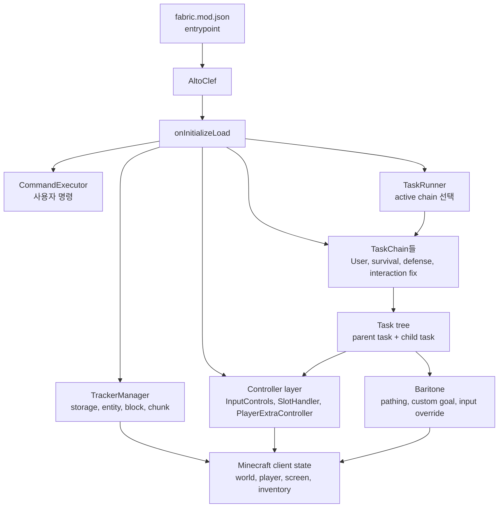

요점: `AltoClef`는 엔진의 중심 조립 지점이다. 명령, TaskRunner, tracker,
controller, chain을 만들고 서로 연결한다.

## 2. 핵심 객체지향 class diagram

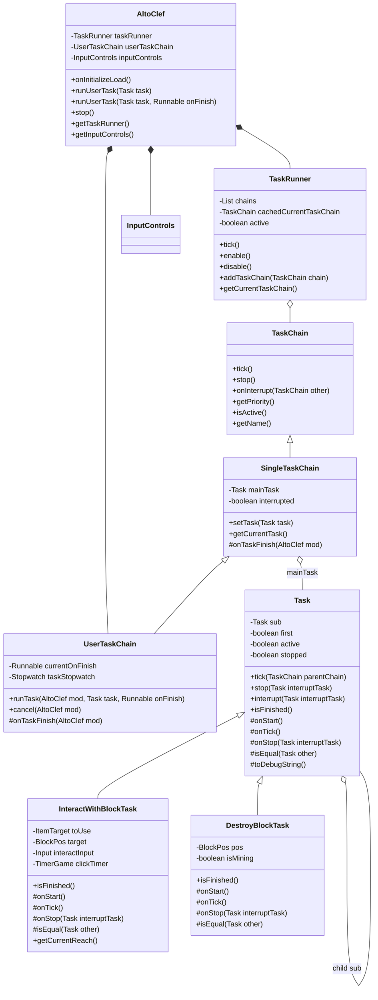

요점: `Task` 상속은 ChatClef의 established contract에 참여하기 위한 것이다.
하지만 `AltoClef`, `TaskRunner`, global chain을 상속해서 새 엔진을 만들면
엔진 lifecycle을 fork하게 되므로 금지한다.

## 3. TaskRunner chain 선택 sequence

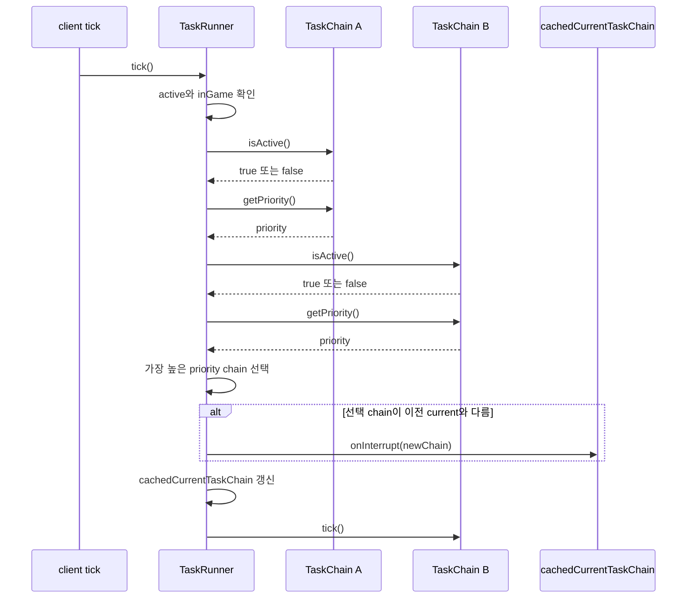

요점: TaskRunner는 직접 Task를 고치는 곳이 아니라 active chain을 선택하고
interrupt를 전달하는 scheduler다.

## 4. Task lifecycle state diagram

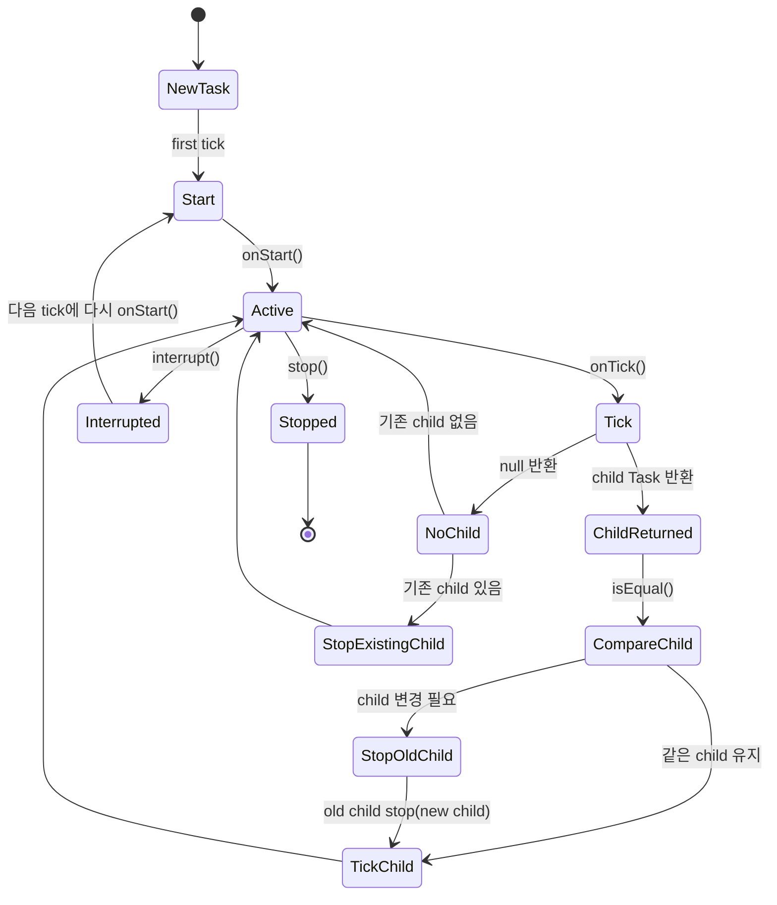

요점: parent Task가 child를 반환하면 `Task.tick()`이 child 교체와 stop 흐름을
관리한다. child 동일성은 `isEqual()`이 결정한다.

## 5. parent / child Task 교체 sequence

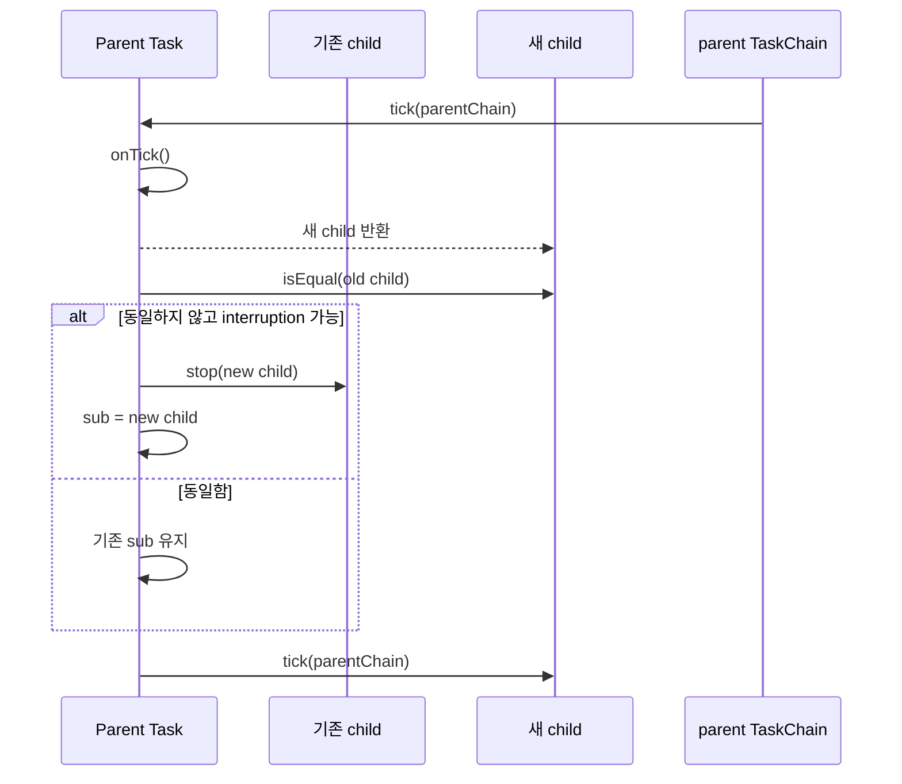

요점: Carry On parent Task를 만들 때 매 tick 새 correlationId를 `isEqual()`에
넣으면 child가 계속 새 Task로 취급될 수 있다. correlationId는 log identity,
`isEqual()`은 semantic operation identity로 분리해야 한다.

## 6. UserTaskChain run / finish 흐름

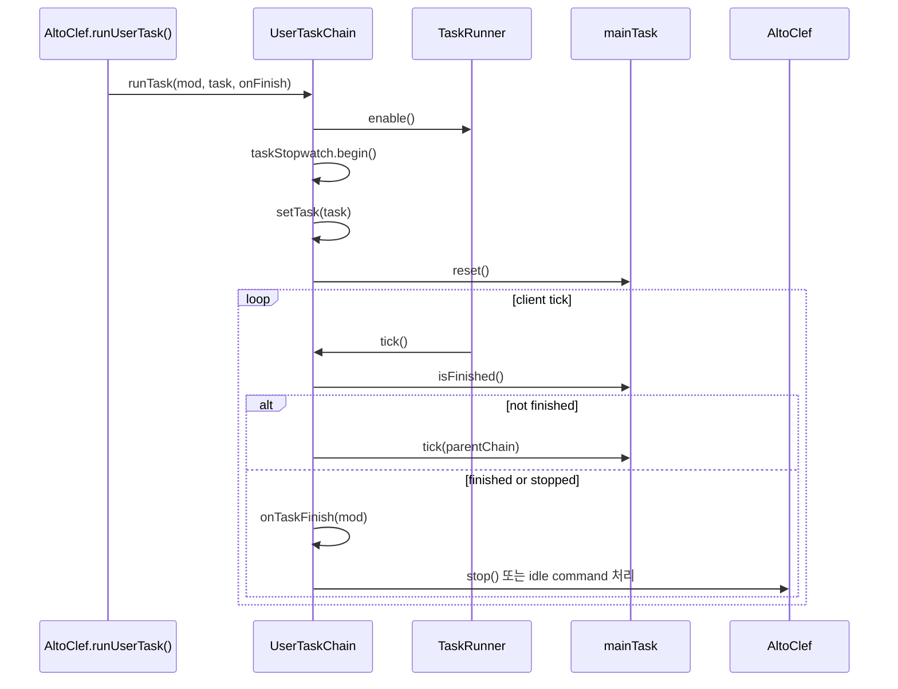

요점: 사용자 명령으로 실행되는 최상위 Task 완료는 `UserTaskChain`이 처리한다.
그래서 Carry On 완료 조건은 별도 parent Task의 `isFinished()`로 드러나야 한다.

## 7. InteractWithBlockTask 세부 흐름

```mermaid
flowchart TB
    Start[onStart]
    Reset[moveChecker, stuckCheck, wanderTask, clickTimer reset]
    PathCancel[pathing forceCancel]
    Tick[onTick]
    Portal{nether portal 안?}
    Stuck{stuck 또는 progress 실패?}
    Item{필요 item 충족?}
    Wander{wander active?}
    Goal[interact goal 생성]
    Click[rightClick()]
    Cant[CANT_REACH]
    Wait[WAIT_FOR_CLICK]
    Attempt[CLICK_ATTEMPTED]
    SetGoal[customGoalProcess.setGoalAndPath]
    LostControl[customGoalProcess.onLostControl]
    WanderTask[wanderTask 반환]
    Null[null 반환]
    Stop[onStop]
    Cleanup[pathing forceCancel, SNEAK release]
    Finish[isFinished = false]

    Start --> PathCancel --> Reset --> Tick
    Tick --> Portal
    Portal --> Stuck
    Stuck -- stuck --> WanderTask
    Stuck -- ok --> Item
    Item -- 부족 --> GetItem[TaskCatalogue.getItemTask]
    Item -- 충족 --> Wander
    Wander -- active --> WanderTask
    Wander -- inactive --> Goal --> Click
    Click --> Cant --> SetGoal --> Null
    Click --> Wait --> LostControl --> Null
    Click --> Attempt --> LostControl --> Null
    Attempt --> Timer{clickTimer elapsed?}
    Timer -- yes --> WanderTask
    Timer -- no --> Null
    Stop --> Cleanup
    Tick --> Finish
```

요점: 이 Task는 접근, 바라보기, 클릭 시도를 담당한다. 성공 판정 자체를
항상 소유하는 구조가 아니기 때문에 Carry On 완료 판정을 여기에 전역으로
넣으면 안 된다.

## 8. rightClick boundary sequence

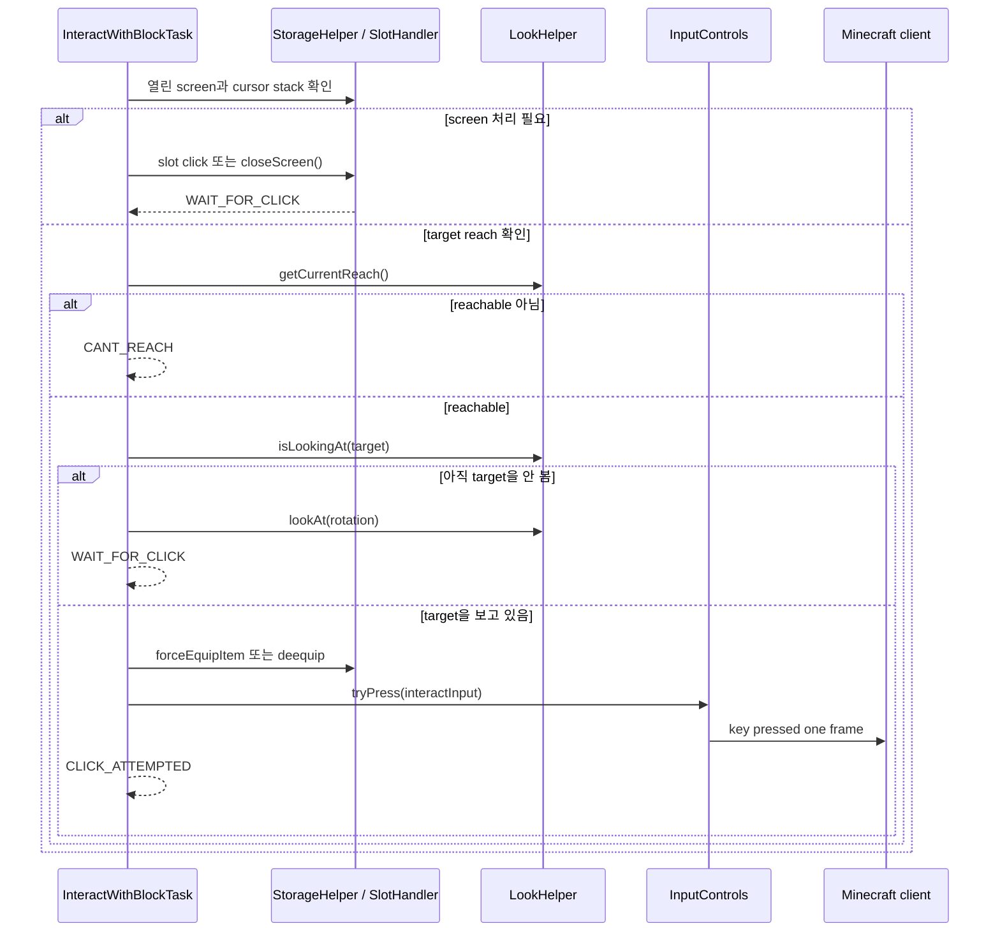

요점: `CLICK_ATTEMPTED`는 클릭 시도이지 Carry On 성공이 아니다. Carry On
성공은 state transition으로 별도 관찰해야 한다.

## 9. InputControls one-frame press lifecycle

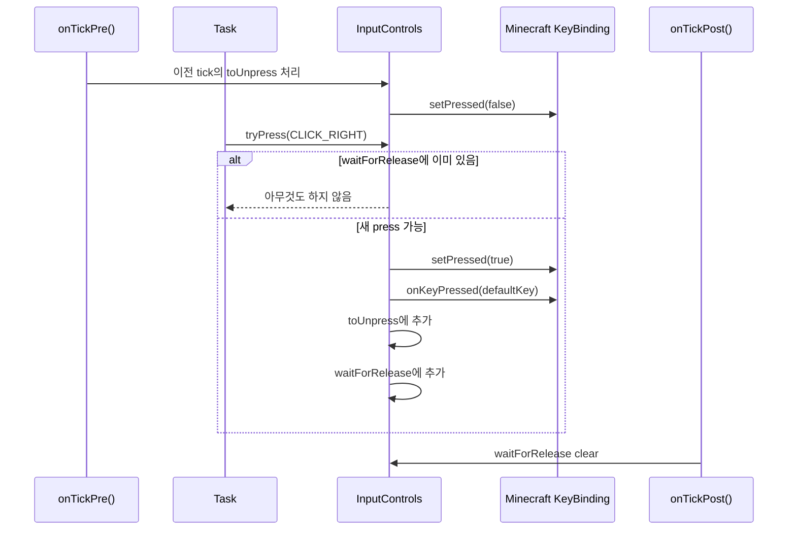

요점: `tryPress()`는 한 프레임 press에 가깝다. 단순히 키가 눌렸다는 사실만으로
operation ownership이나 성공을 증명할 수 없다.

## 10. PlayerInteractionFixChain 영향 지도

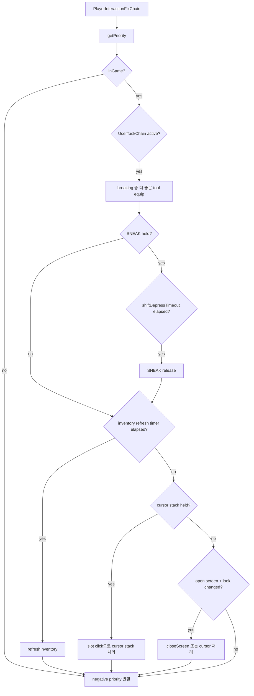

요점: 이 chain은 cursor, screen, tool, SNEAK 등 전역 interaction 환경을
다룬다. Carry On 전용 retry나 cleanup을 여기에 넣으면 일반 상호작용 전체가
영향받을 수 있다.

## 11. Baritone goal / path 영향 지도

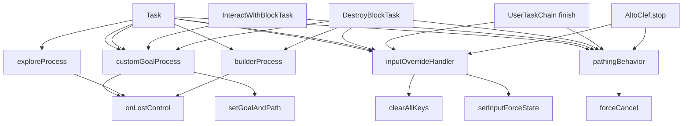

요점: Baritone과 input override는 여러 Task와 chain이 만지는 shared resource다.
Carry On operation이 소유하지 않은 path, goal, input을 전역 해제하면 안 된다.

## 12. container open에서 InteractWithBlockTask가 쓰이는 흐름

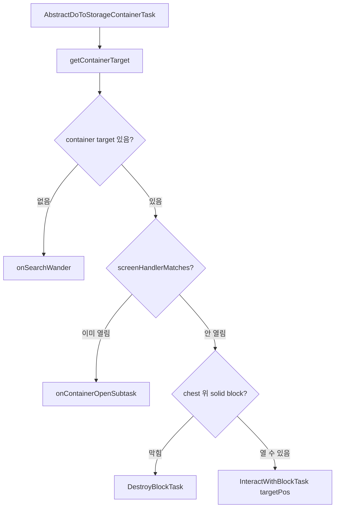

요점: `InteractWithBlockTask`는 Carry On뿐 아니라 container open에도 쓰인다.
따라서 이 Task의 완료 조건을 Carry On 기준으로 전역 변경하면 container 흐름도
깨질 수 있다.

## 13. DestroyBlockTask 비교 다이어그램

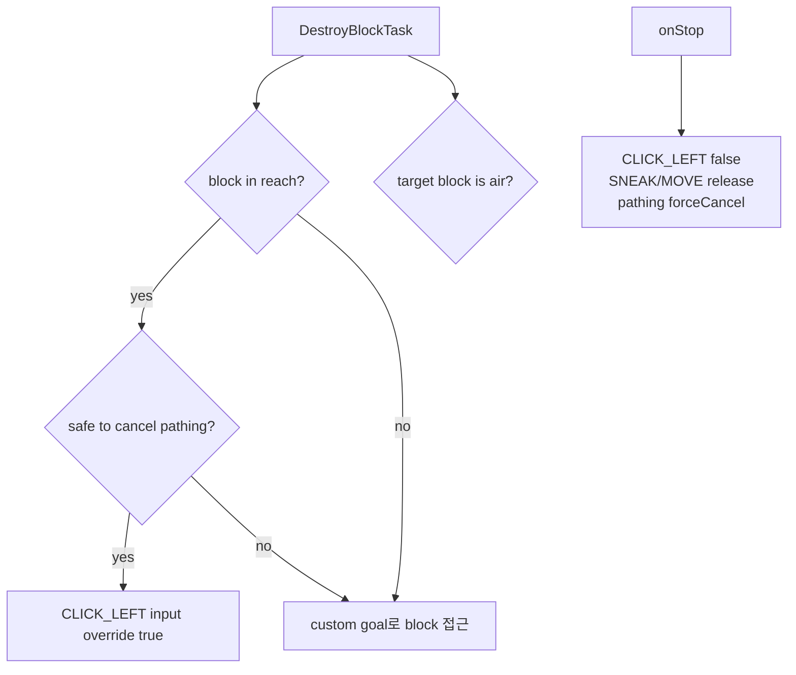

요점: `DestroyBlockTask`는 block이 air가 되면 완료되는 명확한 완료 조건을
가진다. 반면 `InteractWithBlockTask`는 generic click attempt라서 현재
`isFinished()`가 false다. Carry On에는 별도 parent completion이 필요하다.

## 14. Carry On을 붙일 수 있는 외부 경계

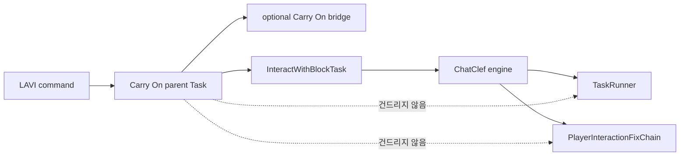

요점: Carry On integration은 `TaskRunner`나 `PlayerInteractionFixChain`을
상속하거나 전역 수정하지 않고, parent Task + optional bridge + generic child
composition으로 시작해야 한다.

## 15. root-cause patch 전 증거 흐름

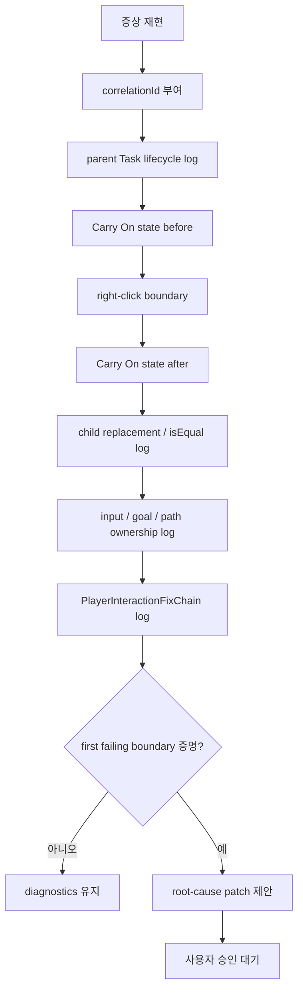

요점: 실패 지점이 증명되기 전에는 behavior를 바꾸지 않는다. build 성공도
root cause 증명이 아니다.
