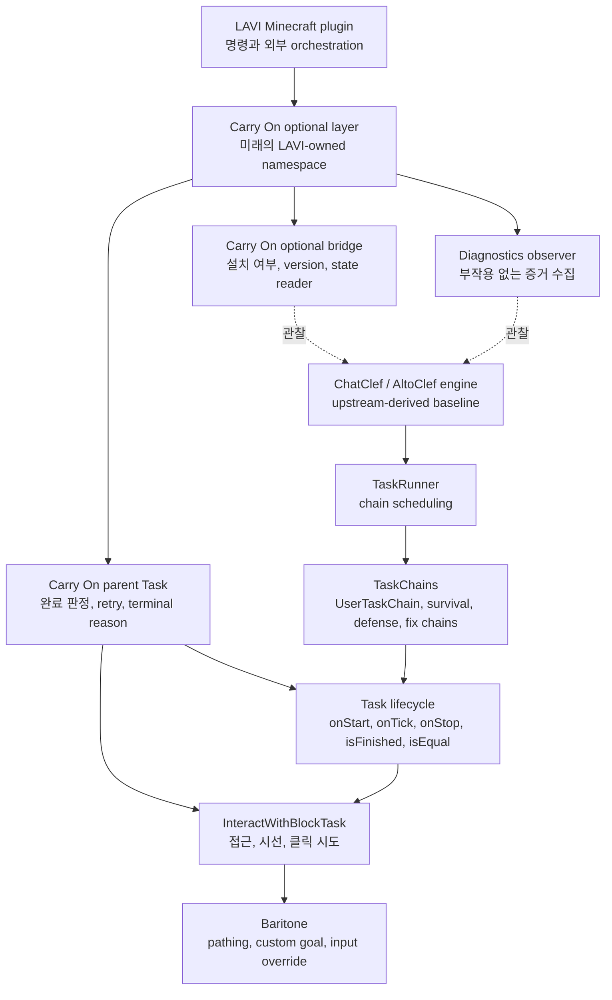
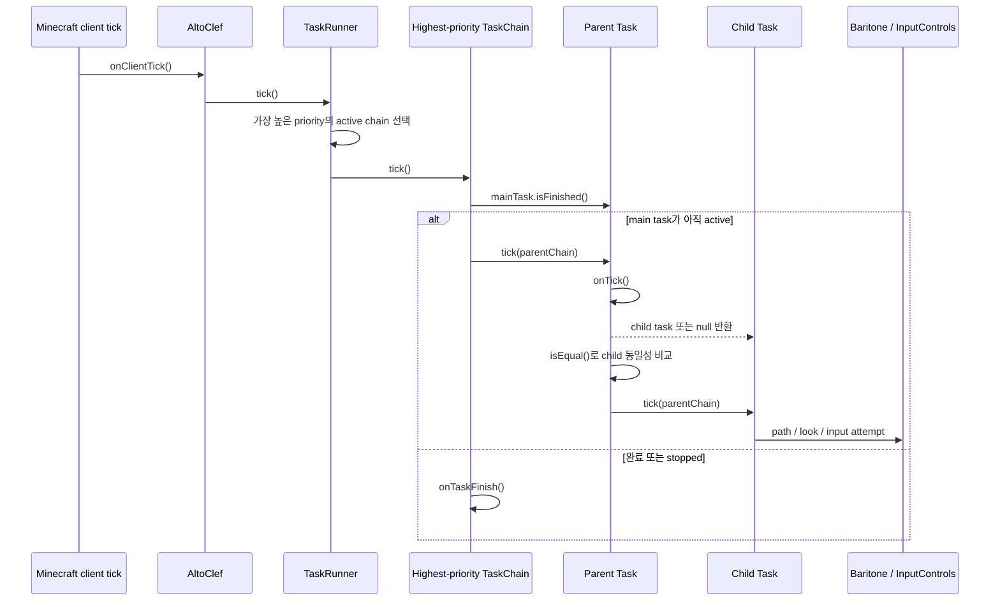
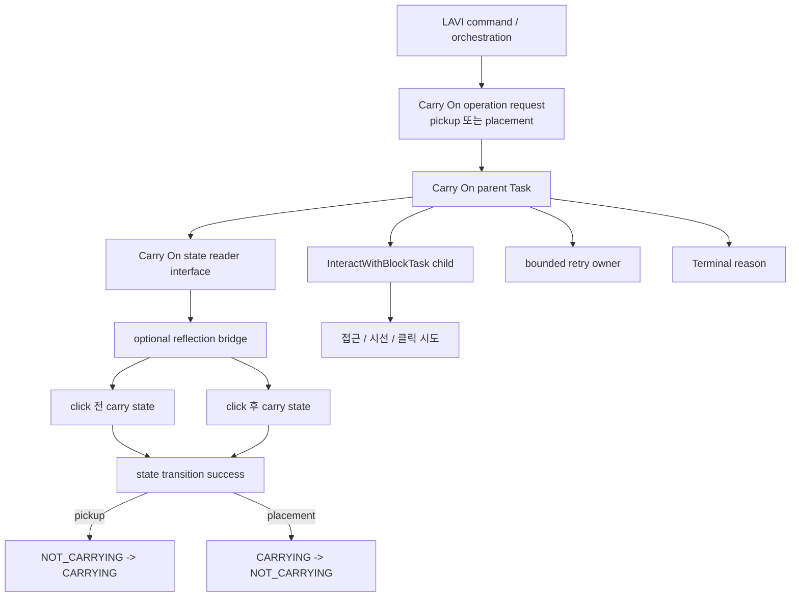
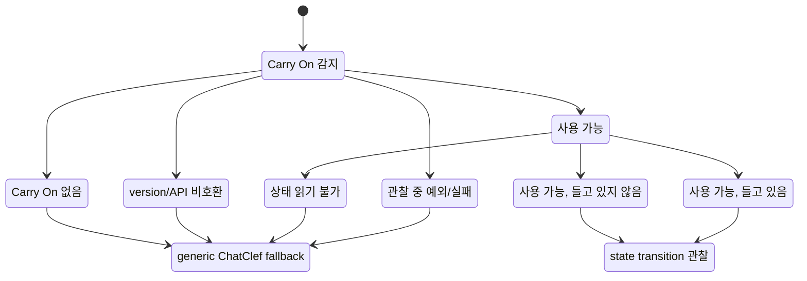
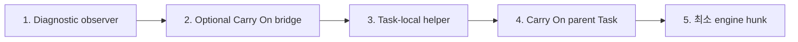

# ChatClef 구조 개요

상태: 문서 전용.

이 문서는 Carry On 구현을 시작하기 전에 현재 ChatClef / AltoClef 구조를
그림으로 고정해 두기 위한 보조 문서다. 기준 방향성 문서는 다음 파일이다.

- [ChatClef / Carry On Integration Direction](chatclef-carryon-integration-direction.md)
- [ChatClef 엔진 다이어그램](chatclef-engine-diagrams.md)

이 문서는 Java 구현, diagnostic log 삽입, 동작 변경, build, commit, push를
승인하지 않는다. 목적은 구조를 먼저 이해하고, 이후 구현 때 같은 실패를
반복하지 않도록 경계를 시각화하는 것이다.

## 1. 소유권 지도



핵심 규칙: ChatClef / AltoClef는 보존해야 하는 엔진이다. Carry On 동작은
엔진을 LAVI 전용 fork로 바꾸는 방식이 아니라, 옆에 얇은 optional layer를
붙이는 composition 방식으로 연결한다.

## 2. 현재 runtime 흐름



현재 기준선에서 중요한 사실:

- `SingleTaskChain`은 `mainTask` 교체와 완료 처리를 소유한다.
- `Task.tick()`은 `isEqual()`을 통해 child task 교체를 소유한다.
- `InteractWithBlockTask.isFinished()`는 현재 항상 `false`를 반환한다.
- 따라서 `InteractWithBlockTask`는 완전한 Carry On operation owner가 아니라
  generic child action으로 봐야 한다.

## 3. generic block interaction 경계

```mermaid
flowchart TB
    Start[InteractWithBlockTask.onStart]
    CancelPath[기존 pathing forceCancel]
    Tick[onTick]
    NeedItem{필요 item 보유?}
    GetItem[item acquisition task 반환]
    Wander{wander task active<br/>또는 movement stuck?}
    DoWander[wander / unstuck task 반환]
    Goal[interaction goal 생성]
    RightClick[rightClick()]
    Reach{target reachable?}
    Look[reachable rotation 바라보기]
    Click[interact input tryPress]
    Attempt[CLICK_ATTEMPTED]
    Wait[WAIT_FOR_CLICK]
    CantReach[CANT_REACH]
    Path[customGoalProcess.setGoalAndPath]
    Stop[onStop]
    Cleanup[pathing forceCancel<br/>SNEAK release]
    Finished[isFinished는 false 반환]

    Start --> CancelPath --> Tick
    Tick --> NeedItem
    NeedItem -- 없음 --> GetItem
    NeedItem -- 있음 --> Wander
    Wander -- 예 --> DoWander
    Wander -- 아니오 --> Goal --> RightClick
    RightClick --> Reach
    Reach -- 불가 --> CantReach --> Path
    Reach -- 가능, 아직 안 봄 --> Look --> Wait
    Reach -- 가능, 보고 있음 --> Click --> Attempt
    Tick --> Finished
    Stop --> Cleanup
```

이 Task는 storage container, liquid, crop, bed, portal ignition, honeycomb,
stripped log 등 여러 일반 우클릭 동작에서 사용된다. 이 Task를 전역으로
바꾸면 Carry On pickup / placement보다 훨씬 넓은 범위가 영향을 받는다.

## 4. 전역 interaction fix chain

```mermaid
flowchart TB
    Chain[PlayerInteractionFixChain<br/>항상 active]
    Priority[getPriority()]
    Tool[block breaking 중 더 좋은 tool equip]
    Sneak[SNEAK stuck release timer]
    Cursor[cursor stack timeout 처리]
    Screen[look 변화 시 screen close]
    Generic[generic interaction behavior]

    Chain --> Priority
    Priority --> Tool
    Priority --> Sneak
    Priority --> Cursor
    Priority --> Screen
    Tool --> Generic
    Sneak --> Generic
    Cursor --> Generic
    Screen --> Generic
```

이 chain은 전역 boundary다. Carry On 전용 retry, cooldown, fallback, input
cleanup은 여기에 넣으면 안 된다. diagnostics가 이 chain이 first failing
boundary임을 증명하고, 더 좁은 owner로는 해결할 수 없을 때만 검토한다.

## 5. 의도한 Carry On composition 구조



parent Task가 소유해야 하는 Carry On 의미:

- operation identity
- completion predicate
- retry count와 retry limit
- terminal reason
- 실제로 획득한 resource에 대한 interruption cleanup
- state transition 해석

`InteractWithBlockTask`는 generic approach, look, click attempt만 담당한다.

## 6. Carry On capability state model



absent, incompatible, unreadable, observation failed 상태는 성공이 아니다.
이 상태에서 blind retry를 시작하면 안 된다. Carry On이 없어도 generic
ChatClef 동작은 load 가능하고 사용 가능해야 한다.

## 7. patch placement 순서



engine modification은 최후 수단이다. upstream-derived engine hunk를 제안하기
전에 exact file, class, method, line range, game tick, state before/after로
failing boundary가 증명되어야 한다.

## 8. stop gates

다음 작업 전에는 멈추고 명시적 승인을 받아야 한다.

- Java implementation
- diagnostic logging insertion
- behavior change
- upstream-derived engine modification
- dependency 또는 Gradle change
- build 또는 runtime reproduction
- commit 또는 push

제안된 변경에 책임이 2개 이상 있으면 LAVI-owned code에서만 split한다.
upstream-derived ChatClef class가 여러 책임을 가지고 있다는 이유만으로
소급 refactor하지 않는다.
