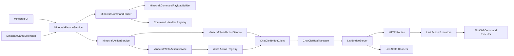
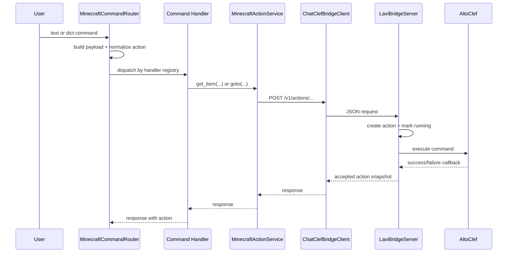
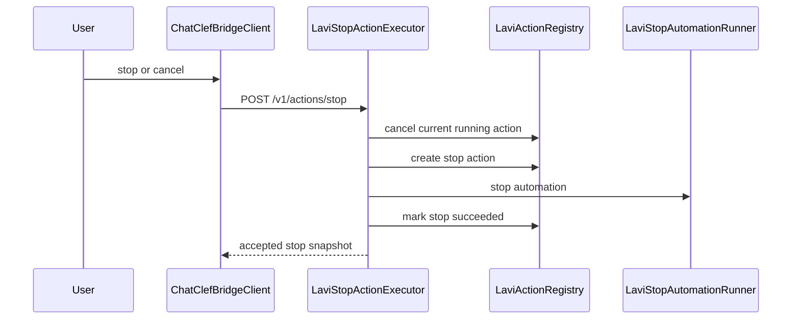

<!--20260725_kpopmodder: Added architecture notes for the Minecraft ChatClef bridge refactor.-->

# Minecraft ChatClef Bridge Architecture

## Current Implemented Surface

The bridge is implemented as a local control path from LAVI to Minecraft:

```text
LAVI Gradio UI or GameExtension
-> plugins/Minecraft Python plugin
-> ChatClefBridgeClient
-> http://127.0.0.1:4316
-> Java LaviBridgeServer
-> ChatClef/AltoClef command execution
```

Implemented HTTP endpoints:

```text
GET  /v1/health
GET  /v1/status
GET  /v1/inventory
GET  /v1/actions/current
POST /v1/actions/get-item
POST /v1/actions/goto
POST /v1/actions/stop
```

Use `/v1/health`, not `/health`. Use `/v1/actions/get-item`, not `/command`.

`MANUAL`, `AI`, and `PAUSED` control mode decisions live in `LaviControlModeReader`. `LaviActionRegistry` owns action ids, action records, status transitions, timestamps, and snapshots.

Verified actions:

- `get-item`: tested with `oak_log 1`; current action reached `succeeded`; inventory count changed.
- `goto`: tested with `0 64 0 overworld`; current action reached `succeeded`.
- `stop`: tested while `goto` was running; previous action reached `cancelled`; stop action reached `succeeded`.

Boundary not yet complete:

- The direct bridge path is connected.
- Full LAVI conversation/LLM natural-language intent mapping into Minecraft actions is the next layer.

## Package Diagram



## Get Item / Goto Sequence



## Stop Sequence



## New Action Checklist

1. Add Java command request validator and command builder.
2. Register the Java action factory in `LaviCommandFactoryRegistry`.
3. Add bridge endpoint support if the HTTP path is new.
4. Add Python write action class under `minecraft_core/actions`.
5. Register the Python write action in `MinecraftWriteActionRegistry`.
6. Add parser/extractor/payload builder classes if natural language should map to it.
7. Register command aliases in `MinecraftCommandHandlerRegistry`.
8. Add GameExtension supported action aliases in `MinecraftCommandRegistry`.
9. Add tests in the nearest split test file.
10. Test health/status/inventory/current action before testing the new action.
